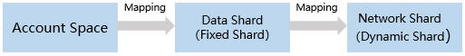
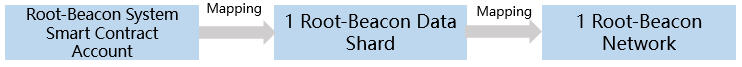
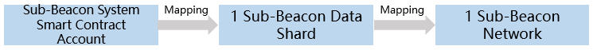
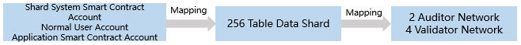

# Account Protocol

## Overview

TOP Network uses an account model. The account is the basis of all the TOP Network's activities.

The address is the unique identifier of an account, and a private key signature is required to operate an account. 

## Account Object

An account is an object that contains state information and logic, which includes balances, properties of stored data, and actions for each property.

The account property is an object of user-defined data that is added as a key-value pair, and the user balance is a special property.

A key is an arbitrary string whose value can be any data type, such as integer, string, list, HashMap, and so on.

An action can be a system-level function, such as transfer or a custom action managed by the application smart contract deployed by the account owner.

Account objects and their methods can be easily and flexibly extended with new properties and custom actions

## Account Address

### Account Address Type

The account address types are shown in the table below.

| Account Type                       | Description                                                  |
| ---------------------------------- | ------------------------------------------------------------ |
| Normal User Account                | Independent Account:T-0。                                    |
| Application Smart Contract Account | T-3，sub account of the independent account.Is created when the contract is deployed。 |
| System Smart Contract Account      | Root-Beacon System Smart Contract Account：T-21；<br/>Sub-Beacon ystem Smart Contract Account：T-22；<br/>Shard System Smart Contract Account：T-2。 |

Example：

* Independent Account:T-0-LQSxHEUBGLPY57SNjS2iMDba643NCHGswp

* Shard System Smart Contract Account:T-2-ML7oBZbitBCcXhrJwqBhha2MUimd6SM9Z6

### Account Address Format

| Fromat                | Length          | Description                                                  |
| --------------------- | --------------- | ------------------------------------------------------------ |
| Prefix Identification | 1 byte          | T:TOP。                                                      |
| Address Type          | 1 btye          | Such as normal account、contract account.                    |
| Network ID            | 2 byte          | 0-TOP:mainnet，"0" not displayed；<br/>65535:testnet；<br/>else：service chains。 |
| Base58 code           | variable-length | Hash the public key.                                         |
| TABLE-ID Postfix      | 4 byte          | Optional，shard of system smart contract.                    |

### Account Space Shard Mapping

The process of account space mapping to sharding is as follows:



* Root-Beacon System Smart Contract Account

  

* Sub-Beacon System Smart Contract Account

  

* Shard System Smart Contract Account、Normal User Account and Application Smart Contract Account

  

## Key-pair Generation 

### Key-pair of Normal User Account

**Private Key**

SHA-256 security hashing algorithm is used to generate a random 256-bit private key, starting with "0x".

Example:

0x40fb93846c424a107ac854f52290043e4c57368f035e563f8dc0091be8cc1ff9.<br/>**Public Key**

Secp256k1 algorithm is used to generate the public key corresponding to the private key.

Example:

0x045f04ab02ef604ee8861b32e5b07ba64070d901daffc5edb0f14a1fc2f27c3b193eff0398023b0ea1285abfd3e1cabc5d83575aa9681880184e8cfd207b02c57f.

**Account Address**

The ECDSA digital signature algorithm is used to convert the public key into the account address and prefix "T-0" according to the account type.

Example:

T-0-LWkTjhseZj7tPZkXwifoTPm2dUJY63jdEd。

### Key-pair of Application Smart Contract Account

**Key-pair**

Application smart contract account uses the same public-private key generation algorithm as normal user account.<br/>

**Account Address**

The application smart contract account address is to add the public key of the contract account and the public key of its parent account bit by bit to obtain a set of array, and then uses ECDSA digital signature algorithm to convert the array into address, and add prefix "T-3".

Example:

T-3-Mo9KPHMGZyyn8AwzUJx6dkdZxzUxhgE9hN。<br/>

Example of application smart contract account address generation:

```
 std::string      xecpubkey_t::to_address(const std::string & parent_addr,const char addr_type,const uint16_t ledger_id)
        {
            if(parent_addr.empty())
                return to_address(addr_type,ledger_id);

            uint8_t     temp_publickey_data[65];
            memcpy(temp_publickey_data, m_publickey_data, sizeof(temp_publickey_data));
            const int parent_addr_size = std::min((int)parent_addr.size(),65);
            for(int i = 0; i < parent_addr_size; ++i)
            {
                temp_publickey_data[i] += parent_addr[i];
            }
            
            return to_address(temp_publickey_data, addr_type, ledger_id);
        }
```

## Keystore File

### Account Keystore File

The account keystore file is your unique private key and a encrypted file that is used to sign transactions. It allows you to store the key in an encrypted manner.

This approach combines**security**  (an attacker needs the account keystore file and your password to steal your assets) and **ease of use** (you only need the account keystore file and password to access the assets).

In order to send the transaction, the TOP Network client will ask you to enter a password (the same as when you created the account) to decrypt your private key. Once it is decrypted, the client program gets the private key to sign the transaction, allowing you to move the asset.

If the private key is lost, it means you cant no longer sign the  transaction, and your assets are permanently locked up in your account.

You must backup your account keystore file and remember the password.

You must never share the private key and account keystore file with anyone! They control access to your funds!

Account keystore file:

```
{
   "address" : "T-0-LWkTjhseZj7tPZkXwifoTPm2dUJY63jdEd",
   "crypto" : {
      "cipher" : "aes-256-cbc",
      "cipherparams" : {
         "iv" : "0x40fb93846c424a107ac854f52290043e4c57368f035e563f8dc0091be8cc1ff9"
      },
      "ciphertext" : "0xb502a93ad3a8af3b9e4b939c40f851d240195ce9aeb417325b4d7bb64a7198f376a001a0a03f4a5b1d61af7b4c5b2cea65bc332a0e8399155eb0505b52cdf477c9c1f38e14857b453603cc4d385d468f",
      "kdf" : "hkdf",
      "kdfparams" : {
         "dklen" : 32,
         "info" : "0xb69d0f41ad6a5511",
         "prf" : "sha3-256",
         "salt" : "0x548c58f15a52ce6c879b5862ec7f12e13dc8b3df1329b8a4528324dfdb940740"
      },
      "mac" : "0xbd877ac89217f31a8c89db4900c4c1cfd9e16a9d4ac149cbdb09ede71f2d6ce4"
   },
   "hint" : "af",
   "public_key" : "0x045f04ab02ef604ee8861b32e5b07ba64070d901daffc5edb0f14a1fc2f27c3b193eff0398023b0ea1285abfd3e1cabc5d83575aa9681880184e8cfd207b02c57f"
}
```

| Parameters |              |       | Description                                                  |
| ---------- | ------------ | ----- | ------------------------------------------------------------ |
| address    |              |       | Account address.                                             |
| crypto     |              |       |                                                              |
|            | cipher       |       | Private key encryption algorithm.                            |
|            | cipherparams |       | Cipher encryption algorithm parameters.                      |
|            |              | iv    | vector                                                       |
|            | ciphertext   |       | Encrypted private key.                                       |
|            | kdf          |       | Key generation function that lets you encrypt the account keystore file with a password. |
|            | kdfparams    |       | Kdf algorithm parameters.                                    |
|            |              | dklen | The key length of the private key encryption algorithm.      |
|            |              | info  | Hexadecimal representation of a random number of 8 bytes.    |
|            |              | prf   | Hash algorithm。                                             |
|            | mac          |       | Message authentication code.                                 |
| hint       |              |       | The hint of the password of the account keystore.            |
| public_key |              |       | Account public key。                                         |

### Key-pair Keystore File

The difference between account keystore file and key-pair keystore file is that the key-pair keystore file does not store account address.

Key-pair keystore file：

```
{
   "crypto" : {
      "cipher" : "aes-256-cbc",
      "cipherparams" : {
         "iv" : "0xd30883e616d5d30249e6f345ca85e2b3b7bfd442504ac5cb3d37293ff3d7b459"
      },
      "ciphertext" : "0x828bb283bcee1f24147047bfe89b1c54b03af98dc3e3fbc74f1b866ae1a1ead1ab88d21023fe853e9b650d6da7bf695f",
      "kdf" : "hkdf",
      "kdfparams" : {
         "dklen" : 32,
         "info" : "0xe82ba4f7f99666f4",
         "prf" : "sha3-256",
         "salt" : "0xff7b70a2d32f2158b45f394a1d00d7dfc04dd1345949774894df92e37bfb3a38"
      },
      "mac" : "0xdb82cfd99c7a9fb8e28b4b2e754c9a612c7fa1cbc7e963d04c7036b14e88ac2b"
   },
   "hint" : "basketball",
   "public_key" : "BFYRfp557uqBAKA54JmFkT+UVXf74LVdHDnjtLBM/V3nyIdKiHLwX2yr7s03RCoHNfciT0Zays3oUvcmkRv5VK4="
}
```

### Keystore File Generation

Reminder:

> Key-pair keystore file does not store account address.

Step1 Generate the original private key and use the original data to encode in base64.

Step2 Generate 32-byte salt.

```
CryptoPP::AutoSeededRandomPool::GenerateBlock
```

Step3 Generate 8-byte info.

```
CryptoPP::AutoSeededRandomPool::GenerateBlock
```

Step4 Generate aes 32-byte encryption key.
Where: Kdf algorithm is hkdf,  hash algorithm is SHA3-256, with the password, to generate the encryption key.

Step5 Generate aes 32-byte iv.

```
CryptoPP::AutoSeededRandomPool::GenerateBlock
```

Step6 Generate ciphertext. 

Where:Encryption algorithm is AES256, encryption mode is CBC_Mode.

Step7 Calculate 32 byte MAC, the last 16 bytes of aes_key are spliced with the encrypted ciphertext, and then hash the spliced data. 

The hash algorithm adopts SHA3-256.

Step8 Write the above data to a file。