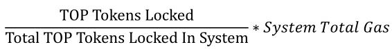

# Resource Model

## Overview

Transactions on TOP Network mainchain can be divided into shard transactions and Root-Beacon transactions. Both types of transactions consume on-chain resources.
The temporarily occupied resources such as NET/CPU, which are unified and abstracted into one type of resource called gas. 
Each account—including each contract account and each ordinary account—has free daily gas. To obtain higher daily quotas, the account must deposit TOP tokens. Gas resources are restored to the maximum amount every 24 hours.

## Gas Consumption Rules

Gas consumption rules vary depending on the type of transaction and account.

* For transactions that are not invoking contracts, only the transaction sender is charged.

* The normal account runs the applicaiton contract and charges the transaction sender first, which is shared by th etransaction sender and the contract (the application contract may set the upper limit of the gas fee that the user is willing to pay for the transaction).

* The platform contract, whether as transaction sender or receiver, is free of charge.

The gas consumed by the transaction is shown in the following table.

| Transaction Type           |                                  | Totoal Consumed Gas                           | Paid by the Sender                                           | Paid by the Receiver                                         | Note                                                         |
| -------------------------- | -------------------------------- | --------------------------------------------- | ------------------------------------------------------------ | ------------------------------------------------------------ | ------------------------------------------------------------ |
| Single Account Transaction |                                  | tx_size*1                                     | tx_size*1                                                    | -                                                            |                                                              |
| Across Account Transaction | Non-run Contract Transaction     | tx_size*3                                     | tx_size*3                                                    | 0                                                            |                                                              |
|                            | Platform Contract Transaction    | tx_size*3                                     | tx_size*3                                                    | 0                                                            |                                                              |
|                            | Application Contract Transaction | tx_size*3+CPU ns(Contract Instruction Set)/40 | Half of the transaction cost shall be paid by the sender, the other half shall be paid by the application contract first, and the other half shall be paid by the sender if the contract cannot pay. | min(gasLimit,contract balance,receiver action consumed gas/2) | gasLimit: The upper limit of the gas fee that the user is willing to pay for the transaction. |

Caution:

The system will automatically deduct 100*10^6 uTOP tokens from the transaction sender's account as the transaction fee for running Root-Beacon system contract(registration node related, proposal related, starting node process) and burn it. This small fee to protect the Root-Beacon system from flood transaction attacks.

## Free Daily Gas

Be default, each account with a balance of at least 100 TOP is given a free 25000 TGAS every 24 hours.This allows for several free transactions per day. A minimum TOP balance is necessary to avoid mass account creation and mass transaction spamming using the free allotted gas.

### Gas Acquisition

Ordinary accounts as well as contract accounts can deposit TOP tokens to gain more gas credits. The formula for gas credits is as follows

Where the System Total Gas=single shard gas *number of shards. This value can be adjusted via on-chain governance. The number of shards is currently set to 4, and the total TGAS of the system will increase as the number of shards increases. The total number of TOP tokens deposited in the system is updated every ten minutes, and the value is stored inside a platform contract.

Total TOP Tokens Locked In System=The system initial locked TOP tokens+user locked TOP tokens,to avoid the initial gasprice being 0.

An ordinary account can't obtain gas more than 200,000 Tgas(on-chain governance parameter) in a 24-hour timeframe. This roughly equates to 800 transactions.

A contract account can't obtain more than 10,000,000 Tgas (on-chain governance parameter) in a 24-hour timeframe. This equates to 40,000 transactions or 4s of CPUT time.

### Gas Consumption Relationship To NET/CPU

1 Tgas is equivalent to 1 byte of bandwidth or 0.04 microseconds of CPU time. Bytes are counted based on the size of the original transaction. CPU time is only consumed when executing a contract,and the total CPU time is determined based on the contract instruction set.

A transaction is allowed to consume up to 25,000 Tgas.

## Transaction Deposit

Most users will have enough free gas for their daily needs, while those who send many transactions may run out of gas and need to pay a small amount of transaction deposit. When an account does not have enough gas to send a transaction, TOP token is deducted from their transaction deposit balance—which must be greater than or equal to 0.1 TOP—to offset the gas costs. This fee is then burned. 

Each transaction deposit is frozen from the account balance other than the amount transferred.

The Tgas to TOP conversation ratio is currently set to: 1 Tgas=100 uTOP token.

The minimum transaction deposit parameter can be changed via on-chain governance.