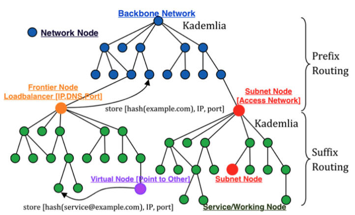

# TOP Network P2P Network Protocol

## Overview

Unfortunately, P2P networks have a big downside; they are not as fast or as efficient when compared to centralized networks. To overcome this, we designed our own customized P2P network architecture.The guiding principle in our design process was to build a P2P network architecture that over time could become nearly as fast as a centralized network. This required a number of new innovations along with some tweaks to existing protocols.

## P2P Overlay Internet

In TOP Network’s ecosystem, there are numerous components and sub-networks which all must communicate and transfer data between each other. If the P2P network through which these various parts interact is weak, the entire platform is affected. Popular P2P network implementations have been optimized for certain use cases over the years, but are not quite adequate for such an ecosystem of many distinct yet connected networks requiring near real-time latency. This is particularly true for a sharded system where there is constant interaction between shards. In fact, the bandwidth used for cross-shard communication can quickly become a bottleneck.

We have accounted for this by building a "P2P Internet", wherein instead of one monolithic network, there are many P2P networks organized in a hierarchical fashion, similar to the design of the Internet. Furthermore, we have developed optimized data transfer and gossip protocols to minimize bandwidth consumption and increase the efficiency of node discovery. Finally, we embed geographical information into the P2P network structure and implement smart-routing to reduce latency.

##  Kademlia DHT

The basis for each P2P network on TOP Network is a modified Kademlia DHT implementation. However, instead of using a single Kad network for communication between all nodes and services, we use many layered Kad networks.

The relationship between sub P2P networks is hierarchical. Each sub-network has information about the layer directly below it. The network hierarchy is organized into Zones, Clusters, and then Shards. Each Zone is a Kad network with Clusters and Shards as "nodes". Clusters and Shards are sub Kad networks made up of physical nodes. Zones are logical divisions, while each Cluster and Shard consists of a physical  P2P Kad network of nodes. Essentially, each sub-network is arranged as if it were a node in a Kad network. We say that each  P2P network within TOP is virtualized as a single node within a larger overarching Kad network.

## XIP Address

As mentioned, the network architecture of TOP is very similar to that of the Internet. The Internet is one large network of networks, while TOP is one big network of  P2P networks. On the Internet, every device is assigned a routable IP address. We use a similar concept in our  P2P Internet through a 128-bit construct we call an XIP address. Just as an IP address allows for the routing of a packet to any device in a network within the Internet, an XIP address allows any TOP node to route a packet to any node within a  P2P network residing in the P2P Internet.

When a node is first elected and joins the network, it is assigned a unique XIP address which maps to a Kad NodeID. This mapping is stored in an election block on-chain. From a high-level, to search or connect with any peer in the overall network, a node simply uses the XIP address. Under the hood, the XIP address is translated using XRouting-Table—a local table stored by each node—which is used to find the correct sub-network based on the XIP. After this translation, the request is sent to the closest NodeIDs to the target NodeID in the destination sub-network. At this point, a regular Kad lookup commences, which returns the IP/Port of the target node.

##  Zones and Geographical Clustering

In traditional Kad networks, each node is given a random unique NodeID, and a notion of distance between two NodeIDs is introduced through the XOR metric. Nodes cluster around peers with similar NodeIDs (small XOR distance). This "distance" is not based on geographical location, and so two "close" NodeIDs could actually be on other sides of the world.This poses a problem. Nodes which interact often are not grouped as such, and so latency can be high.This is particularly problematic in terms of consensus. If a single Kad network is used as the basis for a sharded system, nodes within a particular consensus committee are randomly positioned around the world. This has negative consequences for confirmation times.To remedy this, we make a change to the NodeID. When a node first joins the network, general geographical information such as its country code and network location are determined. This information is then encoded and built into the NodeID. Therefore, NodeIDs with the same country codes will generally be placed close to one another, now both in terms of XOR distance and geographical distance.
Zones represent the top level of this geographical partitioning. Each Zone is a Kad network which spans a certain geographical region. For instance, one Zone may cover North America, while another may span Europe. Nodes within Clusters and Shards in a particular Zone are thus located in the same general region, which vastly improves latency.

##  Optimized Gossip and Data Transfer Protocols

In blockchain networks such as the underlying Bitcoin p2p network, block and transaction propagation occurs through a gossip protocol. Basically, nodes store the information of a large number of nodes,and send out blocks or transactions to a configurable number of peers. The receiving peers then relay the transaction or block through the same process. This continues until every node has received the information. This simple form of gossip is robust, as the broadcasting has high redundancy. However,it is heavy on network resources for the same reason.

TOP also uses a gossip protocol to disseminate information, but with some optimizations. Packets sent within TOP Network are broken into two parts: the header and the body. The header is just a few bytes in size, while the body is usually much larger. Instead of disseminating the entire packet to a large number of nodes in a particular sub-network, the body is sent using the most efficient method of Hierarchical Group Multicasting, while the header is sent using a Reliable Gossip protocol. This greatly reduces the number of times that the body must be transmitted during the gossip process, saving network bandwidth
consumption. 

## Reliable UDP

Most p2p networks, including Kademlia, use UDP as the underlying transport protocol. UDP is fast and has low-overhead, which is ideal for the quick iterative lookup routing scheme used in Kad networks.
However, UDP is connectionless and unreliable. For most applications, UDP on its own cannot guaran-
tee quality of service.

There are some UDP based protocols such as Google’s QUIC which are reliable. However, QUIC is overly robust for our needs, and so introduces unnecessary overhead. Instead of using a pre-existing reliable UDP protocol, we developed our own which we call X-UDP. This protocol is customized to only include the necessities, and so maintains the low-overhead and speed of UDP.

## Smart Routing

Connections made through Kademlia are end-to-end, and not necessarily optimal in terms of latency.To improve QoS, we introduced a smart-routing scheme which has some similarities to the routing mechanisms in the Chord DHT. When connecting to another node, the lookup process will eventually provide the details required to make a direct connection. In addition, several paths will be tested through a forwarding scheme similar to Chord. The latency between each path is compared, and the route with the lowest latency is used.