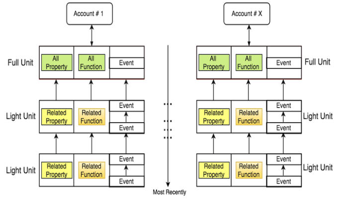
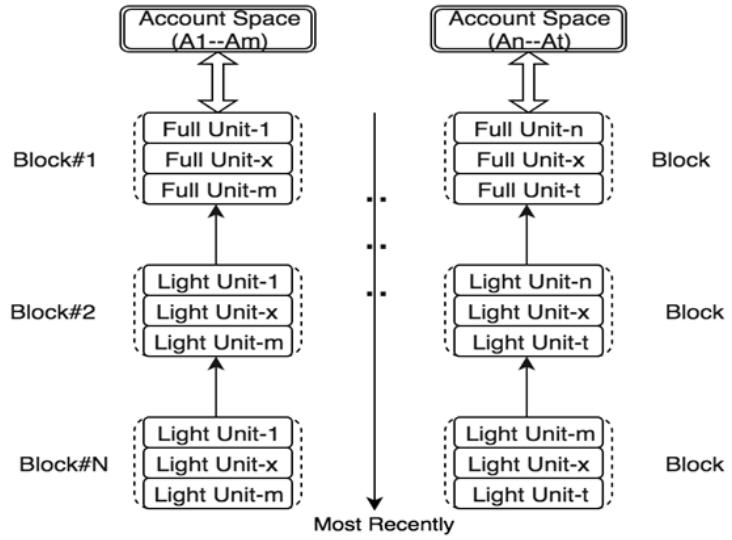

# Data Structure

## Overview

TOP Network is made up of unique data structures specifically designed for sharding and efficient data access and storage. The three main data structures used are Core Objects, the Unit Lattice, and the Block Lattice.

## Core Objects

TOP follows an object-oriented programming paradigm. Each user account and each smart-contract are represented by what we call ”Core Objects.”

### Accounts

A user account is specified by an address on TOP Chain. An account is an object containing state information and logic, including things like the Balance, Properties which store data, and Actions for each property. The account balance can also be treated as a special type of property of the account
object. An action could be a system-level function such as a transfer, or a customized action governed by a smart contract deployed by the account owner. The account object and its methods can be easily and flexibly extended with new properties and customized actions.

### Property

A property of an account is a user-defined data object, which is added as a key-value pair. The key is an arbitrary String whose value can be any data type, such as an Integer, String, List, HashMap and so on.
The account balance, a special property, exists by default when the account is generated.

### Action

An action provides flexible processing capabilities for a property. An action can be a built-in system function such as Hash and Vote, or a user-defined smart contract. Users can trigger an action by sendinga transaction or a message.

### Message

A message is an instruction that initiates an action on a property of an account. Data attached to a message contains the property, action, input parameters and output parameters. For security purposes, a message cannot alter the account balance.

### Transaction

A transaction refers to an instruction that initiates an asset transfer from one account to another. A transaction can also contain an action that will be triggered when the transaction is being processed.

## Two-Layer Lattice

The blockchain state, which is made up of all user account objects and smart contract account objects,is stored across Unit-Lattice and Block-Lattice data structures. Technically, these lattices are a form of Directed Acyclic Graph (DAG). However, unlike other DAG based projects such as IOTA, the lattice
data structure is much more organized and well suited for a sharded architecture.

### Unit Lattice

A transaction or a message sent to or from an account may change the value of a certain property and consequently the state of the account. Each transaction or message applied to an account is called a transaction record, or a Unit. When TOP Chain stores the Units of an account, each Unit is linked to the previous Unit. All of the past events on the account as well as the latest status of all its properties can be retrieved through the process of navigating through all the Units of an account from the genesis Unit (that is, the initial state of all properties when the account is created), to the lastest Unit. Essentially,all Units of an account are linked together to form a tiny chain, which is named a Unit Chain. The collection of Unit Chains of all accounts within a Shard is called a Unit Lattice.
One major benefit of this design is that consensus can be done on the account level simultaneously,which adds another opportunity for parallelization, and therefore faster throughput. This is in contrast to using a single chain per shard which records transactions from many accounts sequentially.

As show in figure above, the last Unit contains all of the information that proves the validity of the final state values of all properties in an account. As a result, the Unit Chain can be safely pruned to keep only the last Unit. TOP Chain can prune all Unit Chains within a Shard in real-time without affecting the whole system, significantly reducing the footprint of the entire blockchain.

### Block Lattice

Block-Lattice acts as a batching mechanism for consensus and cross-zone synchronization. The most recently updated Units are packaged into Table Blocks, and then linked into chains for each account sub-space. The set of these chains within a Zone forms the Block-Lattice data structure. Table Blocks are used for cross-shard synchronization, while the Block-Lattice is used for cross-zone synchronization.

