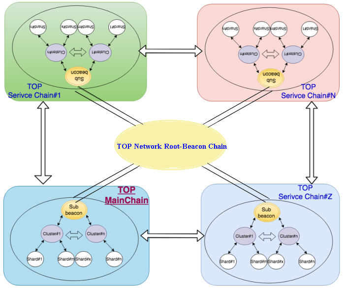

# Overview

TOP Network is the first fully sharded, entirely permissionless public chain providing high TPS, near instant confirmation times, and low to zero gas fees. Building a chain with these features is very difficult, and requires a multitude of techniques. As a result, we have developed a multi-layer scaling stratagem to accomplish these specifications.

## Overall Design

TOP Network adopts a multi-chain architecture. The entire structure of TOP Chain consists of up to 255 level-1 chains, which include the main chain and service chains. Each level-1 chain can itself support up to 255 level-2 sub-chains, and so on. For instance, a developer could branch their own level-2 chain off of the main VPN service chain specifically to support their business.

Level-1 chains are distinct loosely coupled chains. Transactions are routed to the appropriate level-1 chain based on the purpose of the transaction. If it’s for asset transfer, the transaction is routed to the main chain, while if it’s for a type of service transaction, it is routed to the relevant service chain.
Each level-1 Root-Beacon Chain is populated from a common set of nodes. Communication between each level-1 chain network is supported by TOP Network’s P2P Internet architecture, allowing for efficient communication between nodes across chain networks.

## TOP Network Mainchian

The TOP Network mainchain adopts multi-sharding, two-layer lattice based on DAG data structure and other expansion technologies, as well as hpPBFT consensus mechanism, so that the single-chain transaction processing capacity reaches 100,000 TPS. See [Fullly Sharding Mainchain (Layer 1)](/en/AboutTOPNetwork/TOPChainInfrastructure/FullyShardingMainchain(ayer-1)).

## the Root-Beacon

Like some other sharding architectures, we use a Root-Beacon Chain as part of our design. However, unlike other Root-Beacon Chain implementations, TOP Network’s Root-Beacon Chain is very lightweight, and is not involved in confirming the result of the consensus process through methods such as cross-linking. This is the case for Root-Beacon Chains in other sharding projects, which results in them becoming bottlenecks in the system,as all Shards ultimately rely on a single chain to help confirm transactions.

### Root-Beacon Chain Purposes

TOP Network’s Root-Beacon Chain has numerous roles, acting as the coordinator and archive for the system. The Root-Beacon Chain handles node registration and elections, along with staking, voting, slashing, and work-load logging. These parameters and processes are logged and handled through Root-Beacon Chain smart contracts. The Root-Beacon Chain also acts as a global clock for the whole system through the production of timing blocks at regular intervals.

### Root-Beacon Chain Nodes

In many sharding systems, the Root-Beacon Chain is run by nodes who must specifically register to act as Root-Beacon Chain nodes. This can result in a shortage of Root-Beacon Chain nodes, as usually most of the mining rewards are distributed to nodes processing transactions. This can ultimately lead to centralization of
the Root-Beacon Chain.
On TOP Network, every advance node is a potential Root-Beacon Chain node by default. The nodes with the highest stake have a higher probability of selection via VRF-FTS algorithm, which means Root-Beacon Chain operations are generally the most secure.
To add Root-Beacon Chain blocks and execute Root-Beacon Chain smart contracts, a subset of 256 nodes from the entire pool of nodes is randomly selected for each consensus round.

## TOP Network Service Chain

Each business has varying needs and workflows which cannot be satisfied by a single chain. TOP Network introduces service chains, which are pluggable chains built for specific use cases. For instance, there will be a VPN service chain, d-storage service chain etc. 

Businesses can easily deploy their own personal service chain to fit the needs of their application. More about service chain, please refer to [ServiceChainandOne-WayStateChannels(layer-2)](/en/AboutTOPNetwork/TOPChainInfrastructure/ServiceChainandOne-WayStateChannel(layer-2).md).

