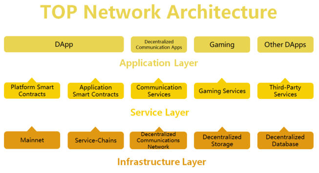

# The TOP Network Blockchain Platform

## Overview

TOP Network is a full-stack platform for DApp development and deployment. The aim is to build an ecosystem providing everything a developer would need to easily build scalable decentralized applications. This is accomplished through a comprehensive stack consisting of three layers.

## Infrastructure Layer

Through extensive R&D, TOP Network has developed the first comprehensive multi-layer sharding design, including the more difficult full-state sharding. However, we realized from the beginning that on-chain scaling is not sufficient in isolation. Asaresult, TOP has pioneered amulti-layer scaling paradigm,which integrates scaling techniques in layer-0, layer-1, and layer-2. With breakthroughs in the areas of P2Pnetworking, blockchain sharding, multi-chain architectures, and more, TOP Network supports true horizontal scale-out. 

In all, the Infrastructure Layer includes a fully sharded high-performance PoS-based public chain with a novel parallel pBFT consensus mechanism, pluggable service-chains,distributed file storage and distributed database technology, and built in layer-2 scaling. This is all supported by an underlying custom built and highly optimized "P2P Internet" networking architecture in "layer-0".

Multiple capacity expansion schemes enable single-chain transaction processing capacity up to 100,000 TPS.

High TPS, near instant confirmation times,low to zero transaction fees, and chain security, suitable for massive, high frequency business.

## Service Layer

Currently, building blockchain applications is very difficult. Only a select few developers have the abilities required to develop well made DApps, which has likely stunted the growth of the DApp space. If DApps are to become as widespread as traditional apps, comprehensive sets of developer tools are
required. TOP Network provides service layer frameworks and tooling which aid in the development process by abstracting the underlying blockchain aspects. Furthermore, TOP provides multiple types of smart contracts, including Platform Contracts for secure asset transfer, and flexible Application Level Contracts for complex business logic. Finally, the Service Layer includes industry specific development frameworks similar to what is found in the traditional application development scene.

## Application Layer

Often the most difficult part of building an App is garnering enough users to reach a critical mass where the business model begins to work. Unfortunately, this is even greater a challenge in the blockchain world, as there are virtually no users to draw from. TOP Network is uniquely positioned in the space thanks to a large pre-existing userbase. The application layer of TOP Network consists of an application ecosystem drawing from a large existing userbase which can be leveraged by third-party developers.These layers offer the three most vital components of an application platform: a scalable infrastructure,comprehensive developer tooling, and an application ecosystem with an abundance of users. This is how TOP Network is able to meet the needs of real-world businesses and large-scale applications.