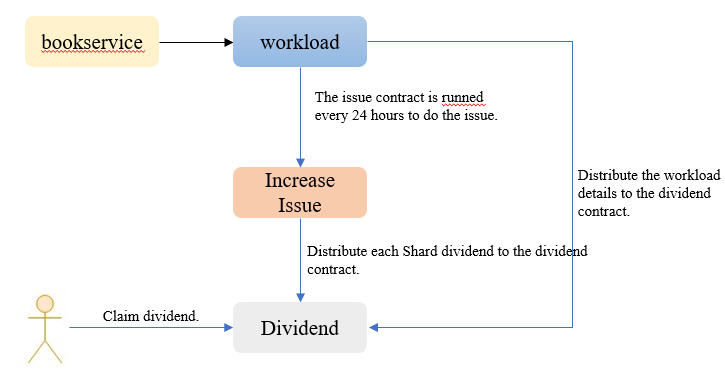

# Reward System

## Overview

The system incrementally issues TOP tokens to form a reward pool. 20% of the reward pool is rewards for node votes, 76% reward to node workload, and the remaining 4% reward will be give to on-chain governance committee members. For a node that has set a dividend ratio, all the rewards it receives will be distributed to the accounts of voters who support the node in accordance with the dividend ratio.

## Total Rewards Issued

The part reserved for rewards by the system creation is 38% of 20 billion, and the annual issuance ratio is 8% of the remaining part of the reserved reward (on-chain governance is adjustable). As the remaining part of the reserved reward decreases year by year, the issued proportion is also decreasing year by year. When the ratio of issuance is reduced to less than 2% (on-chain governance can be adjusted). Afterwards, it will be issued continuously at 2% of 20 billion every year.

Calculation method of annual total reward ratio:

Total reward in the nth year = Max (remaining reserved reward at the beginning of the nth year*8%, 2%*20 billion). The remaining reserved reward value at the beginning of the creation year is 38%*20 billion;

For example, the total reward ratio in the first year=38%*8%=3.04%, and the total reward ratio in the following year=(38%-3.04%)*8%=2.7968%.

## Workload Reward

Workload reward takes 76% of the total reward. The reward percentage is different depending on the work type. The details are as following:

| Work Type    | Node Type               | Percentage of Total Reward  |
| ------------ | ----------------------- | --------------------------- |
| Routing      | edge node               | 3%                          |
| Auditing     | advance node            | Clusters divide 10% equally |
| Verification | validator, advance node | Shard divide 60% equally    |
| Archive      | advance node            | 3%                          |

### Verification Work Reward

**Reward Object**

"validator" node and "advance" node.

**Workload Verify Statistics**

The source of validator leader is recorded in every head of unit block. The quantity of blocks produced by each validator as the leader in the shard is reported to Sub-Beacon at regular intervals. Sub-Beacon records each validator in each segment. The amount of verification work of the piece is used to calculate the verification work reward.

**Reward Rules**

Firstly, the total verification work reward is divided equally according to the shards, and then the reward is divided according to the proportion of the verification work of the node in the shard.

verification work reward = validator workload / total shard workload \* rewards issued per clock block \*Clock block height \* 60% / shards

Description

> The rewards issued per clock block change along with the on-chain governance parameters change.

### Audit Work Reward

**Reward Object**

"validator" nodes and "advance" nodes.

**Audit Workload Statistics** 

The source of auditor leader is recorded in every head of unit block. Shards will report block produced by each auditor as the leader in this shard to the Beacon. The Beacon records each auditor in each shards. The summary value of the audit workload is used to calculate the audit work reward.

**Reward Rules**

Firstly, the total audit work reward (that is, 10% of the total reward pool) is divided equally by the cluster, and then the reward is divided according to the proportion of the audit work of the node in the shard.

audit work reward = auditor workload / total shard workload \* rewards issued per clock block \*Clock block height \* 60% / shards

Description

> The rewards issued per clock block change along with the on-chain governance parameters change.

### Archive Work Reward

**Reward Object**

"advance" nodes. Inactive archive will not be rewarded, and nodes with zero deposit will not be rewarded.

**Reward Rules**

The total reward is divided equally, and the work reward of the node with zero deposit is collected into the "community fund account".

archive work reward=rewards issued per clock block*Clock block height*3%/archives

### Edge Work Reward

**Reward Object**

"edge" nodes. Inactive edge will not be rewarded, and nodes with zero deposit will not be rewarded.

**Reward Rules**

The total reward is divided equally, divided every 24 hours.

### Zero Workload

When the validator, auditor node has no workload, the corresponding total workload reward is awarded to a specific public contract account. That is, if a shard/ Cluster is "zero workload" in a statistical period , the shard/cluster reward will be awarded to a specific public contract account; If all Shards/Clusters are "zero workload", the total node workload reward in this round will be awarded to a specific public contract account.

Voters who vote for a zero workload node will not receive any dividends from the node workload reward, but the voter will still receive the dividend from the node perform as other roles (such as edge and archive).

Pay attention to the definition of zero workload, table contracts will not report the workload if its cumulative workload is lower than the threshold (on-chain governance) in fixed cycle. If all the table of the shard/cluster did not report a deal of workload in a statistical period, then the shard/cluster workload in the Sub-Beacon contract is 0, the nodes in the shard/cluster are zero effort.

TCC can destroy the amount in public accounts through on-chain governance, or transfer funds to TCC designated accounts.

## Node's Ballot Reward

**Rewawrd Object**

Nodes earn more than 0 votes.

**Node Ballot Reward**

20% of the entire reward.

**Reward Calculation and Distrubition Cycle**

24 Hours.

**Count Votes**

Shard regularly reports the aggregated value of votes obtained by each node in this shard to Sub-Beacon, and Sub-Beacon calculates the node vote reward based on the sum of the votes of the node in all shards to obtain the total number of votes for a certain node.

**Reward Rules**

The total node vote rewards are distributed according to the proportion of the nodes' votes.

Node vote reward*=number of votes/total number of votes in the entire network\*20 billion \* M% \*20%*

## Reward Withdraw

Each node can apply for withdrawal once within 24 hours. The node can only withdraw the part for which the reward has been calculated, and cannot withdraw below 1000 TOP.

Withdrawal can be credited immediately.

After the node is cancelled, the rewards that have been calculated and issued to the contract can continue to be received, but the system will not continue to calculate and issue more rewards to this node.

## Reward Distribution Process

Business flow: Nodes can check their total remaining amount of rewards to be collected, and apply to complete the collection of rewards. At most once every 24 hours, the reward amount needs to be ≥1000 TOP each time.

Fund flow: Sub-Beacon transfers the current reward amount from the 38% mining fund pool (or out of nothing) to the shard-level reward pool every 24 hours → the node or voter applies for withdrawal, and the reward funds are transferred to the node or voter account.

