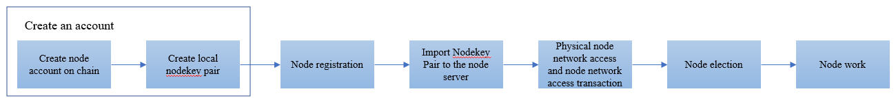

# Node Signature

## Overview

The system saves the public and private keys of the account in a keystore encrypted file, ensuring the security of the account private key.

In the case that the account keystore needs to be uploaded to the cloud server, the system provides another set of methods for node signatures:

Use a pair of public and private keys without assets to bind to the node, and the node uses the private key to sign when sending a transaction.

Even after the private key is stolen, the node's own assets will be safe.

## Node Signature Process

1. Create an account: The client initiates a transaction to create an account on the chain, and then the user creates a pair of public and private keys locally (stored in a keystore file) on the client, and the public and private keys will be used as the nodekey.

2. Node registration: On the client side, use the node account to initiate a transaction, sign with the private key of the node account, and execute a "node registration" transaction. After the node registration transaction is successful, complete the binding of the node account and the node key public key;

3. Import node key to the node server: The user uploads the keystore file of nodekey to the node server.

4. Physical node network access and node network access transaction: Use the private key of nodekey to start the xnode node process, one is to initiate a physical network access request and the other to initiate a transaction with the node account, and sign with nodekey to initiate a "node access" transaction.

5. Node election: Nodes are elected regularly. After the election, the node account and bound nodekey will be broadcast to the entire network in the election block.

6. Node work: After receiving the election block, the node can use the nodekey to sign the block.

