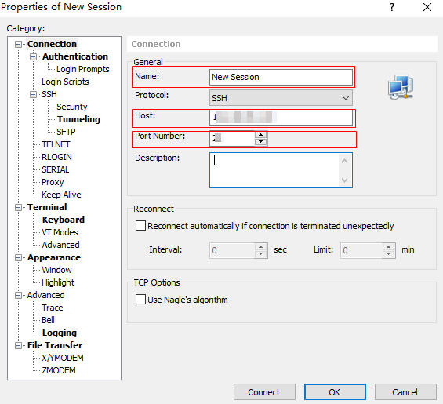
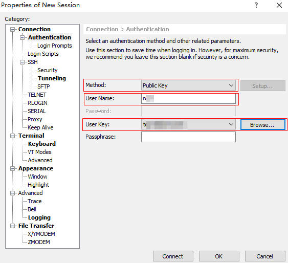

# Install TOPIO

Please install TOPIO before you using it.

## Configure the Cloud Server 

### Operating System 

| Operating System | Description                                    |
| ---------------- | ---------------------------------------------- |
| Linux            | CentOS 7, 64-bit, Kernel Version 3.10 or above |

### Server Recommended Configuration

Different types of nodes have different requirements for cloud server configuration. Please refer to the following table for the minimum configuration.

| Node Role | Hardware Configuration                 |
| --------- | -------------------------------------- |
| edge      | 2CPU/4GB men<br/>40GB SSD<br/>100Mb/s  |
| validator | 2CPU/4GB men<br/>60GB SSD<br/>100Mb/s  |
| advance   | 4CPU/8GB men<br/>100GB SSD<br/>200Mb/s |

### Server Account Permission 

You can start TOPIO in one of the following user modes.

| Cloud Server User Type | Description                                                  |
| ---------------------- | ------------------------------------------------------------ |
| Normal User            | TOPIO needs to be started with sudo permissions, and the user needs to mark "sudo" before all commands.Such as start topcl：`sudo topio topcl`。 |
| Root User              | Unlimited.                                                   |

## Connect to Cloud Server

If you need to access the TOPIO cloud server remotely from a Windows or Mac system, please install Xshell in advance.

| Software | Version | Description |
| -------- | ------- | ----------- |
| Xshell   | -       | -           |

Step 1 Start Xshell. Then select "file > new" to enter the new session box. 

Step 2 Enter the name, server host IP, modify the port number.



Step 3 Enter the "Authentication" page.

Method: Public Key.

User Name: The server user name.

User key: Generated when configuring cloud server.



### Download the TOPIO Installation File

Execute the following command to download the TOPIO installation file to the specified directory。

```
wget -O /home/cathy https://github.com/telosprotocol/topj/releases
```

## Installation Process

Step 1 Execute the following command to enter the TOPIO installation file directory.

```
cd /home/cathy
```

Step 2 Execute the following command to unzip the installation file.

```
tar zxvf topio-0.0.0.0-debug.tar.gz
```

Step 3 Execute the following command to enter the unzip directory. 

```
cd topio-0.0.0.0-debug
```

Step 4 Execute the TOPIO installation script.

```
sh install.sh
```

## Verify Installation

Verify if the installation was successful.

### Installation Success

Execute `topio -v` in any directory to verify whether the installation was successful.

 If the following is output, the installation is successful.

```
topio version: 0.0.0.0
git branch: topio-new-cons-dev
git log -1:
commit 6c854aed9647f1ef6020ff7d972f3235abbc1eed
Author: smaug <smaug.jiao@topnetwork.org>
Date:   Mon Jun 1 10:45:12 2020 +0800

    fix stty echo bug;
build date_time: Jun  1 2020 14:36:08
build user: uid=0(root)
build host: Jiao
build path: /root/top/xchain/cbuild
xbase version: 1.0.33
MD5:94fd89bb3eb5c95f155b2834e00b3657
```

Caution:

> If the MD5 code is inconsistent with the installation package's MD5 code displayed on the official website, although the installation is successful, there is the possibility that the installation file is tampered with! MD5 Official link:

### Installation Fail

Execute `topio -v` in any directory to verify whether the installation was successful.

If the following is output, the installation is failed.

```
topio(10400),not found component(/usr/bin/libxtopchain.so) topio(10400),not found component(/lib/libxtopchain.so) topio(10400),not found component(/lib64/libxtopchain.so)
```

If the installation fails, please redo the installation steps.

