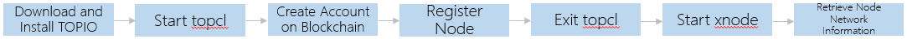
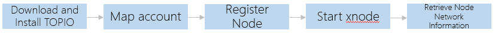

# Quick Start

This chapter explains how to send transactions on the blockchain and join the TOP Network.

* New Users



* Ethereum Cross - chain Users



This chapter takes guiding new users to join TOP Network as an example. For ethereum cross-chain users, please log in [TOP Network Staking DApp](#http://104.248.153.202:7800/swap?id=2) and operate according to the page guidance.

## Download and Install TOPIO

Download and install TOPIO.For details, please refer to [Install TOPIO](/en/Tools/TOPIO/InstallTOPIO.md)。

caution:

> The following samples use the root user account. If you use a normal user account (sudo permissions are required), prefix all commands with "sudo".

## Entry topcl

After installing TOPIO,  execute the following command to enter "topcl".

```
topio topcl
```

## Create Account on Chain

In TOP Network, you should have an account on the chain first to interact with it, including retrieving information, sending transactions, node management and so on.

Step 1 Create a local account.

Execute the following command to create a local account.

```
$> wallet createaccount
Please set a password for the account keystore file. The password must consist of Numbers and Letters, 8 to 16 characters.
Or Ctrl+D skips this step.
Please Input Password Again
Please set a password hint! If don't, there will be no hint when you forget your password.
basketball
Successfully create an account locally!

You can share your public key and account address with anyone.Others need them to interact with you!
You must nerver share the private key and account keystore file with anyone!They control access to your funds!
You must backup your account keystore file!Without the file,you’ll be impossible to access account funds!
You must remember your password!Without the password,it’s impossible to use the keystore file!
Public Key: BBtwShz7qgisA4RsjpvgmijBAAPlh9m/bRh2OsRLK7erroPUD0vFQcwWh4cwVlaIRugxq9b+L67JMztdLipeygc=
Account Address: T-0-LKQULGZTa6uGPDmEtLMaCLgy922NLQntNs
Account Keystore File Path: /root/Topnetwork/keystore/T-0-LKQULGZTa6uGPDmEtLMaCLgy922NLQntNs
```

The account keystore file will be generated when creating the local account. The keystore file's default storage directory:/root/Topnetwork/keystore.

Step 2 Create an account on the blockchain.

You can create your account on the blockchain via transferring TOP Tokens to the local account you created in the previous step by an account with enough balance that has been on the blockchain.

Step3 Confirm account balance.

Caution：

> In TOPIO, account balance, transaction deposit,etc.The unit is uTOP, 1TOP=1*10^6 uTOP.

Sending transactions on TOP Network chain consumes certain gas resources. If the account balance is greater than or equal to 100*10^6 uTOP, the system will give the account 25,000 Tgas for free.

Each transaction requires at least 100,000 uTOP as the transaction deposit, otherwise the transaction will be discarded.

If the account‘s gas resources are sufficient, the transaction deposit will be returned to your account immediately after the transaction is successful. If the account's gas resources are insufficient to pay the transaction costs, a fee shall be deducted from the transaction deposit to exchange gas resources to pay the transaction costs, and the deducted TOP tokens will be destroyed.

If the transaction deposit is not enough to exchange gas resources, the transaction will eventually fail.

For transactions that running the contracts deployed on the Root-beacon (registration node-related, proposal related, starting xnode), in addition to the minimum transaction deposit of 100,000 uTOP tokens, the system will automatically deduct the 100*10^6 uTOP tokens as transaction fee from the sender's account and then destroy it.

The resources consumed by transaction, please refer to [Resource Model](/en/AboutTOPNetwork/Protocol/ResourceModel.md)

Therefore, to register node, in addition to the minimum registration deposit required for node registration (see [Registration Node](# registration Node)), the account balance should have an additional balance of at least 200.1*10^6 uTOP.

**Reset the Default Account**

Your newly created account is used as the default account to send transactions.

If you restart topcl , you need to execute the following command to reset the default account.

```
wallet SetDefault /root/Topnetwork/keystore/T-0-LVUuJXHbfzshf6RM44iCavc24SdMHHCQjE
```

## Register Node 

Step 1 Create the public-private key pair.

Caution：

> Optionally, instead of creating a public-private key pair, you can use the node account public key pair as the node sign key when registering.

To protect your account assets better, it is recommended that you use `Wallet createKey` to create a asset-free public-private key pair, the public key is used as the node sign key when registering node, the private key is used to sign the node when it is working after it has been elected into the network.

Caution：

> Make sure the keystore file of your node sign key is on the server where your TOPIO is running.

```
$> wallet createkey
Please set a password for the keystore file. The password must consist of Numbers and Letters, 8 to 16 characters.
Or Ctrl+D skips this step.
Please Input Password Again
Please set a password hint! If don't, there will be no hint when you forget your password.
basketball
Successfully create an key locally!

You can share your public key with anyone.Others need it to interact with you!
You must nerver share the private key and keystore file with anyone!They can use them to make the node malicious.
You must backup your keystore file!Without the file,you may not be able to send transactions.
You must remember your password!Without the password,it’s impossible to use the keystore file!
Public Key: BBYTqmkmNksMjX/ydgnixYP1fVmd0zHQGqW1xCBo4zXNrWf3H/XXqe+NsUkvrSuZ4wtDbJqdE7NDU752gMFd5+g=
Keystore File Path: /root/Topnetwork/keystore/Lgq6CojT16wVRSCEuGcsQRPg8eRsz3auyJ
```

Step 2 Register node.

TOP Network currently has three types of nodes: edge node, validator node, and advance node. You can register as one of these three types of nodes.

Advance nodes can perform multiple roles in different networks: validator, auditor, archive, Root-Beacon and Sub-Beacon. 

An advance node, however, cannot be auditor and validator in auditor group and the validator group under its jurisdiction at the same time.

The minimum registration deposit of each node is shown in the table below.

| Node Type | Minimum Registration Deposit |
| --------- | ---------------------------- |
| edge      | 100,000*10^6 uTOP            |
| validator | 500,000*10^6 uTOP            |
| advance   | 1,000,000*10^6 uTOP          |

Execute the following command to register the node.

```
$> system registerNode 500000000000 validator qiqi --node_sign_key BBYTqmkmNksMjX/ydgnixYP1fVmd0zHQGqW1xCBo4zXNrWf3H/XXqe+NsUkvrSuZ4wtDbJqdE7NDU752gMFd5+g=
$> {
   "errmsg" : "ok",
   "errno" : 0,
   "sequence_id" : "28",
   "tx_hash" : "0x15109aaf5f3084f66dc8767a39787abc0629d8eb66099e0712f39033af7e26c3",
   "tx_size" : 261
}
Please use command 'get transaction' to query transaction status later on!!!
```

The request parameters are shown in the table below.

| Parameter Name   | Required | Default  Value | Parameter Type | Description                                                  |
| ---------------- | -------- | -------------- | -------------- | ------------------------------------------------------------ |
| register_deposit | Yes      | -              | Uint64         | Node registration deposit. The unit is uTOP。                |
| node_type        | Yes      | -              | String         | The node type includes edge node, validator and advance node. The advance node can perform roles as archive, validator, and auditor.<br/>You can register as one of the three types.<br/>After registering as an advance node, what kind of work role the node is elected depends on the votes it receives:<br/>If the advance node is to be elected as the role of auditor, archive, Root-Beacon or Sub-Beacon, the votes must be greater than or equal to the actual registration deposit of the node (Here, the node deposit is calculated by TOP, not uTOP).<br/>When the votes falls below the actual pledge deposit, the advance node can only be elected as validator.<br/>Caution：<br/>Node's votes must be voted by other nodes or by this node himself. |
| nodename         | Yes      | -              | String         | Node nick name.                                              |

The option is shown in the table below.

| Option Name     | Default Value          | Type   | Description                                                  |
| --------------- | ---------------------- | ------ | ------------------------------------------------------------ |
| --node_sign_key | Public key of account. | String | You can use the the node account's public key (Base64) as the node sign key when registering node.<br/>It is recommended that you use `wallet createKey` to create a asset-free public-private key pair to protect your account assets better, the private key is used to sign the node when it is working after they have have been elected into the network.<br/>Please enter the corresponding public key (Base64), which can be used by other nodes for decryption.<br/>If node_sign_key is not set, the account public key is used by default. |

After executing the command, the transaction hash is returned to query whether the transaction is successful or not, and whether the node information can be queried to determine whether the node registration is successful.ee If the transaction is successful and the node information can be queried, the node registration is successful; if the transaction fails and the node information cannot be queried, the registration fails.

Query transaction information please refer to [Retrieving Information from the Blockchain](docn-en/Tools/TOPIO/topcl/RetrievingInformationFromtheChain.md).

Query node information please refer to [System Transactions](/en/Tools/TOPIO/topcl/SystemTransactions.md).

In addition to node registration, you can also sending other transactions on the blockchain, such as staking, voting node,etc.

## Exit topcl

After completing node registration in topcl, you needs to exit tocl and start the node process before joining the TOP Network physical network and entering the candidate pool to wait for the election. For the node election rules, please refer to [Node Election](/en/Node/NodeElection.md).

Executing the following command to exit topcl.

`exit`、`q`、`quit`、`logout`.

## Start xnode

Caution：

> To retrieve node network information, it is recommended that you use the TOPIO console mode here, that is, start xnode meanwhile entering TOPIO interactive environment.
>
> In order to run multiple node processes locally, you must create separate data directory for each node and specify the local service port. If only one node process is running locally, there is no need to specify a data directory and a local service port.

Execute the following command to start TOPIO in console mode.

```
topio --account_addr T-0-LVUuJXHbfzshf6RM44iCavc24SdMHHCQjE -k /root/Topnetwork/keystore/Lgq6CojT16wVRSCEuGcsQRPg8eRsz3auyJ --password 123456789jjj --datadir /home/cathy4 --admin_http_port 56391 console
```

The optional description is shown in the following table.

| Option Name       | Default Value | Type   | Description                                                  |
| ----------------- | ------------- | ------ | ------------------------------------------------------------ |
| --account_addr    | -             | String | Node account address.                                        |
| -k,--keystore     | -             | String | The keystore file path of the node sign key must be set when registering this node. For example, if the node account public-private key pair is used as the node sign key, the node account keystore file path is stored here. If a public-private key pair is used as the node sign key, the public-private key pair keystore file path is stored here.<br/>If you did not set node sign key when registering the node, the system uses the account public key as node sign key by default, then here is the account keystore file path. |
| -p,--password     | -             | String | The password of the account keystore file or the public-private key pair keystore file corresponding to the node sign key. |
| -d,--datadir      | -             | String | Specify the data directory for the node. If not specified, the data directory of the node the default to "root/Topnetwork". If you specify the data directory "/home/cathy4," the keystore file and blockchain data are stored in this directory. |
| --admin_http_port | 8000          | String | Local server port. If not specified, the default is "8000".  |

## Retrieve Node Network Information

### Net Joined

Execute the following command to query whether the node had successfully joined the physical network.

```
xnode net joined
```

If the query returns "true", the node successfully joined the network. If returns "false", the node failed to join.

### Network ID

Execute the following command to query the node's network ID after the node has been elected.

```
xnode net netID
```

| Network ID                                                   | Description                                   |
| ------------------------------------------------------------ | --------------------------------------------- |
| xnetwork_id[0]                                               | The node has not been elected to the network. |
| xnetwork_id[0] zone_id[1]、cluster_id[0]、group_id[0]        | Root-Beacon Network                           |
| xnetwork_id[0] zone_id[2]、cluster_id[0]、group_id[0]        | Sub-Beacon Network                            |
| xnetwork_id[0] zone_id[14]、cluster_id[1]、group_id[1]       | Archive Network                               |
| xnetwork_id[0] zone_id[15]、cluster_id[1]、group_id[1]       | Edge Network                                  |
| xnetwork_id[0] zone_id[0]、cluster_id[1]、group_id[n],n∈[1,63] | Audit Network                                 |
| xnetwork_id[0] zone_id[0]、cluster_id[1]、group_id[m],m∈[64,126] | Validate Network                              |

Please use the xnode command to query more information about the network. For details, please refer to [Retrieve Node Network Information](/en/Tools/TOPIO/xnode/RetrieveNodeNetworkInformation.md) 。