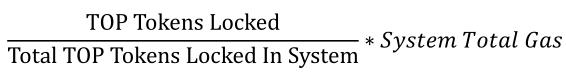

# Send Transactions

## Overview

The "sendtx" commands support sending transactions like transfer, node staking (lock TOP Token to exchange gas, lock TOP token to exchange votes), deploying/running application smart contract, etc.

## Sendtx Commands

Execute `sendtx -h` or ` sendtx --help` view all sendtx commands.

```
COMMANDS:
    callContract                    Send a transaction to a contract to execute it.
    deployContract                  Create a contract account and publish code on it.
    stakeGas                        Lock TOP tokens to get gas.
    stakeVote                       Lock TOP tokens to get votes.
    transfer                        Transfer TOP tokens from account to account.
    unstakeGas                      Unstake gas from your account and unlock TOP tokens.
    unstakeVote                     Unstake votes from your account and unlock TOP tokens.

OPTIONS:
    -h --help                       Show a list of commands or help for one command.
```

Execute `sendtx stakeVote -h` or `sendtx stakeVote--help` view help for subcommand `stakeVote`.

```
Lock TOP tokens to get votes.

USAGE:
    sendtx stakeVote votes_num lock_duration

OPTIONS:
    -h --help                       Show help information for one command.

EXAMPLE:
    sendtx stakeVote 1000 30
```

## Command Instructions

### Transaction Costs

Caution：

> In TOPIO, account balance, transaction deposit,etc.,unit is uTOP, 1TOP=1*10^6 uTOP.

Sending transactions on TOP Network chain consumes certain gas resources. If the account balance is greater than or equal to 100*10^6 uTOP, the system will give the account 25,000 Tgas for free.

Each transaction requires at least 100,000 uTOP as the transaction deposit, otherwise the transaction will be discarded.

If gas resources are sufficient, the transaction deposit will be returned to your account immediately after the transaction is successful. A fee shall be deducted from the transaction deposit to exchange gas resources to pay the transaction costs  if the account's gas resources are insufficient to pay the transaction costs, and the deducted TOP token will be burned.

If the transaction deposit is not sufficient to stake enough gas resources to pay the transaction costs, the transaction will eventually fail.

More about transaction costs, please refer to [Resource Model](/en/AboutTOPNetwork/Protocol/ResourceModel.md).

### Transfer

Transfer TOP token from one account to another.

**Request**

`sendtx transfer`

**Request Parameters**

| Parameter Name | Required | Default Value | Parameter Type | Description                                                  |
| -------------- | -------- | ------------- | -------------- | ------------------------------------------------------------ |
| account_addr   | Yes      | -             | String         | The target account address, a normal user account or contract account. |
| amount         | Yes      | -             | String         | Transfer amount, the unit is uTOP.                           |

**Options**

| Option Name     | Default Value | Type   | Description                                                  |
| --------------- | ------------- | ------ | ------------------------------------------------------------ |
| -t,--tx_deposit | 10,0000 uTOP  | String | Transaction deposit,the default and minimun is 100,000 uTOP. |
| -n,--note       | -             | String | Transfer note.                                               |
| -h,--help       | -             | -      | Check the commands' help information.                        |

**Response Parameters**

| Parameter Name | Parameter Type | Description                                                  |
| -------------- | -------------- | ------------------------------------------------------------ |
| tx_hash        | String         | The transaction hash which can be used to retrieve the transaction consensus status. |
| tx_size        | Uint16         | The gas consumed by transaction consensus is related to the transaction size. |

**Request sample**

```
sendtx transfer T-0-LXC1xmtn1bXB9CAinqNoDtQJCz1Mu9CXfK 20
```

**Response Schema**

Return the hash and transaction size of the transaction, and query whether the transaction is successful and whether the account balance has changed via `get transaction` and `get account` to determine whether the transfer is successful.

* Successful

```
{
	"errmsg": "ok",
	"errno": 0,
	"sequence_id": "8",
	"tx_hash": "0x34ca8f317107ce6b01c933b017f28e6cf0f84f2e31627a8349f167c1aa9ade10",
	"tx_size": 306
}
Please use command 'get transaction' to query transaction status later on!!!
```

Example: An account with a balance of 1,000,000,000,000 uTOP transfered 20 uTO to another account.

Execute `get Account` to query the account's balance, is reduced by 20 uTOP.

Execute `get Transaction` to query the transaction by transaction hash, the consensus final status is "success".

* Failed

When the transaction is failed, the transaction size and transaction hash are also returned.

```
{
	"errmsg": "ok",
	"errno": 0,
	"sequence_id": "4",
	"tx_hash": "0xc73f6295bc5b6be1ace273d59504f4c97d1b01cd2d3301c47cf042e28795e35b",
	"tx_size": 306
}
Please use command 'get transaction' to query transaction status later on!!!
```

Execute `get Transaction` to query the transaction by transaction hash, the consensus final status is "failure", execute `get account` to query the account balance, if the account balance does not change, then the transfer failed.

### Lock TOP Token to Get Gas

The exchange price for gas is:



**Request**

`sendtx stakeGas`

**Request Parameters**

| Parameter Name | Required | Default Value | Parameter Type | Description                                |
| -------------- | -------- | ------------- | -------------- | ------------------------------------------ |
| account_addr   | Yes      | -             | String         | The account address about to exchange gas. |
| locked_utop    | Yes      | -             | String         | Locked TOP token amount,the unit is uTOP.  |

**Options**

| Option Name | Default Value | Type | Description                           |
| ----------- | ------------- | ---- | ------------------------------------- |
| -h,--help   | -             | -    | Check the commands' help information. |

**Response Parameters**

| Parameter Name | Parameter Type | Description                                                  |
| -------------- | -------------- | ------------------------------------------------------------ |
| tx_hash        | String         | The transaction hash which can be used to query the transaction consensus status. |
| tx_size        | Uint16         | The gas consumed by transaction consensus is related to the transaction size. |

**Request Sample**

```
sendtx stakeGas T-0-LQHpzTF1jjj8ie4g7SYPCPvi5D5c2Q3nP5 1000
```

**Response Schema**

* Successful

```
{
	"errmsg": "ok",
	"errno": 0,
	"sequence_id": "13",
	"tx_hash": "0x16f7ba7580fd23b1c900323937b099c9e73c5d14df787c58de8f4388820ff1ba",
	"tx_size": 306
}
Please use command 'get transaction' to query transaction status later on!!!
```

Execute `get Transaction` to query the transaction, the consensus final status is "success", execute `get account` to query the account's total gas and available gas, if they have corresponding changes, then the stake is a success.

* Failed

Lock all account balance to exchange gas.

```
Error! Exception Thrown stoi
```

### Lock Token token to Get Vote

Rules for exchanging votes:

locked TOP token=votes_amount / [ 1.04^(lock_duration / 30 - 1) ], lock_duration < 570；

locked TOP token=vote_amount / 2,                       lock_duration >= 570。

The longer the lock duration is, the fewer TOP tokens are locked for the same number of votes.

**Request**

`sendtx stakeVote`

**Request Parameters**

| Parameter Name | Required | Default Value | Parameter Type | Description                                                  |
| -------------- | -------- | ------------- | -------------- | ------------------------------------------------------------ |
| vote_amount    | Yes      | -             | Uint 64        | Amount of votes to be exchanged, at least 10,000 at a time.  |
| lock_duration  | Yes      | -             | Uint 16        | TOP token lock duration. The the unit is "day".<br/>The lock duration must be at least 30 days and must be an integer multiple of 30. |

**Options**

| Option Name | Default Name | Type | Description                           |
| ----------- | ------------ | ---- | ------------------------------------- |
| -h,--help   | -            | -    | Check the commands' help information. |

**Response Parameters**

| Parameter Name | Parameter Type | Description                                                  |
| -------------- | -------------- | ------------------------------------------------------------ |
| tx_hash        | String         | The transaction hash which can be used to query the transaction consensus status. |
| tx_size        | Uint16         | The gas consumed by transaction consensus is related to the transaction size. |

**Request Sample**

Exchange 10000 votes, lock duration is 30 days.

```
sendtx stakeVote 10000 30
```

**Response Schema**

* Successful

```
{
	"errmsg": "ok",
	"errno": 0,
	"sequence_id": "25",
	"tx_hash": "0x14a3301e093d27e351b4cfe036456419830d4f43ba6938fe91e6641b1c8e90aa",
	"tx_size": 284
}
Please use command 'get transaction' to query transaction status later on!!!
```

Execute `get Transaction` to query the transaction by transaction hash, the consensus final status is "success", execute `get account` to query the account's unused vote, if it has corresponding change, then the stake is a success.

* Failed


```
{
	"errmsg": "ok",
	"errno": 0,
	"sequence_id": "28",
	"tx_hash": "0x3eadada0895b86aa502627f89406d07f085681381648aa1479fbc5f183dc93ea",
	"tx_size": 284
}
Please use command 'get transaction' to query transaction status later on!!!
```

Execute `get Transaction` to query the transaction by transaction hash, the consensus final status is "failure", execute `get account` to query the account's unused vote, if it does not have any changes, then the stake is a failure.

### Deploy Application Smart Contract

**Request**

`sendtx deployContract`

**Request Parameters**

| Parameter Name | Required | Default Value | Parameter Type | Description                                                  |
| -------------- | -------- | ------------- | -------------- | ------------------------------------------------------------ |
| gas_limit      | Yes      | -             | Uint64         | Upper limit of gas that the contract is willing to pay for each transaction from the sender. The unit is Tgas. |
| amount         | Yes      | -             | Uint64         | It will create a contract account when deploying application contract.<br/>If you want the contract account to get free gas, you must transfer at least 100*10^6 uTOP tokens to the contract account. |
| contract_path  | Yes      | -             | String         | Contract code file path.                                     |

**Options**

| Option Name  | Default Value     | Type   | Description                                                  |
| ------------ | ----------------- | ------ | ------------------------------------------------------------ |
| -h,--help    | -                 | -      | Check the commands' help information.                        |
| --tx_deposit | 100,000uTOP token | String | Transaction deposit, the minimum and default is 100,000 uTOP. |

**返回参数**

| Parameter Name   | Parameter Type | Description                                                  |
| ---------------- | -------------- | ------------------------------------------------------------ |
| tx_hash          | String         | The transaction hash which can be used to query the transaction consensus status. |
| tx_size          | Uint16         | The gas consumed by transaction consensus is related to the transaction size. |
| contract_account | String         | The contract account address created by the deploying contract,begins with the symbol "T-3". |

**Request Sample**

```
sendtx deployContract 100 1000 /home/git/TopPyFrame/apitest/lua_script/create_key_rename.lua 
```

**Response Schema**

* Successful

```
contract account: T - 3 - Ma6xiGnaK2Szr6kQvnJvmJa5zw5s5Cb8RJ {
	"errmsg": "ok",
	"errno": 0,
	"sequence_id": "25",
	"tx_hash": "0x572bcc1ac187ff0bd924b826728566f92cbceca74be4382eee1d6cdc53272dec",
	"tx_size": 367
}
Please use command 'get transaction' to query transaction status later on!!!
```

Execute  `get Transaction`  to query the transaction by transaction hash, the consensus final status is "success", then succeed to deploy the application contract.

* Failed

Also returns the transaction hash and transaction size, execute  `get Transaction`  to query the transaction  by transaction hash, the consensus final  status is "failure",then failed to deploy the application contract.

### Run Application Smart Contract

**Request**

`sendtx runContract`

**Request Parameters**

| Parameter Name | Required | Default Value | Parameter Type | Description                                                  |
| -------------- | -------- | ------------- | -------------- | ------------------------------------------------------------ |
| amount         | Yes      | -             | Uint64         | The amount transfered to the contract account. The unit is uTOP. |
| contract_addr  | Yes      | -             | String         | The contract account address created by deploying contract, begins with the symbol "T-3". |
| contract_func  | Yes      | -             | String         | The name of the contract function.                           |
| param_type     | Yes      | -             | String         | 1--Unit64;<br/>2--String;<br/>3--Bool。                      |
| param_value    | Yes      | -             | -              | Parameter value.                                             |

**Options**

| Option Name  | Default Value     | Type   | Description                                                  |
| ------------ | ----------------- | ------ | ------------------------------------------------------------ |
| -h,--help    | -                 | -      | Check the commands' help information.                        |
| --tx_deposit | 100,000uTOP token | String | Transaction deposit, the minimum and default is 100,000 uTOP. |

**Response Parameters**

| Parameter Name | Parameter Type | Description                                                  |
| -------------- | -------------- | ------------------------------------------------------------ |
| tx_hash        | String         | The transaction hash which can be used to query the transaction consensus status. |
| tx_size        | Uint16         | The gas consumed by transaction consensus is related to the transaction size. |

**Request Sample**

Sample 1：

```
sendtx runContract 1000 T-3-MbEfwERMNw9c4oKbLtfkWBkL2KFRsahEDe set_key 1,1|2,a|3,true
```

The name of the contract function is "set_key".

"1,1":

parameter type:Uint64,parameter value:1.

"2,a":

parameter type:String,parameter value:a.

"3,true"

parameter type:Bool,parameter value:true.

Sample 2 ：

```
sendtx runContract 1000 T-3-MnyWSV2r64tWe92vKb4ivGitK8noAcBVFQ add 1,1|1,2
```

The name of the contract function is "add".

"1,1":

parameter type:Uint64,parameter value:1.

"1,2":

parameter type:Uint64,parameter value:2.

**Response Schema**

* Successful

```
{
	"errmsg": "ok",
	"errno": 0,
	"sequence_id": "1",
	"tx_hash": "0x9d093200beceab10f693a733553daa5e633ffc7bf2c6a546b700dec1ab6da4a8",
	"tx_size": 316
}
Please use command 'get transaction' to query transaction status later on!!!
```

Execute  `get Transaction`  to query the transaction by transaction hash, the consensus final status is "success", then succeed to deploy the application contract.

* Failed

Also returns the transaction hash and transaction size, execute `get Transaction` to query the transaction by transaction hash, the consensus final status is "failure", then failed to deploy the application contract.

### Unlock TOP Token for Getting Gas

After initiating the unlock, you have to wait 24 hours and send a transaction (not a query) before the unlocked TOP tokens are received.

**Request**

`sendtx unstakeGas`

**Request Parameters**

| Parameter Name | Required | Default Value | Parameter Type | Description                                  |
| -------------- | -------- | ------------- | -------------- | -------------------------------------------- |
| account_addr   | Yes      | -             | String         | The account address to unlock TOP token.     |
| unlocked_utop  | Yes      | -             | String         | Unlocked TOP token amount. The unit is uTOP. |

**Options**

| Option Name | Default Value | Type | Description                           |
| ----------- | ------------- | ---- | ------------------------------------- |
| -h,--help   | -             | -    | Check the commands' help information. |

**Response Parameters**

| Parameter Name | Parameter Type | Description                                                  |
| -------------- | -------------- | ------------------------------------------------------------ |
| tx_hash        | String         | The transaction hash which can be used to query the transaction consensus status. |
| tx_size        | Uint16         | The gas consumed by transaction consensus is related to the transaction size. |

**Request Sample**

```
sendtx unstakeGas T-0-LQHpzTF1jjj8ie4g7SYPCPvi5D5c2Q3nP5 1000
```

**Response Schema**

* Successful

```
{
	"errmsg": "ok",
	"errno": 0,
	"sequence_id": "30",
	"tx_hash": "0xb83f304a26d2ffe6a3b59eb01fd5269218367481c55b4ec15d60abdc6129380d",
	"tx_size": 306
}
Please use command 'get transaction' to query transaction status later on!!!
```

Execute `get Transaction` to query the transaction by transaction hash, the consensus final status is "success", execute `get account`  to query the account's available gas, if it has corresponding change, then succeed to unlock TOP tokens.

* Failed

Also returns the transaction hash and transaction size, execute  `get Transaction` to query the transaction by transaction hash, the consensus final status is "failure", then failed to unlock TOP tokens.

### Unlock TOP Token for Getting Votes

During the lock duration, the TOP tokens cannot be unlocked, only the TOP tokens at its expiry can be unlocked.

The TOP tokens that are locked corresponding votes that are already in use cannot be unlocked.

After initiating the unlock process, we have to wait 24 hours for the TOP token to return to the account.

**Request**

`sendtx unstakeVote`

**Request Parameters**

| Parameters Name | Required | Default Value | Parameter Type | Description                                      |
| --------------- | -------- | ------------- | -------------- | ------------------------------------------------ |
| votes_num       | Yes      | -             | String         | Votes amount,unlock the corresponding TOP token. |

**Options**

| Option Name | Default Value | Type | Description                           |
| ----------- | ------------- | ---- | ------------------------------------- |
| -h,--help   | -             | -    | Check the commands' help information. |

**Response Name**

| Parameter Name | Parameter Type | Description                                                  |
| -------------- | -------------- | ------------------------------------------------------------ |
| tx_hash        | String         | The transaction hash which can be used to query the transaction consensus status. |
| tx_size        | Uint16         | The gas consumed by transaction consensus is related to the transaction size. |

**Request Sample**

```
sendtx unstakeVote 200
```

**Response Schema**

* Successful

```
{
	"errmsg": "ok",
	"errno": 0,
	"sequence_id": "7",
	"tx_hash": "0x6e74dd5860873cd9bf0dc14f5312aac93bcbbec2a92372c783fffb7fc1f7c902",
	"tx_size": 306
}
Please use command 'get transaction' to query transaction status later on!!!
```

Execute `get Transaction` to query the transaction by transaction hash, the consensus final status is "success", execute `get Account ` to query the account's balance and unused vote amount,have corresponding changes, then successed to unlock TOP tokens.

* Failed

```
{
	"errmsg": "ok",
	"errno": 0,
	"sequence_id": "17",
	"tx_hash": "0x68c925994cb066d11ed946f7e6ef8ec5e62f3554ac7370c82442f8e8b5d067ed",
	"tx_size": 284
}
Please use command 'get transaction' to query transaction status later on!!!
```

Execute `get Transaction` to query the transaction by transaction hash.

```
{
	"errmsg": "transaction not find",
	"errno": 11,
	"sequence_id": "11"
}
```
