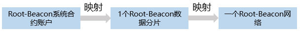
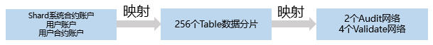

# 账户协议

## 概述

TOP Network采用账户模型，一切活动围绕账户进行。

用户账户由链上的地址唯一标识，操作账户需要私钥签名。

## 账户对象(Account Object)

账户是一个包含状态信息和逻辑的对象，包括余额、存储数据的属性和每个属性的操作(action)。

账户属性是用户自定义数据的对象，它作为一种键值(Key-Value)对被添加，用户余额(balance)是一种特殊属性。

键是一个任意字符串，其值可以是任何数据类型，比如整数、字符串、列表、HashMap等。

一个操作(action)可以是一个系统级的功能，比如转账，或者一个由账户所有者部署的智能合约管理的定制操作。

账户对象及其方法可以通过新的属性和定制操作轻松灵活地扩展。

## 账户地址(Account Address)

### 账户地址类型

TOP Network账户地址类型如下表所示。

| 类型         | 说明                                                         |
| ------------ | ------------------------------------------------------------ |
| 普通用户账户 | 独立账户：T-0。                                              |
| 用户合约账户 | T-3，是独立账户的一种子账户。在部署合约的时候被创建。        |
| 系统合约账户 | Root-Beacon系统合约账户：T-21；<br/>Sub-Beacon系统合约账户：T-22；<br/>shard系统合约账户：T-2。 |

例如：

* 一个独立账户地址：T-0-LQSxHEUBGLPY57SNjS2iMDba643NCHGswp

* 一个Shard系统合约地址：T-2-ML7oBZbitBCcXhrJwqBhha2MUimd6SM9Z6

### 账户地址格式

| 格式         | 长度  | 说明                                                         |
| ------------ | ----- | ------------------------------------------------------------ |
| 前缀标识     | 1字节 | T，代表TOP。                                                 |
| 地址类型     | 1字节 | 如普通账户、合约账户。                                       |
| 网络ID       | 2字节 | 0-TOP：主网，"0"不显示；<br/>65535：测试网；<br/>其他：侧链和业务链。 |
| Base58 code  | 变长  | 公钥Hash的Base58编码。                                       |
| TABLE-ID后缀 | 4字节 | 可选，shard系统合约所处的分片。                              |

### 账户空间的分片映射

账户空间映射到分片的流程为：


* Root-Beacon系统合约账户

  

* Sub-Beacon系统合约账户

  

* shard系统合约账户、普通用户账户和用户合约账户

  

## 生成公私钥对算法

### 普通账户公私钥

**私钥**

使用SHA-256安全散列算法生成一个随机的256位的私钥，须以"0x"开头，例如：0x40fb93846c424a107ac854f52290043e4c57368f035e563f8dc0091be8cc1ff9，对以上私钥进行base64编码，生成<br/>
**公钥**

使用secp256k1算法生成私钥对应的公钥，例如：0x045f04ab02ef604ee8861b32e5b07ba64070d901daffc5edb0f14a1fc2f27c3b193eff0398023b0ea1285abfd3e1cabc5d83575aa9681880184e8cfd207b02c57f。<br/>
**账户地址**

使用ECDSA数字签名算法将公钥转换成账户地址，并根据账户类型加上前缀标识"T-0"，例如：T-0-LWkTjhseZj7tPZkXwifoTPm2dUJY63jdEd。

### 用户合约账户公私钥

**公私钥**

用户合约账户公私钥生成方法与普通账户相同。<br/>

**账户地址**

用户合约账户地址是将合约账户公钥和与其父账号的公钥逐位相加得到一组数组，再用ECDSA数字签名算法将数组转换成地址，并增加前缀标识"T-3"，例如：T-3-Mo9KPHMGZyyn8AwzUJx6dkdZxzUxhgE9hN。<br/>

生成用户合约账户地址示例：

```
 std::string      xecpubkey_t::to_address(const std::string & parent_addr,const char addr_type,const uint16_t ledger_id)
        {
            if(parent_addr.empty())
                return to_address(addr_type,ledger_id);

            uint8_t     temp_publickey_data[65];
            memcpy(temp_publickey_data, m_publickey_data, sizeof(temp_publickey_data));
            const int parent_addr_size = std::min((int)parent_addr.size(),65);
            for(int i = 0; i < parent_addr_size; ++i)
            {
                temp_publickey_data[i] += parent_addr[i];
            }
            
            return to_address(temp_publickey_data, addr_type, ledger_id);
        }
```

## keystore文件

### 账户keystore文件

账户keystore文件是您独有的、用于签署交易的私钥加密文件，允许您以加密的方式存储密钥。

这种方式兼具**安全性**（一个攻击者需要账户keystore文件和您的密码才能盗取您的资产）和**易用性**（您只需要账户keystore文件和密码就能使用资产）。

为了让您发送交易，TOP Network客户端会让您输入密码（与创建账户时密码相同）以解密您的私钥。一旦解密，客户端程序就得到私钥签署交易，允许您移动资产。

如果您丢失了私钥，意味着您失去了签署交易的能力，同时意味着您的资产被永久的锁定在了您的账户里。

所以，请务必保管好您的私钥以及账户keystore文件！不要向他人透露您的私钥和账户keystore文件！

账户keystore文件格式：

```
{
   "address" : "T-0-LWkTjhseZj7tPZkXwifoTPm2dUJY63jdEd",
   "crypto" : {
      "cipher" : "aes-256-cbc",
      "cipherparams" : {
         "iv" : "0x40fb93846c424a107ac854f52290043e4c57368f035e563f8dc0091be8cc1ff9"
      },
      "ciphertext" : "0xb502a93ad3a8af3b9e4b939c40f851d240195ce9aeb417325b4d7bb64a7198f376a001a0a03f4a5b1d61af7b4c5b2cea65bc332a0e8399155eb0505b52cdf477c9c1f38e14857b453603cc4d385d468f",
      "kdf" : "hkdf",
      "kdfparams" : {
         "dklen" : 32,
         "info" : "0xb69d0f41ad6a5511",
         "prf" : "sha3-256",
         "salt" : "0x548c58f15a52ce6c879b5862ec7f12e13dc8b3df1329b8a4528324dfdb940740"
      },
      "mac" : "0xbd877ac89217f31a8c89db4900c4c1cfd9e16a9d4ac149cbdb09ede71f2d6ce4"
   },
   "hint" : "af",
   "public_key" : "0x045f04ab02ef604ee8861b32e5b07ba64070d901daffc5edb0f14a1fc2f27c3b193eff0398023b0ea1285abfd3e1cabc5d83575aa9681880184e8cfd207b02c57f"
}
```

| 参数       |              |       | 说明                                                 |
| ---------- | ------------ | ----- | ---------------------------------------------------- |
| address    |              |       | 账户地址。                                           |
| crypto     |              |       | 私钥加密相关信息。                                   |
|            | cipher       |       | 私钥加密算法。                                       |
|            | cipherparams |       | 上述cipher加密算法参数。                             |
|            |              | iv    | 向量。                                               |
|            | ciphertext   |       | 加密后的私钥。                                       |
|            | kdf          |       | 密钥生成函数，用于让您用密码加密账户keystore文件。   |
|            | kdfparams    |       | 上述kdf算法需要的参数。                              |
|            |              | dklen | 私钥加密算法的密钥长度。                             |
|            |              | info  | 8字节随机数的16进制表示。                            |
|            |              | prf   | hash算法。                                           |
|            | mac          |       | 消息认证码。                                         |
| hint       |              |       | 您创建账户时设置的账户keystore文件加密密码提示问题。 |
| public_key |              |       | 账户对应的public key。                               |

### 公私钥对keystore文件

公私钥对keystore文件与账户keystore文件格式的区别在于：公私钥对keystore文件不存储账户信息，而账户keystore文件存储账户地址信息，公私钥对keystore文件详细说明请参见“**创建账户-账户keystore文件**”。

公私钥对keystore文件格式为：

```
{
   "crypto" : {
      "cipher" : "aes-256-cbc",
      "cipherparams" : {
         "iv" : "0xd30883e616d5d30249e6f345ca85e2b3b7bfd442504ac5cb3d37293ff3d7b459"
      },
      "ciphertext" : "0x828bb283bcee1f24147047bfe89b1c54b03af98dc3e3fbc74f1b866ae1a1ead1ab88d21023fe853e9b650d6da7bf695f",
      "kdf" : "hkdf",
      "kdfparams" : {
         "dklen" : 32,
         "info" : "0xe82ba4f7f99666f4",
         "prf" : "sha3-256",
         "salt" : "0xff7b70a2d32f2158b45f394a1d00d7dfc04dd1345949774894df92e37bfb3a38"
      },
      "mac" : "0xdb82cfd99c7a9fb8e28b4b2e754c9a612c7fa1cbc7e963d04c7036b14e88ac2b"
   },
   "hint" : "basketball",
   "public_key" : "BFYRfp557uqBAKA54JmFkT+UVXf74LVdHDnjtLBM/V3nyIdKiHLwX2yr7s03RCoHNfciT0Zays3oUvcmkRv5VK4="
}
```

### 生成keystore文件方法

提醒：

> 公私钥对keystore文件中不存储账户地址(address)信息。

步骤1 生成原始私钥，并对原始数据进行Base64编码。

步骤 2 生成32字节salt。

```
CryptoPP::AutoSeededRandomPool::GenerateBlock
```

步骤3 生成8字节info。

```
CryptoPP::AutoSeededRandomPool::GenerateBlock
```

步骤4 生成aes的32字节加密key。

其中：kdf算法采用hkdf，hash算法采用sha3-256，再加上密码，生成加密key。

步骤5 生成aes的32字节iv。

```
CryptoPP::AutoSeededRandomPool::GenerateBlock
```

步骤6 生成密文。

其中：加密算法采用aes256，加密模式采用CBC_Mode。

步骤7 计算32字节mac，将aes_key后16字节同加密后的密文拼接，然后对拼接数据进行hash计算。

其中：hash算法采用sha3-256。

步骤8 将上述相关数据写入文件。