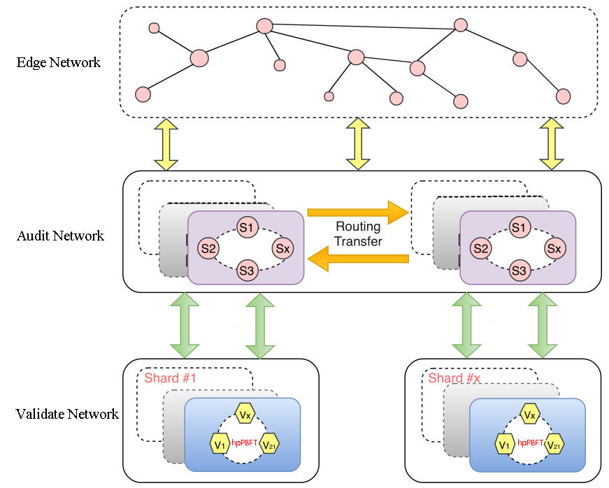
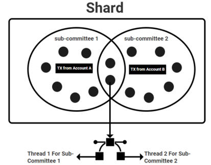
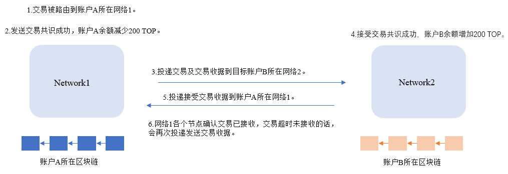
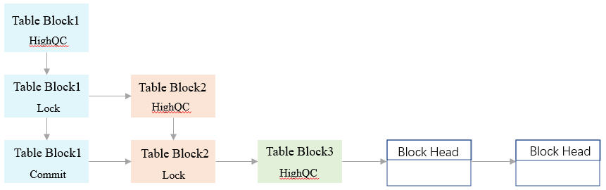

# 共识协议

## 概述

在一个分布式的节点网络中实现数据一致性，是很困难的。

必须通过某种机制选出一个节点，由这个节点决定此时需要处理哪一笔交易，并把这个交易的执行结果广播给其他节点做验证或存储，这样才可以实现全网节点数据的一致性。这个节点我们叫他"leader"，而选出leader并达成数据一致的机制，就叫“共识机制”。

leader通过VRF-FTS过程来确定。被选为hpPBFT leader的机会由一个节点的综合权益来衡量，具体请参见[节点选举](/zh/Node/NodeElection.md)。

## 三层共识网络

TOP Network的共识网络分为三层：

The Edge Network：充当客户端的接入点，所有交易在被转发到路由网络之前都会被先发送给边缘网络的边缘节点。

The Audit Network：由随机划分为分片的审计节点组成。此层网络负责处理跨分片通信和同步，同时参与交易验证。

The Validate Network：由包含验证节点的分片组成。这里是进行交易验证的地方。在每个分片中，验证节点使用并行pBFT算法验证和确认交易。

TOP Network出于多种原因而使用分层网络。首先，多种类型节点之间划分职责有助于降低对节点的要求。路由网络处理大多数对带宽要求较高的需求，例如跨分片通信，这就允许降低对验证节点的带宽要求。此外，因为客户端只能将交易直接发送到边缘节点，从而保护路由和核心网络免受泛滥交易的攻击。

## 共识算法

#### 高度并行hpPBFT（Highly-Parallel pBFT）

TOP Network的pBFT改进算法，称为hpPBFT（Highly-Parallel pBFT，高速并行pBFT），采用了一种允许O(n)通信复杂度和O(n)视图变化复杂度的三阶段提交策略。该算法实现了基于VRF时间的视图改进，但是通过一个二次审计网络额外保证了系统安全性，并通过并行化提高了系统可扩展性。

##### 二次审计

现有其他版本pBFT算法需要在系统安全性和可扩展性上做权衡。

TOP Network的hpPBFT通过对协议改进来确保安全性和可扩展性，该协议将视图复杂性降低到O(n)，同时还提高了安全性。通过使用3阶段提交范式而不是通常的2阶段提交，简化了视图更改过程。虽然插入额外的提交阶段会增加少量的延迟，但是为了能实现复杂的共识leader替换过程的线性扩展，这样做是值得的。

通过引入审计委员会和来自审计网络的leader节点，提高了协议的安全性。在每个视图期间，审计委员会与原始pBFT小组一起执行自己的检查。因此，共识不强依赖最初的pBFT leader。即使一个分片不作为或者leader作恶，审计网络也能够阻止无效状态的交易。

##### 完全并行共识

除了分片具有的通常的并行特性，TOP Network还采用了其他几种并行方式。

###### 基于多个CPU Cores的节点虚拟化

在我们的设计中，每个节点可以同时担任多个角色。例如，高级节点可以同时执行验证节点的任务。每种类型节点工作依赖的代码运行在单独的CPU Cores上。这扩展了单个节点的有用工作量，并从本质上增加了节点数量，从而提高了系统整体的可扩展性。

这种方式同时让分片更安全，因为对stake有较高要求的高级节点充当验证节点，让攻击者的stake更难在分片中占据较高比例，因为成为高级节点，需要满足为高级节点设置的最低保证金和选举要求。

###### 并行子委员会共识

与所有分片设计一样，每个分片可以与其他分片并行执行交易验证。但是，TOP Network更进一步，允许在分片中进一步实行并行化。对于单个账户发送的每个交易，通过VRF-FTS算法随机选择目标分片内的一个节点子集，形成一个共识委员会。

如果来自同一个空间内的多个账户的多个交易同时发送，则将同时选择关联分片内的多个子委员会。在某些情况下，将选择同一个验证节点同时参与多个子委员会。这是通过多线程技术实现的。每个节点可以同时使用多个线程在多个子组中执行共识算法。在[链数据结构](/zh/AboutTOPNetwork/TOPChainInfrastructure/DataStructure.md)中提到的单元点阵模型，使这种额外的并行方式成为可能。

#### PoS*

在链是无许可(permissionless)的情况下，pBFT算法本身并不安全。对于像比特币和以太坊这样的区块链，PoW被用作抵抗Sybil攻击机制。然而，PoW的效率非常低，需要节点使用昂贵的挖矿设备。而TOP Network使用了股权证明(PoS)来防止Sybil攻击。PoS要求节点加入网络时必须质押TOP token作为保证金。这使得作恶实体通过控制足够的节点组织攻击的成本变得高昂。

在大多数PoS形式中，决定节点是否有资格加入网络的唯一因素是区块链token最低保证金。TOP Network将这一概念扩展为“综合权益(Comprehensive Stake)”，即hpPBFT-PoS中的"*"。综合权益考虑多个因素，以确定节点参与工作的可能性大小。

综合权益为：

**保证金**：综合权益的主要组成部分是TOP Network token的缴存数量。每个类型的节点在TOP Network有不同的最低保证金要求。

**信誉**：节点的贡献历史是考察节点信用或声誉的一种形式。一个节点成功完成的任务越多，节点的信誉就越高，因此节点的综合权益也就越大。如果一个节点的带宽或计算能力与其他节点相比过低，它的信誉分就会下降。

**选票**：任何token持有者都可以使用其token为特定节点投票。节点得到的选票越多，当选的机会就越大。

## 交易共识过程

单账户交易只需经历一次共识，交易的发送账户和接收账户相同，账户操作自己属性，如锁定TOP token兑换选票/gas。

以账户A给账户B转账200 TOP token为例，跨账户交易共识过程如下图所示。

1.交易被路由到账户A所在Network1。

2.发送交易共识成功，打包出块，账户A减200 TOP。

发送交易共识过程：首先由hpPBFT leader对交易进行验证，验证完成后，将验证结果广播到Network1里的其他节点，其他节点对结果进行验证，当leader收到Network1内2/3节点的签名或者投票后，此轮共识成功，块存储到数据库。同时账户A余额减200 TOP。

3.投递交易及发送交易收据到目标账户B所在Network2。

交易收据包括交易多重签名和Merkle树路径。交易收据的作用是证明交易被成功共识，分为发送交易收据和接收交易收据。

4.接收交易共识成功，打包出块，账户B余额增加200 TOP。

接收交易共识过程参照发送交易共识过程。

5.投递接受交易收据到源账户A所在Network1。

6.Network1各个节点确认交易(confirm action)已接受，打包出块。

如果目标账户B所在Network2超时未接受交易，会再次投递发送交易收据。

## Table Block 状态

交易会经过三轮共识，才会最终被确认，达到合法状态，每次共识块的状态会经历如下三次状态。

第一轮共识后，块的状态为"HighQC"，第二轮共识，块的状态变更为"Lock"状态，第三轮共识，块的状态变更为最终确认状态"Commit"。

每一轮共识都会更新共识leader，当新leader发现交易池中没有交易时就会出空块，帮助最后一个块达到"Commit"状态。
