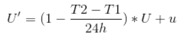
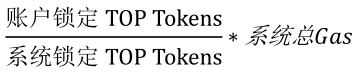

# 资源模型

## 概述

TOP Network链上的交易可被分为分片交易和Root-Beacon系统交易，每笔交易都会消耗链上资源。

像NET、CPU这种临时占用的资源，我们称为gas。

每个账户：包括智能合约账户和普通账户，都有免费的gas资源配额。

为了获得更高的配额，账户必须锁定TOP Token以兑换gas资源。

gas资源每24小时恢复到最大数量。

## gas消耗规则

gas消费规则根据交易涉及的交易类型以及账户类型而不同。

* 非调用合约的交易，仅向发起方收费。

* 普通账户调用用户合约交易，优先向发起方收费，发起方与合约共同承担（用户合约可设置愿意为交易支付的gas费上限）。

* 系统合约无论是作为发送方还是接收方，都不收费。

交易消耗的gas如下表所示。

| 交易类型   |                  | 总消耗gas                       | 交易费发送方支付                                             | 交易接收方支付                                    | 备注                                                        |
| ---------- | ---------------- | ------------------------------- | ------------------------------------------------------------ | ------------------------------------------------- | ----------------------------------------------------------- |
| 单账户交易 |                  | tx_size*1                       | tx_size*1                                                    | -                                                 |                                                             |
| 跨账户交易 | 非调用合约交易   | tx_size*3                       | tx_size*3                                                    | 0                                                 |                                                             |
|            | 调用系统合约交易 | tx_size*3                       | tx_size*3                                                    | 0                                                 |                                                             |
|            | 调用用户合约交易 | tx_size*3+CPU ns(合约指令集)/40 | 费用的一半由发送方承担，另一半优先由用户合约承担，合约无法支付再由发送方承担 | min(gasLimit,合约余额,receiver action消耗的gas/2) | gasLimit：合约愿意为交易发送方付出的每笔交易的gas费用上限。 |

提醒：

> 对于Root-Beacon系统合约交易（注册节点相关、提案相关、启动节点进程入网）来说，除了会消耗gas，交易发送放还将会被自动扣除一笔手续费并被销毁，当前为100*10^6 uTOP token。这一小笔费以保护Root-Beacon免受泛滥交易攻击。

## 每日免费gas

默认情况下，若账户余额大于等于100 TOP token，该账户每24小时还会被免费赠送25,000Tgas。这允许该账户每日可以进行多次免费交易。

最低限额可避免作恶者使用免费分配的gas来创建大量账户和泛滥交易实施攻击。

账户已使用gas随时间逐步衰减，24小时（链上治理参数）后衰减到0，即可用gas恢复到gas额度，衰减的公式如下：

比如在时间T1时刻，账户gas已使用量为U，到T1+12h，账户再次使用gas为u,此时账户已使用TGAS为 U/2 + u。

### 锁定TOP token兑换gas

普通账户和合约账户都可以锁定TOP  token以兑换更多的gas（合约账户无法主动发起，可由部署合约的父账户发起）。

兑换gas的公式如下：

其中：系统总gas=单片gas*分片数。单片gas和分片数可以通过链上治理调整。分片数目前被设置为4，系统gas总量随着分片数的增长而增长。

锁定在系统中的TOP token总数每十分钟更新一次，其值存储在一个系统合约中。

系统总锁定TOP=初始值+用户锁定值，以免初始gasprice为0。

一个普通账户24小时内可以获得的gas不超过200,000Tgas，大约可以发起800条交易。

一个合约账户24小时内可以获得的gas不超过10,000,000Tgas，大约可以执行4万条交易，使用4秒CPU。

### gas消耗与NET/CPU的关系

1Tgas相当于1byte的带宽或40ns的CPU时间。

字节是根据原始交易的大小计算的。

CPU时间仅在执行合约时消耗，并且总CPU时间是根据合约指令集确定的。

一个交易最多允许消耗25,000Tgas。

## 交易保证金(tx_deposit)

大多数用户将有足够的免费gas来满足他们的日常需求，而那些发送较多交易的用户可能会用光gas，并需要支付一笔数额很小的交易保证金。

当账户没有足够的gas来发送交易时，TOP Network将从其交易保证金(tx_deposit)余额中扣除一部分费用兑换gas以支付交易费用。

交易保证金余额必须大于或等于0.1 TOP token来抵消gas花费，这笔费用随即被销毁。   

每笔交易保证金从账户除转账金额以外的账户余额中冻结。

当前交易保证金兑换gas比例设置为：1Tgas=100 uTOP token。

交易保证金可以通过链上治理进行更改。

