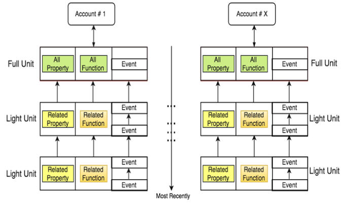
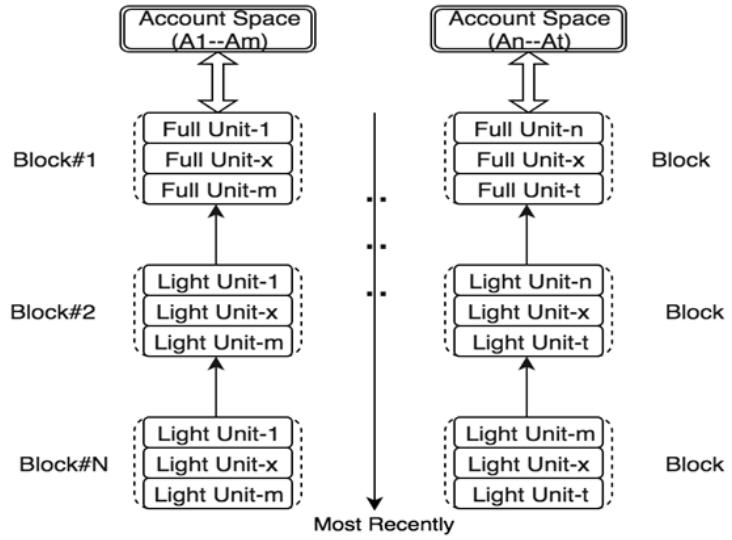

# 链数据结构

## 概述

TOP Network由独特的数据结构组成，专门为分片和高效的数据访问和存储而设计。核心对象、单元点阵和区块点阵是我们使用的三种主要数据结构。

## 核心对象(Core Objects)

TOP Network遵循一个面向对象的编程范例。每个用户账户和每个智能合约都由我们的“核心对象”表示。

### 账户(Accounts)

TOP Network中每个用户账户都有一个特定的地址。账户是一个包含状态信息和逻辑的对象，包括余额、存储数据的属性、以及对属性的操作等。账户余额也可以作为账户对象的一种特殊财产来处理。操作可以是系统级的功能，比如转账，也可以是由账户所有者部署的智能合约控制的自定义操作。账户对象及其方法可以通过新的属性和定制的操作轻松灵活地扩展。

### 属性(Property)

账户属性是用户自定义数据的对象，它作为一种键值(Key-Value)对被添加。键是一个任意字符串，其值可以是任何数据类型，比如整数、字符串、列表、HashMap等等。账户余额具有特殊的属性，在生成帐户时默认存在。

### 操作(Action)

操作使属性具有灵活的处理功能。一个操作可以是一个内置的系统功能，比如Hash和投票，或者是一个自定义的智能合约。用户可以通过发送交易或消息来触发操作。

### 消息(Message)

消息就是对账户属性发起操作的指令。消息的数据包含属性、动作、输入参数和输出参数。出于安全目的，消息不能更改帐户余额。

消息是一种特殊的交易。一个发送高频消息的账户会受到流量控制，必须支付gas费，否则账户所有者可能被迫执行工作证明(POW)。

### 交易(Transaction)

交易是指启动从一个账户到另一个帐户的资产转移的命令。交易还可以包含在处理交易时将被触发的操作。

## 双层点阵数据结构

TOP Network链状态由所有用户账户对象和智能合约账户对象组成，存储在单元格和块格数据结构中。从技术上讲，这些格是有向无环图(DAG)的一种形式。

然而，与其他基于DAG的项目不同的是，这种网格结构更有组织性，非常适合分片架构。

### 单元点阵(Unit Lattice)

账户的属性的每一次历史交易变化（即交易记录）称为单元(Unit Block)，链把每个账户的全部单元都保存下来。如果遍历一个账户的所有单元，从创世单元（即账户创建时候的初始属性值）到最后一个单元，即可获得这个账户所发生的所有事件，也可以知道账户下的属性的最终状态值。因此，一个账户的所有单元连载一起就如同一条微小的链，称之为Unit Chain。很多个账户的Unit Chain打包在一起就叫单元点阵(Unit Lattice)。

这种设计的一个主要好处是可以同时在账户级别上达成一致，这为并行共识创造了另一个机会，从而提高了吞吐量。这与在每个分片上使用单个链来连续记录来自多个账户的交易形式形成了对比。

### 区块点阵(Block Lattice)

区块点阵作为共识和跨zone同步的批处理机制。最新更新的单元被打包到Table Block中，然后链接到每个账户空间的链中。zone内这些链的集合形成区块点阵数据结构。Table Block用于跨分片同步，而区块点阵用于跨zone同步。

