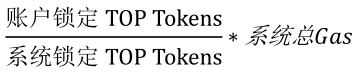

# Java SDK

## 快速开始

实例化"topj"。

```java
package org.sawyer;

import org.topj.account.Account;
import org.topj.core.Topj;
import org.topj.procotol.http.HttpService;
import java.io.IOException;

public class main {
    private static Topj topj = null;
    private static Account account = null;
    public static void main(String[] args) throws IOException {
        HttpService httpService = new HttpService("http://192.168.50.193:19081");
        topj = Topj.build(httpService);
    }
}
```

## 接口总览
| 接口                                                | 描述                              |
| :-------------------------------------------------- | :-------------------             |
| [topj.setTransactionReceiptProcessor()](#交易初始化设置) | 交易初始化设置。                   |
| [topj.genAccount()](#根据私钥生成account账户对象)             | 根据私钥生成account账户对象。       |
| [topj.passport()](#获取链上访问身份令牌) | 获取链上访问身份令牌。          |
| [topj.getChainInfo()](#获取主链信息)              | 获取主链信息。                     |
| [topj.getAccount()](#查询链上账户信息)                      | 查询链上账户信息。             |
| [topj.transfer()](#转账)                             | 转账。                            |
| [topj.getTransaction()](#查询账户交易详情)                | 查询账户交易详情。                 |
| [topj.stakeGas()](锁定TOP_token兑换gas)                | 锁定TOP token兑换gas。    |
| [topj.unStakeGas()](解锁兑换gas的TOP_token)        | 解锁兑换gas的TOP token。     |
| [topj.deployContract()](#部署用户智能合约)                | 部署用户智能合约。                 |
| [topj.callContract()](#调用用户智能合约)                    | 调用用户智能合约。                 |
| [topj.getProperty()](#获取属性)                         | 获取属性。                        |
| [topj.registerNode()](#注册节点)                        | 注册节点。                        |
| [topj.queryNodeInfo()](#查询节点信息)                   | 查询节点信息。                  |
| [topj.unRegisterNode()](#注销节点)                      | 注销节点。                        |
| [topj.redeemNodeDeposit()](#赎回节点保证金)                | 赎回节点保证金。                   |
| [topj.stakeVote()](#锁定TOP_token兑换选票)             | 锁定TOP token兑换选票。        |
| [topj.unStakeVote()](#解锁兑换选票的TOP_token)            | 解锁兑换选票的TOP token。        |
| [topj.voteNode()](#节点投票)                    | 节点投票。                   |
| [topj.unVoteNode()](#取消投票)                          | 取消投票。                         |
| [topj.listVoteUsed()](#获取投票列表)                      | 获取已使用投票列表。               |
| [topj.queryVoterDividend()](#获取投票者奖励信息)            | 获取投票者奖励信息。                |
| [topj.claimVoterDividend()](#领取投票者奖励)              | 领取投票者奖励。                    |
| [topj.queryNodeReward()](#获取节点奖励信息)                 | 获取节点奖励信息。                  |
| [topj.claimNodeReward()](#领取节点奖励)                   | 领取节点奖励。                      |
| [topj.submitProposal()](#提交提案)                   | 提交提案。                   |
| [topj.withdrawProposal()](#撤回提案)                 | 撤回提案。                        |
| [topj.queryProposal()](#获取提案详情)                     | 获取提案详情。                       |
| [topj.tccVote()](#TCC表决提案)                          | TCC表决提案                    |

| 工具方法                                            | 描述                                |
| :------------------------------------------------- | :-------------------                |
| [transferActionParam.decode](#解析出转账交易体中的amount和note数据) | 解析出转账交易体中的amount和note数据。 |
| [topj.setTransactionReceiptProcessor](#交易初始化设置)    | 交易初始化设置。                      |
| [xTransaction.isSuccess](#判断交易是否成功)              | 判断交易是否成功。                    |
| [交易体对象说明](#交易体对象说明) | 所有交易请求都返回该对象。 |

## 交易初始化设置

SDK发送交易请求后，请求无法直接返回交易执行结果，所以需要循环去链上查询交易是否成功，默认每3秒查询一次，循环100次，共5分钟。如果此时交易仍查询不到，则程序返回交易hash。

“setTransactionReceiptProcessor”方法可以修改循环查询间隔以及循环次数，比如示例代码中修改为每5秒查询一次，循环3次，共15秒。

**请求方式**

> topj.setTransactionReceiptProcessor

**请求参数**

| 参数名称 | 是否必选 | 默认值 | 类型 | 说明 |
| -------- | -------- | ------ | ---- | ---- |
|TransactionReceiptProcessor|是|-|TransactionReceiptProcessor|交易接受体操作对象。|

TransactionReceiptProcessor为抽象类，有PollingTransactionReceiptProcessor和NoOpProcessor两个实现类，可实例化这两个类并传入。

PollingTransactionReceiptProcessor表示会轮询attempts次，每次间隔sleepDuration毫秒。
实例化所需参数如下。

| 参数名称 | 是否必选 | 默认值 | 类型 | 说明 |
| -------- | -------- | ------ | ---- | ---- |
|sleepDuration|是|-|long|等待间隔，单位s。|
|attempts|是|-|int|循环次数。|

也可设置不循环，直接返回交易hash，传入NoOpProcessor对象接口，代码为 topj.setTransactionReceiptProcessor(new NoOpProcessor())。

NoOpProcessor表示直接返回hash，无须参数。

**样例**

``` java
package org.sawyer;

import org.topj.account.Account;
import org.topj.core.Topj;
import org.topj.procotol.http.HttpService;
import org.topj.tx.PollingTransactionReceiptProcessor;
import java.io.IOException;

public class main {
    private static Topj topj = null;
    private static Account account = null;
    public static void main(String[] args) throws IOException {

        HttpService httpService = new HttpService("http://192.168.50.193:19081");
        topj = Topj.build(httpService);
        topj.setTransactionReceiptProcessor(new PollingTransactionReceiptProcessor(5000, 3));
    }
}
```
## 链基础操作

### 根据私钥生成account账户对象

本地根据私钥生成账户对象，对象中包含私钥、公钥、地址等参数。

**请求方法**

> topj.genAccount

**请求参数**

| 参数名称   | 是否必选 | 默认值 | 类型   | 说明   |
| ---------- | -------- | ------ | ------ | ------ |
| privateKey | 是       | -      | String | 私钥。 |

**返回参数**

| 参数名称        | 类型    | 说明                                                         |
| --------------- | ------- | ------------------------------------------------------------ |
| address         | String  | 账户地址。                                                   |
| addressType     | String  | 账户地址类型：0--普通用户账户；1--子账户；2--系统合约账户；3--用户合约账户 |
| balance         | Uint64  | 账户余额。                                                   |
| lastUnitHeight  | Uint64  | 最新共识成功的交易的unit block高度。                         |
| netType         | Integer | 网络类型，"0"--主网、"1"--测试网。                           |
| nonce           | Uint64  | 该账户最新共识成功的交易序号，唯一。                         |
| privateKey      | String  | 私钥用于解密和交易签名。<br/>请不要与其他人分享您的私钥，以免造成资产损失！ |
| privateKeyBytes | String  | 私钥的Byte格式。                                             |
| publicKey       | String  | 公钥，和私钥总是成对出现。<br/>用于加密及验签。              |
| sequenceId      | String  | 客户端会话次数，递增。                                       |
| identityToken   | String  | 与链交互前首先需要获取链访问身份令牌(identity token)，身份令牌因账户不同而不同。当前未对该字段进行校验。 |

本地生成account主要用于生成公私钥和地址，其他参数，除了“token"，均为初始值，需调用`topjs.getAccount`方法获取链上真实值。

**请求样例**

``` java
package org.test;

import org.topj.account.Account;
import org.topj.core.Topj;
import org.topj.procotol.http.HttpService;

public class main {
    private static Topj topj = null;
    private static Account account = null;

    public static void main(String[] args){
        HttpService httpService = new HttpService("http://localhost:19081");
        topj = Topj.build(httpService);
        account = topj.genAccount();
    }
}
```
**返回样例**
```javascript
{
    "address":"T-0-LVqncsABDB49GVzwwV5LGx9gBStf4HD9XW",
    "addressType":"0",
    "balance":0,
    "lastUnitHeight":0,
    "netType":0,
    "nonce":0,
    "privateKey":"ec8519c723649ab2170807d39a9d01be1a6197266cfe39b4cc66c0433df85321",
    "privateKeyBytes":"7IUZxyNkmrIXCAfTmp0BvhphlyZs/jm0zGbAQz34UyE=",
    "publicKey":"04ba6f20d132c94044fb0dd36035c3a9fc11ce30d6f3252e16083add3c78a76fe692d980754d77ba06594e70dfa51dbfe87832e5b38c91a03fdeae80ed0b414f65",
    "sequenceId":"1600657385123",
    "identityToken": ""
}
```


### 获取链上访问身份令牌

根据账户获取identity token（身份令牌），每个账户token不同。在后续所有的请求中，都需要token参数。

**请求方法**

> topj.passport

**请求参数**

| 参数名称 | 是否必选 | 默认值 |  类型   | 说明       |
| :------: | :------: | :----: | :-----: | ---------- |
| account  |    是    |   -    | Account | 账户对象。 |

**返回参数**

返回值中包含token字段，已直接放入account对象中，供后续调用时使用。

| 参数名称           | 类型   | 说明                                                     |
| ------------------ | ------ | -------------------------------------------------------- |
| secret_key         | String | 密钥key。                                                |
| signature_method   | String | 签名方法。                                               |
| signature_ver_code | String | 签名方法版本号。                                         |
| identity_token     | String | 身份令牌，用于和主链节点交互，后续所有请求都需要该参数。 |

**请求样例**

``` java
package org.sawyer;

import com.alibaba.fastjson.JSONObject;
import org.topj.account.Account;
import org.topj.core.Topj;
import org.topj.methods.response.PassportResponse;
import org.topj.methods.response.ResponseBase;
import org.topj.procotol.http.HttpService;
import org.topj.tx.PollingTransactionReceiptProcessor;
import java.io.IOException;

public class main {

    private static Topj topj = null;
    private static Account account = null;
    public static void main(String[] args) throws IOException {

        HttpService httpService = new HttpService("http://192.168.50.193:19081");
        topj = Topj.build(httpService);
        topj.setTransactionReceiptProcessor(new PollingTransactionReceiptProcessor(5000, 3));
        account = topj.genAccount();
        ResponseBase<PassportResponse> token =topj.passport(account);
        System.out.println(JSONObject.toJSONString(token));
    }
}

```

**返回样例**

``` java
{
    "data":{
        "identity_token":"c139fb51-d541-41f5-9d9d-4e6c083766f1",
        "secret_key":"fc06ccea-c34d-40b5-8b93-f985c6f3ecee",
        "signature_method":"hmac_sha2",
        "signature_ver_code":"1.0"
    },
    "errmsg":"ok",
    "errno":0,
    "sequence_id":"1600657932853"
}
```

### 获取主链信息
**请求方法**

> topj.getChainInfo

**请求参数**

| 参数名称 | 是否必选 | 默认值 |  类型   | 说明       |
| :------: | :------: | :----: | :-----: | ---------- |
| account  |    是    |   -    | Account | 账户对象。 |

**返回参数**

| 参数名称               | 类型   | 说明                   |
| ---------------------- | ------ | ---------------------- |
| first_timerblock_hash  | String | 第一个时钟块hash。     |
| first_timerblock_stamp | String | 第一个时钟块生成时间。 |
| version                | String | 版本。                 |

**请求样例**

``` java
package org.sawyer;


import com.alibaba.fastjson.JSONObject;
import org.topj.account.Account;
import org.topj.core.Topj;
import org.topj.methods.response.ChainInfoResponse;
import org.topj.methods.response.ResponseBase;
import org.topj.procotol.http.HttpService;
import org.topj.tx.PollingTransactionReceiptProcessor;

import java.io.IOException;

public class main {

    private static Topj topj = null;
    private static Account account = null;

    public static void main(String[] args) throws IOException {

        HttpService httpService = new HttpService("http://192.168.50.193:19081");
        topj = Topj.build(httpService);
        topj.setTransactionReceiptProcessor(new PollingTransactionReceiptProcessor(5000, 3));
        account = topj.genAccount();
        topj.passport(account);
        ResponseBase<ChainInfoResponse> chainInfo = topj.getChainInfo(account);
        System.out.println(JSONObject.toJSONString(chainInfo));
    }
}
```

**返回样例**

``` java
{
    "data":{
        "first_timerblock_hash":"1854a9495b387b2307b5ae483d2953ae26c29a4cbb076b42ba48b0e54d7b94a5",
        "first_timerblock_stamp":"946713600",
        "version":"0.0.0.1"
    },
    "errmsg":"ok",
    "errno":0,
    "sequence_id":"1600658014340"
}
```

## 账户管理

### 查询链上账户信息
当一个用户发送交易至链上时，必须要使用该用户最新的"nonce"和"last_hash_xxhash64"，这两个属性可以从该方法的返回值中获取。

**请求方法**

> topj.getAccount

**请求参数**

| 参数名称 | 是否必选 | 默认值 |  类型   | 说明       |
| :------: | :------: | :----: | :-----: | ---------- |
| account  |    是    |   -    | Account | 账户对象。 |

**返回参数**

| 参数名称                | 类型   | 说明                                                         |
| ----------------------- | ------ | ------------------------------------------------------------ |
| account_addr            | String | 账户地址。                                                   |
| available_gas           | Uint64 | 账户现有可用gas的量，单位Tgas。                              |
| balance                 | Uint64 | 账户余额，单位uTOP。                                         |
| burned_token            | Uint64 | 该账户所有已经销毁的TOP token，单位uTOP。                    |
| cluster_id              | Uint8  | cluster ID。                                                 |
| created_time            | Uint64 | 账户在链上创建的时钟高度。                                   |
| disk_staked_token       | Uint64 | 兑换disk锁定的TOP token，单位uTOP。                          |
| gas_staked_token        | Uint64 | 兑换gas锁定的TOP token，单位uTOP。                           |
| group_id                | Uint8  | group ID。                                                   |
| latest_tx_hash          | String | 最新共识成功的交易hash。                                     |
| latest_tx_hash_xxhash64 | String | 最新共识成功的交易xx64hash。                                 |
| latest_unit_height      | Uint64 | 最新共识成功的交易的unit block高度。                         |
| lock_balance            | Uint64 | 锁定的TOP token，单位uTOP，主要用于用户合约交易。<br/>调用用户合约的时候，交易发送方可同时给合约账户转账，如果合约执行失败，转账款需要退还给发送方，所以在合约执行成功前，先将转账款锁定。 |
| lock_deposit_balance    | Uint64 | 用户合约交易费用与执行合约交易占用的CPU时长以及交易大小相关，无法在交易开始确定合约的交易费用。采取的方法是冻结一部分发送方交易保证金，在交易第三次共识的时候，根据合约的最终执行情况，扣除发送方交易保证金以支付交易费用，单位uTOP。 |
| lock_gas                | Uint64 | 用户合约交易费用与据执行合约交易占用的CPU时长以及交易大小相关，无法在交易开始确定合约的交易费用。采取的方法是冻结发送方一部分gas，在交易第三次共识的时候，根据合约的最终执行情况，扣除发送方交易消耗的gas，单位Tgas。 |
| nonce                   | Uint64 | 该账户最新共识成功的交易序号，唯一。                         |
| total_gas               | Uint64 | 账户总gas量，单位Tgas。<br/>一个普通账户24小时内可以获得的gas不超过200,000Tgas。<br/>一个合约账户24小时内可以获得的gas不超过10,000,000Tgas。 |
| unlock_disk_staked      | Uint64 | 解锁中的兑换disk的TOP token，发起解锁后，需要等待24小时，解锁的金额才会到账。 |
| unlock_gas_staked       | Uint64 | 解锁中的兑换gas的TOP token，发起解锁后，需要等待24小时，解锁的金额才会到账。 |
| unused_free_gas         | Uint64 | 免费gas余量，单位Tgas。                                      |
| unused_stake_gas        | Uint64 | 锁定TOP token兑换的gas余量，单位Tgas。                       |
| unused_vote_amount      | Uint64 | 该账户未使用选票数量。                                       |
| vote_staked_token       | Uint64 | 兑换选票锁定的TOP token，单位uTOP。                          |
| zone_id                 | Uint8  | zone ID。                                                    |

**请求样例**

``` java
package org.sawyer;

import com.alibaba.fastjson.JSONObject;
import org.topj.account.Account;
import org.topj.core.Topj;
import org.topj.methods.response.AccountInfoResponse;
import org.topj.methods.response.ResponseBase;
import org.topj.procotol.http.HttpService;
import org.topj.tx.PollingTransactionReceiptProcessor;
import java.io.IOException;

public class main {
    private static Topj topj = null;
    private static Account account = null;
    public static void main(String[] args) throws IOException {
        HttpService httpService = new HttpService("http://192.168.50.193:19081");
        topj = Topj.build(httpService);
        topj.setTransactionReceiptProcessor(new PollingTransactionReceiptProcessor(5000, 3));
        account = topj.genAccount("ff867b2ceb48f6bfc8a93d6c6aac05a29baad5da18ab5fb2bb9758379475fad8");
        topj.passport(account);
        ResponseBase<AccountInfoResponse>  accountInfoResponse = topj.getAccount(account);
        System.out.println(JSONObject.toJSONString(accountInfoResponse));
    }
}
```
**返回样例**

``` java
{
    "data":{
        "account_addr":"T-0-LRaFyaGZ1isfcKnhLxPLoePFUmY2iyFGv6",
        "available_gas":25000,
        "balance":100000000000000,
        "burned_token":0,
        "cluster_id":1,
        "created_time":1600658140,
        "disk_staked_token":0,
        "gas_staked_token":0,
        "group_id":65,
        "latest_tx_hash":"0x49e09cfe7c3508e9b70239aa3ac16266a4c4dcf3965b23c53caa855425db876b",
        "latest_tx_hash_xxhash64":"0x60599edc803dc200",
        "lock_balance":0,
        "lock_deposit_balance":0,
        "lock_gas":0,
        "nonce":1,
        "total_gas":25000,
        "unlock_disk_staked":0,
        "unlock_gas_staked":0,
        "unused_free_gas" : 0,
        "unused_stake_gas" : 0,
        "unused_vote_amount":0,
        "vote_staked_token":0,
        "zone_id":0
    },
    "errmsg":"ok",
    "errno":0,
    "sequence_id":"1600658167966"
}
```

### 转账

发起转账交易前，发起人的账户余额应该大于100,000uTOP token，这100,000uTOP token将用作交易保证金。

**请求方法**

> topj.transfer

**请求参数**

| 参数名称 | 是否必填 | 默认值   | 类型   | 说明                                                         |
| :------: | -------- | -------- | ------ | ------------------------------------------------------------ |
| account  | 是       | -        | Object | 发送交易前，需要先获取最新的nonce和last_hash_xxhash64赋值与需要使用的account对象中，可直接调用"topjs.updateNonceAndLastHash"方法，将自动把这两个参数放入account对象中。 |
|    to    | 是       | -        | String | 交易接收账户地址，为普通账户或者合约账户。<br/>接收者地址在"target_action"对象下的"account_addr"属性中。 |
|   note   | 否       | 空字符串 | String | 转账备注。                                                   |
|  amount  | 是       | -        | Uint64 | 转账金额，单位uTOP。                                         |

**返回参数**

返回交易结果对象,请参见[交易体对象说明](#交易体对象说明)。

**请求样例**

``` java
package org.sawyer;

import com.alibaba.fastjson.JSONObject;
import org.topj.account.Account;
import org.topj.core.Topj;
import org.topj.methods.response.ResponseBase;
import org.topj.methods.response.tx.XTransactionResponse;
import org.topj.procotol.http.HttpService;
import org.topj.tx.PollingTransactionReceiptProcessor;
import java.io.IOException;
import java.math.BigInteger;

public class main {
    private static Topj topj = null;
    private static Account account = null;
    public static void main(String[] args) throws IOException {
        HttpService httpService = new HttpService("http://192.168.50.47:19081");
        topj = Topj.build(httpService);
        topj.setTransactionReceiptProcessor(new PollingTransactionReceiptProcessor(5000, 10));
        account = topj.genAccount("ff867b2ceb48f6bfc8a93d6c6aac05a29baad5da18ab5fb2bb9758379475fad8");
        topj.passport(account);
        topj.getAccount(account);
        ResponseBase<XTransactionResponse> result = topj.transfer(account,"T-0-LiC6tHMcmS8Qpn6LQuWcLRXjvGuYXQGthd", BigInteger.valueOf(140), "");
        System.out.println(JSONObject.toJSONString(result));
    }
}

```
**返回样例**

``` java
{
    "data":{
        "original_tx_info":{
            "authorization":"0x01ecc8e94deb97155f078a5d15ca982d7d67395787be17b53f6a3ad649cf5075ad13a8af3bf58a4c36e48f428dc160af5b41d5a3db648e05ba7ea06fc0f7241eb3",
            "challenge_proof":"",
            "ext":"",
            "from_ledger_id":0,
            "last_tx_hash":"8953296047531467839",
            "last_tx_nonce":19,
            "note":"",
            "receiver_action":{
                "action_authorization":"",
                "action_ext":"",
                "action_hash":0,
                "action_name":"",
                "action_param":"0x000000008c0000000000000000000000",
                "action_size":82,
                "action_type":6,
                "tx_receiver_account_addr":"T-0-LiC6tHMcmS8Qpn6LQuWcLRXjvGuYXQGthd"
            },
            "send_timestamp":1600671092,
            "sender_action":{
                "action_authorization":"",
                "action_ext":"",
                "action_hash":0,
                "action_name":"",
                "action_param":"0x000000008c0000000000000000000000",
                "action_size":82,
                "action_type":0,
                "tx_sender_account_addr":"T-0-LRaFyaGZ1isfcKnhLxPLoePFUmY2iyFGv6"
            },
            "to_ledger_id":0,
            "tx_deposit":300000,
            "tx_expire_duration":100,
            "tx_hash":"0xd0a468822f5d983f468947b70a48489e90e5ff2806190f7ec16fe157662a8f53",
            "tx_len":323,
            "tx_random_nonce":0,
            "tx_structure_version":0,
            "tx_type":4,
            "xx64Hash":"0x412da7bf7cf8f4"
        },
        "tx_consensus_state":{
            "confirm_unit_info":{
                "exec_status":"",
                "height":0,
                "tx_exec_status":"",
                "unit_hash":"d47bc0df7cfc9d92b5d00ac71cd3a1cedfdf7956d55abd247304d678a87b5292",
                "used_deposit":0,
                "used_disk":0,
                "used_gas":0
            },
            "recv_unit_info":{
                "height":0,
                "unit_hash":"073922013d27e7bc27cb5536ad2151472d5a7cca591087049493fdaf49fc1ee4",
                "used_deposit":0,
                "used_disk":0,
                "used_gas":0
            },
            "send_unit_info":{
                "height":39,
                "tx_fee":0,
                "unit_hash":"98eebc38b0d6b38d9a935feb8bcf0c0d1219acaabcd22980e8042e0e17343bb7",
                "used_deposit":0,
                "used_disk":0,
                "used_gas":798
            }
        }
    },
    "errmsg":"ok",
    "errno":0,
    "sequence_id":"1600671092156"
}
```

### 查询账户交易详情
**请求方法**

> topj.getTransaction

**请求参数**

| 参数名称 | 是否必填 | 默认值 | 类型    | 说明       |
| :------: | -------- | ------ | ------- | ---------- |
| account  | 是       | -      | Account | 账户对象。 |
|  txHash  | 是       | -      | String  | 交易hash。 |

**返回参数**

请参见[交易体对象说明](#交易体对象说明)。

**请求样例**

``` java
package org.sawyer;

import com.alibaba.fastjson.JSONObject;
import org.topj.account.Account;
import org.topj.core.Topj;
import org.topj.methods.response.ResponseBase;
import org.topj.methods.response.tx.XTransactionResponse;
import org.topj.procotol.http.HttpService;
import org.topj.tx.PollingTransactionReceiptProcessor;
import java.io.IOException;

public class main {
    private static Topj topj = null;
    private static Account account = null;
    public static void main(String[] args) throws IOException {
        HttpService httpService = new HttpService("http://192.168.50.47:19081");
        topj = Topj.build(httpService);
        topj.setTransactionReceiptProcessor(new PollingTransactionReceiptProcessor(5000, 10));
        account = topj.genAccount("ff867b2ceb48f6bfc8a93d6c6aac05a29baad5da18ab5fb2bb9758379475fad8");
        topj.passport(account);
        topj.getAccount(account);
        ResponseBase<XTransactionResponse> result = topj.getTransaction(account,"0xd0a468822f5d983f468947b70a48489e90e5ff2806190f7ec16fe157662a8f53");
        System.out.println(JSONObject.toJSONString(result));
    }
}

```

**返回样例**

``` java
{
    "data":{
        "original_tx_info":{
            "authorization":"0x01ecc8e94deb97155f078a5d15ca982d7d67395787be17b53f6a3ad649cf5075ad13a8af3bf58a4c36e48f428dc160af5b41d5a3db648e05ba7ea06fc0f7241eb3",
            "challenge_proof":"",
            "ext":"",
            "from_ledger_id":0,
            "last_tx_hash":"8953296047531467839",
            "last_tx_nonce":19,
            "note":"",
            "receiver_action":{
                "action_authorization":"",
                "action_ext":"",
                "action_hash":0,
                "action_name":"",
                "action_param":"0x000000008c0000000000000000000000",
                "action_size":82,
                "action_type":6,
                "tx_receiver_account_addr":"T-0-LiC6tHMcmS8Qpn6LQuWcLRXjvGuYXQGthd"
            },
            "send_timestamp":1600671092,
            "sender_action":{
                "action_authorization":"",
                "action_ext":"",
                "action_hash":0,
                "action_name":"",
                "action_param":"0x000000008c0000000000000000000000",
                "action_size":82,
                "action_type":0,
                "tx_sender_account_addr":"T-0-LRaFyaGZ1isfcKnhLxPLoePFUmY2iyFGv6"
            },
            "to_ledger_id":0,
            "tx_deposit":300000,
            "tx_expire_duration":100,
            "tx_hash":"0xd0a468822f5d983f468947b70a48489e90e5ff2806190f7ec16fe157662a8f53",
            "tx_len":323,
            "tx_random_nonce":0,
            "tx_structure_version":0,
            "tx_type":4
        },
        "tx_consensus_state":{
            "confirm_unit_info":{
                "exec_status":"",
                "height":0,
                "tx_exec_status":"",
                "unit_hash":"d47bc0df7cfc9d92b5d00ac71cd3a1cedfdf7956d55abd247304d678a87b5292",
                "used_deposit":0,
                "used_disk":0,
                "used_gas":0
            },
            "recv_unit_info":{
                "height":18,
                "unit_hash":"8d131cc229145f576cd05da992bfe25a226eb854ab3039e0be43550227d9be16",
                "used_deposit":0,
                "used_disk":0,
                "used_gas":0
            },
            "send_unit_info":{
                "height":39,
                "tx_fee":0,
                "unit_hash":"98eebc38b0d6b38d9a935feb8bcf0c0d1219acaabcd22980e8042e0e17343bb7",
                "used_deposit":0,
                "used_disk":0,
                "used_gas":798
            }
        }
    },
    "errmsg":"ok",
    "errno":0,
    "sequence_id":"1600671217159"
}
```

### 锁定TOP_token兑换gas

兑换gas的价格为：



**请求方法**

> topj.stakeGas

**请求参数**

| 参数名称 | 是否必填 | 默认值 | 类型    | 说明                 |
| :------: | -------- | ------ | ------- | -------------------- |
| account  | 是       | -      | Account | 账户对象。           |
|  amount  | 是       | -      | Uint64  | 锁定金额，单位uTOP。 |

**返回参数**

请参见[交易体对象说明](#交易体对象说明)。

**请求样例**

``` java
package org.sawyer;

import com.alibaba.fastjson.JSONObject;
import org.topj.account.Account;
import org.topj.core.Topj;
import org.topj.methods.response.AccountInfoResponse;
import org.topj.methods.response.ResponseBase;
import org.topj.methods.response.tx.XTransactionResponse;
import org.topj.procotol.http.HttpService;
import org.topj.tx.PollingTransactionReceiptProcessor;
import java.io.IOException;
import java.math.BigInteger;

public class main {
    private static Topj topj = null;
    private static Account account = null;
    public static void main(String[] args) throws IOException {
        HttpService httpService = new HttpService("http://192.168.50.193:19081");
        topj = Topj.build(httpService);
        topj.setTransactionReceiptProcessor(new PollingTransactionReceiptProcessor(5000, 10));
        account = topj.genAccount("ff867b2ceb48f6bfc8a93d6c6aac05a29baad5da18ab5fb2bb9758379475fad8");
        topj.passport(account);
        topj.getAccount(account);
        ResponseBase<XTransactionResponse> result = topj.stakeGas(account, BigInteger.valueOf(4000));
        System.out.println(JSONObject.toJSONString(result));
    }
}
```

**返回样例**
请参见[交易体对象说明](#交易体对象说明)。

### 解锁兑换gas的TOP_token

发起解锁后，需要等待24小时，解锁的金额才会到账。

**请求方法**

> topj.unStakeGas

**请求参数**

| 参数名称 | 是否必填 | 默认值 | 类型    | 说明                 |
| :------: | -------- | ------ | ------- | -------------------- |
| account  | 是       | -      | Account | 账户对象。           |
|  amount  | 是       | -      | Uint64  | 赎回金额，单位uTOP。 |

**返回参数**

请参见[交易体对象说明](#交易体对象说明)。

**请求样例**

``` java
package org.sawyer;

import com.alibaba.fastjson.JSONObject;
import org.topj.account.Account;
import org.topj.core.Topj;
import org.topj.methods.response.AccountInfoResponse;
import org.topj.methods.response.ResponseBase;
import org.topj.methods.response.tx.XTransactionResponse;
import org.topj.procotol.http.HttpService;
import org.topj.tx.PollingTransactionReceiptProcessor;
import java.io.IOException;
import java.math.BigInteger;

public class main {
    private static Topj topj = null;
    private static Account account = null;
    public static void main(String[] args) throws IOException {
        HttpService httpService = new HttpService("http://192.168.50.193:19081");
        topj = Topj.build(httpService);
        topj.setTransactionReceiptProcessor(new PollingTransactionReceiptProcessor(5000, 10));
        account = topj.genAccount("ff867b2ceb48f6bfc8a93d6c6aac05a29baad5da18ab5fb2bb9758379475fad8");
        topj.passport(account);
        topj.getAccount(account);
        ResponseBase<XTransactionResponse> result = topj.unStakeGas(account, BigInteger.valueOf(2000));
        System.out.println(JSONObject.toJSONString(result));
    }
}
```

**返回样例**
请参见[交易体对象说明](#交易体对象说明)。

## 用户智能合约部署和调用

### 部署用户智能合约
**请求方法**

> topj.deployContract

**请求参数**

|   参数名称   | 是否必填 | 默认值 | 类型    | 说明                                                         |
| :----------: | -------- | ------ | ------- | ------------------------------------------------------------ |
|   account    | 是       | -      | Account | 账户对象。                                                   |
| contractCode | 是       | -      | String  | 合约代码。                                                   |
|   deposit    | 是       | -      | Uint64  | 转入合约账户的金额，单位uTOP。<br/>部署合约会创建一个合约账户，您可以同时向此账户中转账，也可以不转。 |

**返回参数**

请参见[交易体对象说明](#交易体对象说明)。

**请求样例**

``` java
package org.sawyer;

import com.alibaba.fastjson.JSONObject;
import org.topj.account.Account;
import org.topj.core.Topj;
import org.topj.methods.response.ResponseBase;
import org.topj.methods.response.tx.XTransactionResponse;
import org.topj.procotol.http.HttpService;
import org.topj.tx.PollingTransactionReceiptProcessor;

import java.io.File;
import java.io.FileInputStream;
import java.io.IOException;
import java.io.InputStream;
import java.math.BigInteger;
import java.net.URL;

public class main {
    private static Topj topj = null;
    private static Account account = null;
    public static void main(String[] args) throws IOException {
        HttpService httpService = new HttpService("http://192.168.50.193:19081");
        topj = Topj.build(httpService);
        topj.setTransactionReceiptProcessor(new PollingTransactionReceiptProcessor(5000, 10));
        account = topj.genAccount("ff867b2ceb48f6bfc8a93d6c6aac05a29baad5da18ab5fb2bb9758379475fad8");
        topj.passport(account);
        topj.getAccount(account);
        String codeStr = getResourceFile("opt_map.lua");
        ResponseBase<XTransactionResponse> result = topj.deployContract(account, codeStr, BigInteger.valueOf(200));
        System.out.println(JSONObject.toJSONString(result));
    }

    public static String getResourceFile(String fileName) throws IOException {
        URL url = Thread.currentThread().getContextClassLoader().getResource(fileName);
        File file = new File(url.getPath());
        InputStream inputStream = new FileInputStream(file);
        byte[] bytes = new byte[inputStream.available()];
        inputStream.read(bytes);
        String codeStr = new String(bytes);
        return codeStr;
    }
}
```
**返回样例**

```
{
    "data":{
        "original_tx_info":{
            "authorization":"0x01ecc8e94deb97155f078a5d15ca982d7d67395787be17b53f6a3ad649cf5075ad13a8af3bf58a4c36e48f428dc160af5b41d5a3db648e05ba7ea06fc0f7241eb3",
            "challenge_proof":"",
            "ext":"",
            "from_ledger_id":0,
            "last_tx_hash":"0x10a5e44a3d4a8468",
            "last_tx_nonce":5,
            "note":"",
            "receiver_action":{
                "action_authorization":"",
                "action_ext":"",
                "action_hash":0,
                "action_name":"",
                     "action_param":"0x00000000000000007a04000066756e6374696f6e20696e697428290a202020206372656174655f6b6579282774656d705f3127290a202020206372656174655f6b6579282774656d705f3227290a202020206372656174655f6b6579282774656d705f6127290a20202020686372656174652827686d617027290a202020207365745f6b6579282774656d705f31272c2027736627290a202020207365745f6b6579282774656d705f32272c2027616227290a202020207365745f6b6579282774656d705f61272c202761636227290a20202020687365742827686d6170272c20276b6579272c202776616c27290a20202020686372656174652827656d7074795f6d617027290a202020206372656174655f6b657928276d61705f6c656e27290a202020206372656174655f6b657928276d61705f73747227290a0a202020206c63726561746528276d6c69737427290a20202020727075736828276d6c697374272c2027343427290a656e640a0a66756e6374696f6e206f70745f6d6170286b65792c2076616c7565290a20202020687365742827686d6170272c20746f737472696e67286b6579292c20746f737472696e672876616c756529290a202020206c7075736828226d6c697374222c20746f737472696e672876616c756529290a656e640a0a66756e6374696f6e20636865636b5f6d6170286b6579290a202020206c6f63616c206d61705f6c656e203d20686c656e2827686d617027290a202020207365745f6b6579282774656d705f31272c20746f737472696e67286d61705f6c656e29290a202020206c6f63616c206d61705f737472203d20686765742827686d6170272c20746f737472696e67286b657929290a202020207365745f6b6579282774656d705f32272c20746f737472696e67286d61705f73747229290a202020206864656c2827686d6170272c20746f737472696e67286b657929290a656e640a0a66756e6374696f6e206765745f656d7074795f6d617028290a202020207365745f6b657928276d61705f6c656e272c20746f737472696e6728686c656e2827656d7074795f6d6170272929290a202020207365745f6b657928276d61705f737472272c20746f737472696e6728686765742827656d7074795f6d6170272c2027756e6578697374272929290a656e640a0a66756e6374696f6e206765745f656d7074795f6b657928290a202020207365745f6b657928276d61705f737472272c20746f737472696e6728686765742827656d7074795f6d6170272c2027272929290a656e640a0a66756e6374696f6e2064656c5f656d7074795f6b657928290a202020206864656c2827686d6170272c202727290a202020207365745f6b657928276d61705f6c656e272c20746f737472696e6728686c656e2827656d7074795f6d6170272929290a656e640a0a66756e6374696f6e2064656c5f6e6f745f65786973745f6b657928290a202020206864656c2827686d6170272c2027756e657869737427290a202020207365745f6b657928276d61705f6c656e272c20746f737472696e6728686c656e2827656d7074795f6d6170272929290a656e640a",
                "action_size":82,
                "action_type":3,
                "tx_receiver_account_addr":"T-3-MeFQZx2UUTNW9g9g6Qh725BMdjnvfZnsAi"
            },
            "send_timestamp":1600671092,
            "sender_action":{
                "action_authorization":"",
                "action_ext":"",
                "action_hash":0,
                "action_name":"",
                "action_param":"0x00000000c80000000000000000000000",
                "action_size":82,
                "action_type":0,
                "tx_sender_account_addr":"T-0-LRaFyaGZ1isfcKnhLxPLoePFUmY2iyFGv6"
            },
            "to_ledger_id":0,
            "tx_deposit":300000,
            "tx_expire_duration":100,
            "tx_hash":"0xd0a468822f5d983f468947b70a48489e90e5ff2806190f7ec16fe157662a8f53",
            "tx_len":323,
            "tx_random_nonce":0,
            "tx_structure_version":0,
            "tx_type":1
        },
        "tx_consensus_state":{
            "confirm_unit_info":{
                "exec_status":"",
                "height":0,
                "tx_exec_status":"",
                "unit_hash":"d47bc0df7cfc9d92b5d00ac71cd3a1cedfdf7956d55abd247304d678a87b5292",
                "used_deposit":0,
                "used_disk":0,
                "used_gas":0
            },
            "recv_unit_info":{
                "height":18,
                "unit_hash":"8d131cc229145f576cd05da992bfe25a226eb854ab3039e0be43550227d9be16",
                "used_deposit":0,
                "used_disk":0,
                "used_gas":0
            },
            "send_unit_info":{
                "height":39,
                "tx_fee":0,
                "unit_hash":"98eebc38b0d6b38d9a935feb8bcf0c0d1219acaabcd22980e8042e0e17343bb7",
                "used_deposit":0,
                "used_disk":0,
                "used_gas":798
            }
        }
    },
    "errmsg":"ok",
    "errno":0,
    "sequence_id":"1600671217159"
}
```

### 调用用户智能合约

**请求方法**

> topj.callContract

**请求参数**

|    参数名称     | 是否必填 | 默认值 | 类型    | 说明                                      |
| :-------------: | -------- | ------ | ------- | ----------------------------------------- |
|     account     | 是       | -      | Account | 账户对象。                                |
| contractAddress | 是       | -      | String  | 合约账户地址。                            |
|   actionName    | 是       | -      | String  | 方法名。                                  |
| contractParams  | 是       | -      | List    | 调用参数（包括String、Unit64、Boolean）。 |

**返回参数**

调用合约接口，无法直接返回调用结果，请参见[交易体对象说明](#交易体对象说明)。

**请求样例**

``` java
package org.sawyer;

import com.alibaba.fastjson.JSONObject;
import org.topj.account.Account;
import org.topj.core.Topj;
import org.topj.methods.response.ResponseBase;
import org.topj.methods.response.tx.XTransactionResponse;
import org.topj.procotol.http.HttpService;
import org.topj.tx.PollingTransactionReceiptProcessor;

import java.io.IOException;
import java.util.Arrays;

public class main {
    private static Topj topj = null;
    private static Account account = null;
    public static void main(String[] args) throws IOException {
        HttpService httpService = new HttpService("http://192.168.50.193:19081");
        topj = Topj.build(httpService);
        topj.setTransactionReceiptProcessor(new PollingTransactionReceiptProcessor(5000, 10));
        account = topj.genAccount("ff867b2ceb48f6bfc8a93d6c6aac05a29baad5da18ab5fb2bb9758379475fad8");
        topj.passport(account);
        topj.getAccount(account);
        String contractAddress = "T-3-MfCtfpfvMNbcPxMJjT9LSVA1GbX7Q7DuKm";
        ResponseBase<XTransactionResponse> result = topj.callContract(account, contractAddress, "set_new", Arrays.asList("中文"));
        System.out.println(JSONObject.toJSONString(result));
    }
}
```

**返回样例**

```
{
    "data":{
        "original_tx_info":{
            "authorization":"0x01ecc8e94deb97155f078a5d15ca982d7d67395787be17b53f6a3ad649cf5075ad13a8af3bf58a4c36e48f428dc160af5b41d5a3db648e05ba7ea06fc0f7241eb3",
            "challenge_proof":"",
            "ext":"",
            "from_ledger_id":0,
            "last_tx_hash":"0x10a5e44a3d4a8468",
            "last_tx_nonce":5,
            "note":"",
            "receiver_action":{
                "action_authorization":"",
                "action_ext":"",
                "action_hash":0,
                "action_name":"set_new",
                "action_param":"0x0000000000000000",
                "action_size":82,
                "action_type":5,
                "tx_receiver_account_addr":"T-3-MeFQZx2UUTNW9g9g6Qh725BMdjnvfZnsAi"
            },
            "send_timestamp":1600671092,
            "sender_action":{
                "action_authorization":"",
                "action_ext":"",
                "action_hash":0,
                "action_name":"",
                "action_param":"0x00000000c80000000000000000000000",
                "action_size":82,
                "action_type":0,
                "tx_sender_account_addr":"T-0-LRaFyaGZ1isfcKnhLxPLoePFUmY2iyFGv6"
            },
            "to_ledger_id":0,
            "tx_deposit":300000,
            "tx_expire_duration":100,
            "tx_hash":"0xd0a468822f5d983f468947b70a48489e90e5ff2806190f7ec16fe157662a8f53",
            "tx_len":323,
            "tx_random_nonce":0,
            "tx_structure_version":0,
            "tx_type":3
        },
        "tx_consensus_state":{
            "confirm_unit_info":{
                "exec_status":"",
                "height":0,
                "tx_exec_status":"",
                "unit_hash":"d47bc0df7cfc9d92b5d00ac71cd3a1cedfdf7956d55abd247304d678a87b5292",
                "used_deposit":0,
                "used_disk":0,
                "used_gas":0
            },
            "recv_unit_info":{
                "height":18,
                "unit_hash":"8d131cc229145f576cd05da992bfe25a226eb854ab3039e0be43550227d9be16",
                "used_deposit":0,
                "used_disk":0,
                "used_gas":0
            },
            "send_unit_info":{
                "height":39,
                "tx_fee":0,
                "unit_hash":"98eebc38b0d6b38d9a935feb8bcf0c0d1219acaabcd22980e8042e0e17343bb7",
                "used_deposit":0,
                "used_disk":0,
                "used_gas":798
            }
        }
    },
    "errmsg":"ok",
    "errno":0,
    "sequence_id":"1600671217159"
}
```

### 获取属性

合约中保存的数据，会作为属性保存在合约账户中，可通过"getProperty"获取。

**请求方法**

> topj.getProperty

**请求参数**

|    参数名称     | 是否必填 | 默认值 | 类型                              | 说明             |
| :-------------: | -------- | ------ | --------------------------------- | ---------------- |
|     account     | 是       | -      | Account                           | 账户对象。       |
| contractAddress | 是       | -      | String                            | 合约地址。       |
|    dataType     | 是       | -      | String、Map、List                 | 目标属性的类型。 |
|     params      | 是       | -      | List（包括String、Long、Boolean） | key。            |

**返回参数**

| 参数名称       | 类型 | 说明                                                         |
| -------------- | ---- | ------------------------------------------------------------ |
| property_value | List | 结果数组，获取List数据时，直接返回List中所有数据，返回值为ASCII码。 |

**请求样例**

dataType和params分别为目标属性的类型和key，dataType参数共有三种类型，分别为String、Map、List，故分别实现了getStringProperty、getMapProperty、getListProperty三个获取方法。
``` java
package org.sawyer;

import com.alibaba.fastjson.JSONObject;
import org.topj.account.Account;
import org.topj.core.Topj;
import org.topj.methods.response.GetPropertyResponse;
import org.topj.methods.response.ResponseBase;
import org.topj.procotol.http.HttpService;
import org.topj.tx.PollingTransactionReceiptProcessor;

import java.io.IOException;

public class main {
    private static Topj topj = null;
    private static Account account = null;
    public static void main(String[] args) throws IOException {
        HttpService httpService = new HttpService("http://192.168.50.193:19081");
        topj = Topj.build(httpService);
        topj.setTransactionReceiptProcessor(new PollingTransactionReceiptProcessor(5000, 10));
        account = topj.genAccount("ff867b2ceb48f6bfc8a93d6c6aac05a29baad5da18ab5fb2bb9758379475fad8");
        topj.passport(account);
        topj.getAccount(account);
        String contractAddress = "T-3-MfCtfpfvMNbcPxMJjT9LSVA1GbX7Q7DuKm";
        ResponseBase<GetPropertyResponse> result = topj.getProperty(account, contractAddress, "string", "temp_1");
        System.out.println(JSONObject.toJSONString(result));
    }
}
```
**返回样例**

``` java
{"data":{"property_value":["7465737456616c7565","3434"]},"errmsg":"ok","errno":0,"sequence_id":"1588766493425"}
{"data":{"property_value":
["7465737456616c7565"]},"errmsg":"ok","errno":0,"sequence_id":"1588766493470"}
{"data":{"property_value":["7366"]},"errmsg":"ok","errno":0,"sequence_id":"1588766493488"}
```

## 节点操作

### 注册节点

TOP Network目前有三种类型的节点：边缘(edge)节点、验证(validator)节点、高级(advance)节点。您可以注册成为其中一种类型的节点。

高级节点可在不同的网络里同时担任多个角色：验证（validator)、审计(auditor)、存档(archive)、Root-Beacon、Sub-Beacon。

以下是各类型节点入网的最低保证金要求。

| 节点角色             | 最低注册保证金            |
| -------------------- | ------------------------- |
| 边缘者(edge）        | 100,000*10^6 uTOP token   |
| 验证节点(validator） | 500,000*10^6 uTOP token   |
| 高级节点(advance)    | 1,000,000*10^6 uTOP token |

**请求方法**

> topj.registerNode

**请求参数**

|   参数名称    | 是否必填 | 默认值 | 类型    | 说明                                                         |
| :-----------: | -------- | ------ | ------- | ------------------------------------------------------------ |
|    account    | 是       | -      | Account | 账户对象。                                                   |
|   mortgage    | 是       | -      | Uint64  | 节点质押金，单位uTOP。                                       |
|   nodeType    | 是       | -      | String  | 节点类型，包括edge（边缘节点）、validator（验证节点）、advance（高级节点），高级节点兼具archive（存档）、validator（验证）、auditor（审计）角色。<br/>您可以注册成为三种类型中的一种。<br/>注册成为高级节点后，advance节点被选举为何种工作角色取决于节点的选票：<br/>advance节点被选举为audtior、archive、Root-Beacon、Sub-Beacon角色，节点所获得的选票需要大于等于节点实际质押的保证金（此处节点保证金以TOP计算，非uTOP）。<br/>当选票低于实际质押保证金时，advance节点只能被选为validator。<br/>说明：<br/>节点选票须由接受投票而得，可以由其他节点投票，也可由本账户投票。 |
|   nickName    | 是       | -      | String  | 节点昵称，4-16字符，字母、数字或下划线。                     |
| node_sign_key | 是       | -      | String  | 您可以使用节点账户公私钥对作为节点注册的node key，此处直接传入节点账户的公钥。<br/>为了更好地保护您的账户资产，建议您创建一对无资产的公私钥对，在节点注册入网后，节点工作时使用该私钥为节点签名。<br/>此处请输入对应的公钥，其他节点可使用该公钥进行验签。 |

**返回参数**

请参见[交易体对象说明](#交易提对象说明)。

**请求样例**

``` java
package org.sawyer;

import com.alibaba.fastjson.JSONObject;
import org.topj.account.Account;
import org.topj.core.Topj;
import org.topj.methods.property.NodeType;
import org.topj.methods.response.ResponseBase;
import org.topj.methods.response.tx.XTransactionResponse;
import org.topj.procotol.http.HttpService;
import org.topj.tx.PollingTransactionReceiptProcessor;

import java.io.IOException;
import java.math.BigInteger;

public class main {
    private static Topj topj = null;
    private static Account account = null;
    public static void main(String[] args) throws IOException {
        HttpService httpService = new HttpService("http://192.168.50.193:19081");
        topj = Topj.build(httpService);
        topj.setTransactionReceiptProcessor(new PollingTransactionReceiptProcessor(5000, 10));
        account = topj.genAccount("ff867b2ceb48f6bfc8a93d6c6aac05a29baad5da18ab5fb2bb9758379475fad8");
        topj.passport(account);
        topj.getAccount(account);
        ResponseBase<XTransactionResponse> result = topj.registerNode(account, BigInteger.valueOf(1000000000000l), NodeType.advanced, "topNode1", "public key");
        System.out.println(JSONObject.toJSONString(result));
    }
}
```

**返回样例**

``` javascript
{
    "data":{
        "original_tx_info":{
            "authorization":"0x00242f309211c8c894ce46f533aa51f3971eca7336b696a07331b70d49f4f4f6b66ea28e6c507a56f8506fd29be35c496ea81335a14be2aea2ef0b5b6753349e6a",
            "challenge_proof":"",
            "ext":"",
            "from_ledger_id":0,
            "last_tx_hash":"9976467503308536061",
            "last_tx_nonce":1,
            "note":"",
            "receiver_action":{
                "action_authorization":"",
                "action_ext":"",
                "action_hash":0,
                "action_name":"registerNode",
                "action_param":"0x07000000616476616e636503000000746f700a0000007075626c6963206b6579",
                "action_size":114,
                "action_type":5,
                "tx_receiver_account_addr":"T-21-38DSqqwBWkHKxkVuCq3htW47BGtJRCM2paf@0"
            },
            "send_timestamp":1600761061,
            "sender_action":{
                "action_authorization":"",
                "action_ext":"",
                "action_hash":0,
                "action_name":"",
                "action_param":"0x000000000010a5d4e800000000000000",
                "action_size":82,
                "action_type":0,
                "tx_sender_account_addr":"T-0-LRaFyaGZ1isfcKnhLxPLoePFUmY2iyFGv6"
            },
            "to_ledger_id":0,
            "tx_deposit":300000,
            "tx_expire_duration":100,
            "tx_hash":"0xca7c5cc74f2ccabb2c4e7b9bfade810338a78eb5d456a48db5dbabc926be4397",
            "tx_len":355,
            "tx_random_nonce":0,
            "tx_structure_version":0,
            "tx_type":3,
            "xx64Hash":"0xbe9d1f5f8d09b652"
        },
        "tx_consensus_state":{
            "confirm_unit_info":{
                "exec_status":"",
                "height":0,
                "tx_exec_status":"",
                "unit_hash":"f45195cc04590c98aa12d8676bd5585de291620e1b76377ec46d0f1d8376a302",
                "used_deposit":0,
                "used_disk":0,
                "used_gas":0
            },
            "recv_unit_info":{
                "height":1,
                "unit_hash":"c53af43e3058d709aef394ca6fca867f32adeeab3684655f7b293299725d8a3d",
                "used_deposit":0,
                "used_disk":0,
                "used_gas":0
            },
            "send_unit_info":{
                "height":2,
                "tx_fee":100000000,
                "unit_hash":"5b01cce7ae7803c619291f1851f345097e58f02f2934ebf4a903db3245bdb4c8",
                "used_deposit":0,
                "used_disk":0,
                "used_gas":1065
            }
        }
    },
    "errmsg":"ok",
    "errno":0,
    "sequence_id":"1600761061898"
}
```
### 查询节点信息

**请求方法**

> topj.queryNodeInfo

**请求参数**

|  参数名称   | 是否必填 | 默认值 | 类型    | 说明           |
| :---------: | -------- | ------ | ------- | -------------- |
|   account   | 是       | -      | Account | 账户对象。     |
| nodeAddress | 是       | -      | String  | 节点账户地址。 |

**返回参数**

| 参数名称             | 类型    | 说明                                                         |
| -------------------- | ------- | ------------------------------------------------------------ |
| account_addr         | String  | 节点账户地址。                                               |
| auditor_credit       | String  | auditor节点信誉分。                                          |
| auditor_stake        | Uint64  | auditor节点权益：auditor stake=（节点保证金+节点得票总数）*信誉分 |
| dividend_ratio       | Integer | 分红率，百分比%，值为[0,100]。                               |
| network_id           | String  | 节点经过选举后，加入的具体的网络ID。                         |
| node_deposit         | Uint64  | 节点注册保证金。                                             |
| nodename             | String  | 节点昵称。                                                   |
| registered_node_type | String  | 节点注册类型：<br/>边缘节点：edge<br/>验证节点：validator<br/>高级节点：advance |
| node_sign_key        | String  | 注册节点时使用的公钥。                                       |
| validator_credit     | String  | validator节点信誉分。                                        |
| validator_stake      | Uint64  | validator节点权益：validator stake=（节点保证金+节点得票总数）/2 |
| vote_amount          | Uint64  | 节点得票总数。                                               |

**请求样例**

``` java
package org.sawyer;

import com.alibaba.fastjson.JSON;
import com.alibaba.fastjson.JSONObject;
import org.topj.account.Account;
import org.topj.core.Topj;
import org.topj.methods.property.NodeType;
import org.topj.methods.response.NodeInfoResponse;
import org.topj.methods.response.ResponseBase;
import org.topj.methods.response.tx.XTransactionResponse;
import org.topj.procotol.http.HttpService;
import org.topj.tx.PollingTransactionReceiptProcessor;

import java.io.IOException;
import java.math.BigInteger;

public class main {
    private static Topj topj = null;
    private static Account account = null;
    public static void main(String[] args) throws IOException {
        HttpService httpService = new HttpService("http://192.168.50.193:19081");
        topj = Topj.build(httpService);
        topj.setTransactionReceiptProcessor(new PollingTransactionReceiptProcessor(5000, 10));
        account = topj.genAccount("ff867b2ceb48f6bfc8a93d6c6aac05a29baad5da18ab5fb2bb9758379475fad8");
        topj.passport(account);
        topj.getAccount(account);
       ResponseBase<NodeInfoResponse> nodeInfo = topj.queryNodeInfo(account, account.getAddress());
       System.out.println("node info > " + JSON.toJSONString(nodeInfo));
    }
}
```

**返回样例**

``` java
{
    "data":{
        "account_addr":"T-0-LRaFyaGZ1isfcKnhLxPLoePFUmY2iyFGv6",
        "auditor_credit":"0.000000",
        "auditor_stake":0,
        "dividend_ratio":0,
        "network_id":"0 ",
        "node_deposit":1000000000000,
        "node_sign_key":"public key",
        "nodename":"topNode1",
        "rec_stake":0,
        "registered_node_type":"edge",
        "validator_credit":"0.000000",
        "validator_stake":0,
        "vote_amount":0,
        "zec_stake":0
    },
    "errmsg":"ok",
    "errno":0,
    "sequence_id":"1600766193961"
}
```
### 注销节点
在TOP Network主网的节点要退出主网， 需要先发起节点注销。

* 节点注销只能节点自己发起。

* 节点注销后， 保证金不会立马退回到节点账号上， 会被锁定一段时间（具体链上治理可配），如果节点作恶，锁定期会延长。

* 锁定的保证金到期后需要节点账号主动发起赎回保证金的操作，不会自动退回。

**请求方法**

> topj.unRegisterNode

**请求参数**

| 参数名称 | 是否必填 | 默认值 | 类型    | 说明       |
| :------: | -------- | ------ | ------- | ---------- |
| account  | 是       | -      | Account | 账户对象。 |

**返回参数**

请参见[交易体对象说明](#交易体对象说明)。

**请求样例**

``` java
package org.sawyer;

import com.alibaba.fastjson.JSON;
import com.alibaba.fastjson.JSONObject;
import org.topj.account.Account;
import org.topj.core.Topj;
import org.topj.methods.property.NodeType;
import org.topj.methods.response.NodeInfoResponse;
import org.topj.methods.response.ResponseBase;
import org.topj.methods.response.tx.XTransactionResponse;
import org.topj.procotol.http.HttpService;
import org.topj.tx.PollingTransactionReceiptProcessor;

import java.io.IOException;
import java.math.BigInteger;

public class main {
    private static Topj topj = null;
    private static Account account = null;
    public static void main(String[] args) throws IOException {
        HttpService httpService = new HttpService("http://192.168.50.193:19081");
        topj = Topj.build(httpService);
        topj.setTransactionReceiptProcessor(new PollingTransactionReceiptProcessor(5000, 10));
        account = topj.genAccount("ff867b2ceb48f6bfc8a93d6c6aac05a29baad5da18ab5fb2bb9758379475fad8");
        topj.passport(account);
        topj.getAccount(account);
        ResponseBase<XTransactionResponse> result = topj.unRegisterNode(account);
        System.out.println(JSONObject.toJSONString(result));
    }
}

```

**返回样例**

``` java
{
    "data":{
        "original_tx_info":{
            "authorization":"0x01aefd0a118c48fd7846f3ee05a2728a55141ebf3fe94e6076cd1fd1bef295140f356bb10a12dd6731d8ab50332d57ced26f6379162d0eb8fd87871603d8380056",
            "challenge_proof":"",
            "ext":"",
            "from_ledger_id":0,
            "last_tx_hash":"11448926042541027033",
            "last_tx_nonce":3,
            "note":"",
            "receiver_action":{
                "action_authorization":"",
                "action_ext":"",
                "action_hash":0,
                "action_name":"registerNode",
                "action_param":"0x040000006564676508000000746f704e6f6465310a0000007075626c6963206b6579",
                "action_size":116,
                "action_type":5,
                "tx_receiver_account_addr":"T-21-38DSqqwBWkHKxkVuCq3htW47BGtJRCM2paf@0"
            },
            "send_timestamp":1600766121,
            "sender_action":{
                "action_authorization":"",
                "action_ext":"",
                "action_hash":0,
                "action_name":"",
                "action_param":"0x000000000010a5d4e800000000000000",
                "action_size":82,
                "action_type":0,
                "tx_sender_account_addr":"T-0-LRaFyaGZ1isfcKnhLxPLoePFUmY2iyFGv6"
            },
            "to_ledger_id":0,
            "tx_deposit":300000,
            "tx_expire_duration":100,
            "tx_hash":"0x4ce54b11e728fbd65745873a9e831d39516fd0ea326ef055de76a9efd8d25783",
            "tx_len":357,
            "tx_random_nonce":0,
            "tx_structure_version":0,
            "tx_type":3,
            "xx64Hash":"0xa1b759352d90776c"
        },
        "tx_consensus_state":{
            "confirm_unit_info":{
                "exec_status":"",
                "height":0,
                "tx_exec_status":"",
                "unit_hash":"f45195cc04590c98aa12d8676bd5585de291620e1b76377ec46d0f1d8376a302",
                "used_deposit":0,
                "used_disk":0,
                "used_gas":0
            },
            "recv_unit_info":{
                "height":3,
                "unit_hash":"b76a433d5a53392cd811f4d2ae06f357c49fd89cf97efdb955033723aaea1c4f",
                "used_deposit":0,
                "used_disk":0,
                "used_gas":0
            },
            "send_unit_info":{
                "height":6,
                "tx_fee":100000000,
                "unit_hash":"a39ef9be02b3c301f50aeeddc1c474871f47104dbc4ef063fda9892a51dc99b3",
                "used_deposit":0,
                "used_disk":0,
                "used_gas":1071
            }
        }
    },
    "errmsg":"ok",
    "errno":0,
    "sequence_id":"1600766121429"
}
```
### 赎回节点保证金
节点注销后，节点保证金将会被锁定72小时，锁定的保证金到期后需要节点主动赎回保证金，系统不会自动退回。

**请求方法**

> topj.redeemNodeDeposit

**请求参数**

| 参数名称 | 是否必填 | 默认值 | 类型    | 说明       |
| :------: | -------- | ------ | ------- | ---------- |
| account  | 是       | -      | Account | 账户对象。 |

**返回参数**

请参见“[交易体对象说明](#交易体对象说明)”。

**请求样例**

``` java
package org.sawyer;

import com.alibaba.fastjson.JSON;
import com.alibaba.fastjson.JSONObject;
import org.topj.account.Account;
import org.topj.core.Topj;
import org.topj.methods.property.NodeType;
import org.topj.methods.response.NodeInfoResponse;
import org.topj.methods.response.ResponseBase;
import org.topj.methods.response.tx.XTransactionResponse;
import org.topj.procotol.http.HttpService;
import org.topj.tx.PollingTransactionReceiptProcessor;

import java.io.IOException;
import java.math.BigInteger;

public class main {
    private static Topj topj = null;
    private static Account account = null;
    public static void main(String[] args) throws IOException {
        HttpService httpService = new HttpService("http://192.168.50.193:19081");
        topj = Topj.build(httpService);
        topj.setTransactionReceiptProcessor(new PollingTransactionReceiptProcessor(5000, 10));
        account = topj.genAccount("ff867b2ceb48f6bfc8a93d6c6aac05a29baad5da18ab5fb2bb9758379475fad8");
        topj.passport(account);
        topj.getAccount(account);
        ResponseBase<XTransactionResponse> result = topj.redeemNodeDeposit(account);
        System.out.println(JSONObject.toJSONString(result));
    }
}
```

**返回样例**

```
{
    "data":{
        "original_tx_info":{
            "authorization":"0x01aefd0a118c48fd7846f3ee05a2728a55141ebf3fe94e6076cd1fd1bef295140f356bb10a12dd6731d8ab50332d57ced26f6379162d0eb8fd87871603d8380056",
            "challenge_proof":"",
            "ext":"",
            "from_ledger_id":0,
            "last_tx_hash":"11448926042541027033",
            "last_tx_nonce":3,
            "note":"",
            "receiver_action":{
                "action_authorization":"",
                "action_ext":"",
                "action_hash":0,
                "action_name":"redeemNodeDeposit",
                "action_param":"0x0400000065646765080000007",
                "action_size":116,
                "action_type":5,
                "tx_receiver_account_addr":"T-21-38DSqqwBWkHKxkVuCq3htW47BGtJRCM2paf@0"
            },
            "send_timestamp":1600766121,
            "sender_action":{
                "action_authorization":"",
                "action_ext":"",
                "action_hash":0,
                "action_name":"",
                "action_param":"0x000000000010a",
                "action_size":82,
                "action_type":0,
                "tx_sender_account_addr":"T-0-LRaFyaGZ1isfcKnhLxPLoePFUmY2iyFGv6"
            },
            "to_ledger_id":0,
            "tx_deposit":300000,
            "tx_expire_duration":100,
            "tx_hash":"0x4ce54b11e728fbd65745873a9e831d39516fd0ea326ef055de76a9efd8d25783",
            "tx_len":357,
            "tx_random_nonce":0,
            "tx_structure_version":0,
            "tx_type":3,
            "xx64Hash":"0xa1b759352d90776c"
        },
        "tx_consensus_state":{
            "confirm_unit_info":{
                "exec_status":"",
                "height":0,
                "tx_exec_status":"",
                "unit_hash":"f45195cc04590c98aa12d8676bd5585de291620e1b76377ec46d0f1d8376a302",
                "used_deposit":0,
                "used_disk":0,
                "used_gas":0
            },
            "recv_unit_info":{
                "height":3,
                "unit_hash":"b76a433d5a53392cd811f4d2ae06f357c49fd89cf97efdb955033723aaea1c4f",
                "used_deposit":0,
                "used_disk":0,
                "used_gas":0
            },
            "send_unit_info":{
                "height":6,
                "tx_fee":100000000,
                "unit_hash":"a39ef9be02b3c301f50aeeddc1c474871f47104dbc4ef063fda9892a51dc99b3",
                "used_deposit":0,
                "used_disk":0,
                "used_gas":1071
            }
        }
    },
    "errmsg":"ok",
    "errno":0,
    "sequence_id":"1600766121429"
}
```

## staking

### 锁定TOP_token兑换选票

兑票规则：

locked TOP token=votes_amount / [ 1.04^(lock_duration / 30 - 1) ], duration < 570；

locked TOP token=vote_amount / 2, lock_duration >= 570。

锁定期越长，相同的兑票数量锁定越少的TOP token。

**请求方法**

> topj.stakeVote

**请求参数**

| 参数名称 | 是否必填 | 默认值 | 类型    | 说明                                                         |
| :------: | -------- | ------ | ------- | ------------------------------------------------------------ |
| account  | 是       | -      | Account | 账户对象。                                                   |
|  amount  | 是       | -      | Uint64  | 锁定TOP token的数量，uTOP。（应该是兑票数量）                |
| lockTime | 是       | -      | String  | TOP token锁定期，锁定期单位：天。<br/>锁定期最少为30天，且必须为30的整数倍。锁定期越长，相同的兑票数量锁定越少的TOP token。 |
|   note   | 否       | 空字符 | String  | 备注。                                                       |

**返回参数**

请参见[交易体对象说明](#交易体对象说明)。

**请求样例**

``` java
package org.sawyer;

import com.alibaba.fastjson.JSON;
import com.alibaba.fastjson.JSONObject;
import org.topj.account.Account;
import org.topj.core.Topj;
import org.topj.methods.response.ResponseBase;
import org.topj.methods.response.tx.XTransactionResponse;
import org.topj.procotol.http.HttpService;
import org.topj.tx.PollingTransactionReceiptProcessor;

import java.io.IOException;
import java.math.BigInteger;

public class main {
    private static Topj topj = null;
    private static Account account = null;
    public static void main(String[] args) throws IOException {
        HttpService httpService = new HttpService("http://192.168.50.193:19081");
        topj = Topj.build(httpService);
        topj.setTransactionReceiptProcessor(new PollingTransactionReceiptProcessor(5000, 10));
        account = topj.genAccount("ff867b2ceb48f6bfc8a93d6c6aac05a29baad5da18ab5fb2bb9758379475fad8");
        topj.passport(account);
        topj.getAccount(account);
        ResponseBase<XTransactionResponse> result = topj.stakeVote(account, BigInteger.valueOf(4000), BigInteger.valueOf(30));
        System.out.println(JSONObject.toJSONString(result));
    }
}
```
**返回样例**
同上

### 解锁兑换的TOP_token
锁定期内的TOP token不能解锁，只能解锁到期的TOP token。

已经被使用的选票对应锁定的TOP token不能被解锁。

发起解锁后，需要等待24小时，解锁的金额才会到账。

**请求方法**

topj.unStakeVote

**请求参数**

| 参数名称 | 是否必填 | 默认值 | 类型    | 说明                            |
| :------: | -------- | ------ | ------- | ------------------------------- |
| account  | 是       | -      | Account | 账户对象。                      |
|  amount  | 是       | -      | Uint64  | 选票数量，解锁相应的TOP token。 |
|   note   | 是       | -      | String  | 备注。                          |

**返回参数**

请参见[交易体对象说明](#交易体对象说明)。

**请求样例**

``` java
package org.sawyer;

import com.alibaba.fastjson.JSON;
import com.alibaba.fastjson.JSONObject;
import org.topj.account.Account;
import org.topj.core.Topj;
import org.topj.methods.response.ResponseBase;
import org.topj.methods.response.tx.XTransactionResponse;
import org.topj.procotol.http.HttpService;
import org.topj.tx.PollingTransactionReceiptProcessor;

import java.io.IOException;
import java.math.BigInteger;

public class main {
    private static Topj topj = null;
    private static Account account = null;
    public static void main(String[] args) throws IOException {
        HttpService httpService = new HttpService("http://192.168.50.193:19081");
        topj = Topj.build(httpService);
        topj.setTransactionReceiptProcessor(new PollingTransactionReceiptProcessor(5000, 10));
        account = topj.genAccount("ff867b2ceb48f6bfc8a93d6c6aac05a29baad5da18ab5fb2bb9758379475fad8");
        topj.passport(account);
        topj.getAccount(account);
        ResponseBase<XTransactionResponse> result = topj.unStakeVote(account, BigInteger.valueOf(1998));
        System.out.println(JSONObject.toJSONString(result));
    }
}
```
**返回样例**

交易体对象

### 节点投票

投票之前请确保您的节点账户中有足够的未使用的选票，可使用`topj.getAccount`查询。如您的账户中没有足够的选票，可通过`topj.stakeVote`兑换选票。

节点账户可以给在线节点投票，获取收益：

TOP Network链上节点账户可以给在线节点投票，获取收益：

- 您可以给任意一个包含"auditor"角色的节点（即advance节点）投票。
- 投到一个节点上的起投票数10,000票，后续累加投票无限制。
- 单个账户目前最多允许给1000个节点投票。
- 给节点投票后，节点获取的奖励会有一部分分给投票者。

**请求方法**

> topj.voteNode

**请求参数**

| 参数名称 | 是否必填 | 默认值 | 类型                    | 说明                         |
| :------: | -------- | ------ | ----------------------- | ---------------------------- |
| account  | 是       | -      | Account                 | 投票者账户对象。             |
| voteInfo | 是       | -      | Map<String, BigInteger> | key：节点地址；value：票数。 |

**返回参数**

请参见[交易体对象说明](#交易体对象说明)。

**请求样例**

``` java
package org.sawyer;

import com.alibaba.fastjson.JSONObject;
import org.topj.account.Account;
import org.topj.core.Topj;
import org.topj.methods.response.ResponseBase;
import org.topj.methods.response.tx.XTransactionResponse;
import org.topj.procotol.http.HttpService;
import org.topj.tx.PollingTransactionReceiptProcessor;

import java.io.IOException;
import java.math.BigInteger;
import java.util.HashMap;
import java.util.Map;

public class main {
    private static Topj topj = null;
    private static Account account = null;
    public static void main(String[] args) throws IOException {
        HttpService httpService = new HttpService("http://192.168.50.26:19081");
        topj = Topj.build(httpService);
        topj.setTransactionReceiptProcessor(new PollingTransactionReceiptProcessor(5000, 10));
        account = topj.genAccount("ff867b2ceb48f6bfc8a93d6c6aac05a29baad5da18ab5fb2bb9758379475fad8");
        topj.passport(account);
        topj.getAccount(account);
        Map<String, BigInteger> voteInfo = new HashMap<>();
        String nodeAddress = "T-0-LefzYnVUayJSgeX3XdKCgB4vk7BVUoqsum";
        voteInfo.put(nodeAddress, BigInteger.valueOf(500));
        ResponseBase<XTransactionResponse> result = topj.voteNode(account, voteInfo);
        System.out.println(JSONObject.toJSONString(result));
    }
}
```
**返回样例**
交易体对象


### 取消投票

投票人可以随时将已经投到节点上的选票取消并收回。

每次取消投票的票数无限制，但时不能高于给节点投票的总数，否则取消投票将失败。

给节点投票后，即使注销节点，选票也不会主动退还至您的账户， 取消投票需要您主动发起取消投票操作。

您可以批量取消节点投票。

**请求方法**

> topj.unVoteNode

**请求参数**

| 参数名称 | 是否必填 | 默认值 | 类型                    | 说明                         |
| :------: | -------- | ------ | ----------------------- | ---------------------------- |
| account  | 是       | -      | Account                 | 投票者账户对象。             |
| voteInfo | 是       | -      | Map<String, BigInteger> | key：节点地址；value：票数。 |

**返回参数**

请参见[交易体对象说明](#交易体对象说明)。

**请求样例**

``` java
package org.sawyer;

import com.alibaba.fastjson.JSONObject;
import org.topj.account.Account;
import org.topj.core.Topj;
import org.topj.methods.response.ResponseBase;
import org.topj.methods.response.tx.XTransactionResponse;
import org.topj.procotol.http.HttpService;
import org.topj.tx.PollingTransactionReceiptProcessor;

import java.io.IOException;
import java.math.BigInteger;
import java.util.HashMap;
import java.util.Map;

public class main {
    private static Topj topj = null;
    private static Account account = null;
    public static void main(String[] args) throws IOException {
        HttpService httpService = new HttpService("http://192.168.50.26:19081");
        topj = Topj.build(httpService);
        topj.setTransactionReceiptProcessor(new PollingTransactionReceiptProcessor(5000, 10));
        account = topj.genAccount("ff867b2ceb48f6bfc8a93d6c6aac05a29baad5da18ab5fb2bb9758379475fad8");
        topj.passport(account);
        topj.getAccount(account);
        Map<String, BigInteger> voteInfo = new HashMap<>();
        String nodeAddress = "T-0-LefzYnVUayJSgeX3XdKCgB4vk7BVUoqsum";
        voteInfo.put(nodeAddress, BigInteger.valueOf(500));
        ResponseBase<XTransactionResponse> result = topj.unVoteNode(account, voteInfo);
        System.out.println(JSONObject.toJSONString(result));
    }
}
```
**返回样例**
请参见[交易体对象说明](#交易体对象说明)。

### 获取投票者分红信息
您给节点投票之后，可以获取相应的投票分红，分红比例由被投票的节点设置。

投票者分红不是立刻可以查询，在投票之后的6小时可以查询投票者分红。

**请求方法**

> topj.queryVoterDividend

**请求参数**

|  参数名称   | 是否必填 | 默认值 | 类型    | 说明             |
| :---------: | -------- | ------ | ------- | ---------------- |
|   account   | 是       | -      | Account | 投票者账户对象。 |
| nodeAddress | 是       | -      | String  | 投票者地址。     |

**返回参数**

| 参数名称        |                 | 类型   | 说明                                           |
| --------------- | --------------- | ------ | ---------------------------------------------- |
| accumulated     |                 | Uint64 | 投票者分红总额，单位uTOP。                     |
| last_claim_time |                 | Uint64 | 投票者上次领取分红的时钟高度。                 |
| node_dividend   |                 | List   | 被投票节点的分红信息。                         |
|                 | account_addr    | String | 被投票节点账户地址。                           |
|                 | accumulated     | Uint64 | 被投票节点分给该投票者的分红，单位uTOP。       |
|                 | last_claim_time | Uint64 | 被投票节点分红上次被领取的时钟高度。           |
|                 | unclaimed       | Uint64 | 被投票节点分给该投票者未领取的分红，单位uTOP。 |
| unclaimed       |                 | Uint64 | 投票者未领取的分红总额，单位uTOP。             |

**请求样例**

``` java
package org.sawyer;

import com.alibaba.fastjson.JSONObject;
import org.topj.account.Account;
import org.topj.core.Topj;
import org.topj.methods.response.ResponseBase;
import org.topj.methods.response.reward.VoterDividendResponse;
import org.topj.procotol.http.HttpService;
import org.topj.tx.PollingTransactionReceiptProcessor;

import java.io.IOException;

public class main {
    private static Topj topj = null;
    private static Account account = null;
    public static void main(String[] args) throws IOException {
        HttpService httpService = new HttpService("http://192.168.50.26:19081");
        topj = Topj.build(httpService);
        topj.setTransactionReceiptProcessor(new PollingTransactionReceiptProcessor(5000, 10));
        account = topj.genAccount("ff867b2ceb48f6bfc8a93d6c6aac05a29baad5da18ab5fb2bb9758379475fad8");
        topj.passport(account);
        topj.getAccount(account);
        ResponseBase<VoterDividendResponse> result = topj.queryVoterDividend(account, account.getAddress());
        System.out.println(JSONObject.toJSONString(result));
    }
}

```
**返回样例**

``` java
{
    "data":{
        "accumulated":2791642992,
        "last_claim_time":0,
        "node_rewards":[
            {
                "account":"T-0-LRaFyaGZ1isfcKnhLxPLoePFUmY2iyFGv6",
                "accumulated":2791642992,
                "last_claim_time":0,
                "unclaimed":2791642992
            }
        ],
        "unclaimed":2791642992
    },
    "errmsg":"ok",
    "errno":0,
    "sequence_id":"1588769031342"
}
```

### 领取投票者分红

分红系统每24小时结算一次投票者分红，将投票人分红自动发放到分红池。

投票人24小时内可以申请提现一次，发起提现申请后立即到账，如提现金额低于10*10^6 uTOP，提现将失败。发放频率由链上治理配置。

**请求方法**

> topj.claimVoterDividend

**请求参数**

| 参数名称 | 是否必填 | 默认值 | 类型    | 说明             |
| :------: | -------- | ------ | ------- | ---------------- |
| account  | 是       | -      | Account | 投票者账户对象。 |

**返回参数**

请参见[交易体对象说明](#交易体对象说明)。

**请求样例**

``` java
package org.sawyer;

import com.alibaba.fastjson.JSONObject;
import org.topj.account.Account;
import org.topj.core.Topj;
import org.topj.methods.response.ResponseBase;
import org.topj.methods.response.tx.XTransactionResponse;
import org.topj.procotol.http.HttpService;
import org.topj.tx.PollingTransactionReceiptProcessor;

import java.io.IOException;

public class main {
    private static Topj topj = null;
    private static Account account = null;
    public static void main(String[] args) throws IOException {
        HttpService httpService = new HttpService("http://192.168.50.26:19081");
        topj = Topj.build(httpService);
        topj.setTransactionReceiptProcessor(new PollingTransactionReceiptProcessor(5000, 10));
        account = topj.genAccount("ff867b2ceb48f6bfc8a93d6c6aac05a29baad5da18ab5fb2bb9758379475fad8");
        topj.passport(account);
        topj.getAccount(account);
        ResponseBase<XTransactionResponse> result = topj.claimVoterDividend(account);
        System.out.println(JSONObject.toJSONString(result));
    }
}
```
**返回样例**
请参见[交易体对象说明](#交易体对象说明)。

### 获取节点奖励信息

节点奖励包括节点工作奖励及选票奖励。

**请求方法**

> topj.queryNodeReward

**请求参数**

|  参数名称   | 是否必填 | 默认值   | 类型    | 说明           |
| :---------: | -------- | -------- | ------- | -------------- |
|   account   | 否       | 空字符串 | Account | 节点账户对象。 |
| nodeAddress | 是       | -        | String  | 节点账户地址   |

**返回参数**

| 参数名称        | 类型   | 说明                     |
| --------------- | ------ | ------------------------ |
| accumulated     | Uint64 | 节点奖励总额，单位uTOP。 |
| issue_time      | Uint64 | 奖励发放时的时钟高度。   |
| last_claim_time | Uint64 | 上次领取奖励的时钟高度。 |
| unclaimed       | Uint64 | 未领取的奖励，单位uTOP。 |

**请求样例**

``` java
package org.sawyer;

import com.alibaba.fastjson.JSONObject;
import org.topj.account.Account;
import org.topj.core.Topj;
import org.topj.methods.response.ResponseBase;
import org.topj.methods.response.reward.NodeRewardResponse;
import org.topj.procotol.http.HttpService;
import org.topj.tx.PollingTransactionReceiptProcessor;

import java.io.IOException;

public class main {
    private static Topj topj = null;
    private static Account account = null;
    public static void main(String[] args) throws IOException {
        HttpService httpService = new HttpService("http://192.168.50.26:19081");
        topj = Topj.build(httpService);
        topj.setTransactionReceiptProcessor(new PollingTransactionReceiptProcessor(5000, 10));
        account = topj.genAccount("ff867b2ceb48f6bfc8a93d6c6aac05a29baad5da18ab5fb2bb9758379475fad8");
        topj.passport(account);
        topj.getAccount(account);
        ResponseBase<NodeRewardResponse> result = topj.queryNodeReward(account, account.getAddress());
        System.out.println(JSONObject.toJSONString(result));
    }
}

```
**返回样例**

``` java
{
   "data" : {
      "T-0-LSiFkNdXxRh9KyrYDsDEX2QJrnCCUScMqB" : {
         "accumulated" : 5918521830,
         "issue_time" : 1000,
         "last_claim_time" : 0,
         "unclaimed" : 5918521830
      },
      "T-0-La8cTjNyTEmspAyTbXEsMhRPN6U9A7JRvH" : {
         "accumulated" : 4687423050,
         "issue_time" : 1200,
         "last_claim_time" : 0,
         "unclaimed" : 4687423050
      }
   },
   "errmsg" : "ok",
   "errno" : 0,
   "sequence_id" : "49"
}
```

### 领取节点奖励

领取节点奖励之前可使用`system queryNodeReward`查询节点奖励信息。

每24小时最多领取一次，每次领取奖励金额需要≥1,000*10^6 uTOP token。

**请求方法**

> topj.claimNodeReward

**请求参数**

| 参数名称 | 是否必填 | 默认值 | 类型    | 说明           |
| :------: | -------- | ------ | ------- | -------------- |
| account  | 是       | -      | Account | 节点账户对象。 |

**返回参数**

请参见[交易体对象说明](#交易体对象说明)。

**请求样例**

``` java
package org.sawyer;

import com.alibaba.fastjson.JSONObject;
import org.topj.account.Account;
import org.topj.core.Topj;
import org.topj.methods.response.ResponseBase;
import org.topj.methods.response.tx.XTransactionResponse;
import org.topj.procotol.http.HttpService;
import org.topj.tx.PollingTransactionReceiptProcessor;

import java.io.IOException;

public class main {
    private static Topj topj = null;
    private static Account account = null;
    public static void main(String[] args) throws IOException {
        HttpService httpService = new HttpService("http://192.168.50.26:19081");
        topj = Topj.build(httpService);
        topj.setTransactionReceiptProcessor(new PollingTransactionReceiptProcessor(5000, 10));
        account = topj.genAccount("ff867b2ceb48f6bfc8a93d6c6aac05a29baad5da18ab5fb2bb9758379475fad8");
        topj.passport(account);
        topj.getAccount(account);
        ResponseBase<XTransactionResponse> result = topj.claimNodeReward(account);
        System.out.println(JSONObject.toJSONString(result));
    }
}
```

**返回样例**

请参见[交易体对象说明](#交易体对象说明)。

## 提案管理
### 提交提案

链上治理时，首先需要提交链上治理提案。

任何用户可以发起提案，只要质押一定的TOP token即可。

提醒：

> 提交提案需要质押至少100*10^6 uTOP token作为提案保证金，质押天数为30天，到期时，提案保证金会自动退回至您的账户中。

> 除了最低交易保证金100,000 uTOP token，调用Beacon系统合约交易，需要扣除100*10^6 uTOP token的交易手续费。

>  因此提交提案前请确保您的账户里至少有200.1*10^6 uTOP token的余额。

#### 链上参数修改提案

只有TCC委员对提案有表决权，对于不同级别的提案，表决通过的规则不同：

* Normal：需51%委员通过。

* Important：需51%委员通过，且弃权委员不超过25%。

* Critical：需2/3的委员通过，且反对委员不超过20%。

#### 社区基金管理提案

社区基金管理提案为"Critical"级别。

系统将治理奖励和零工作量节点奖励发放至社区基金账户，社区用户可以通过链上治理将账户中的余额转账至销毁账户，提案经过TCC表决通过后，销毁即生效。

说明：

> * 社区基金账户地址：T-21-38QMHWxXshXyZa1E48JU1LREu3UrT5KGD2U@0。
> * 销毁账户地址：T-!-Ebj8hBvoLdvcEEUwNZ423zM3Kh9d4nL1Ug。

**请求方法**

> topj.submitProposal

**请求参数**

| 参数名称 | 是否必填 | 默认值 | 类型     | 说明                        |
| :------: | -------- | ------ | -------- | --------------------------- |
| account  | 是       | -      | Account  | 提案发起者account账户对象。 |
| proposal | 是       | -      | Proposal | 提案对象。                  |

**proposal**参数说明

| 参数名称               | 是否必选 | 默认值 | 类型   | 说明                                                         |
| ---------------------- | -------- | ------ | ------ | ------------------------------------------------------------ |
| proposal_type          | 是       | -      | Uint8  | 提案类型：1--修改链上治理参数提案；2--社区基金管理提案。     |
| target                 | 是       | -      | String | 当提案类型为修改链上治理参数提案时，target为链上治理参数名称，链上治理参数请参见[链上治理参数说明](/zh/On-ChainGovernance/On-ChainGovernance parameters.md)；<br/>当提案类型为社区基金管理提案时，target为接受转账账户地址，销毁账户地址为：T-!-Ebj8hBvoLdvcEEUwNZ423zM3Kh9d4nL1Ug。 |
| value                  | 是       | -      | String | 当target为链上治理参数时，value为修改后的值。<br/>当target为接受转账账户地址，value为转账金额，单位uTOP。 |
| proposal_deposit       | 是       | -      | Uint64 | 提案保证金，最低为100*10^6 uTOP。                            |
| effective_timer_height | 是       | -      | Uint64 | 提案通过后生效时钟高度。如生效始终高度小于提案通过时的始终高度，那么提案在通过后会立刻生效。 |

**返回参数**

请参见[交易体对象说明](#交易体对象说明)。

**请求样例**

``` java
package org.sawyer;

import com.alibaba.fastjson.JSONObject;
import org.topj.account.Account;
import org.topj.core.Topj;
import org.topj.methods.Model.Proposal;
import org.topj.methods.response.ResponseBase;
import org.topj.methods.response.tx.XTransactionResponse;
import org.topj.procotol.http.HttpService;
import org.topj.tx.PollingTransactionReceiptProcessor;

import java.io.IOException;
import java.math.BigInteger;

public class main {
    private static Topj topj = null;
    private static Account account = null;
    public static void main(String[] args) throws IOException {
        HttpService httpService = new HttpService("http://192.168.50.26:19081");
        topj = Topj.build(httpService);
        topj.setTransactionReceiptProcessor(new PollingTransactionReceiptProcessor(5000, 10));
        account = topj.genAccount("ff867b2ceb48f6bfc8a93d6c6aac05a29baad5da18ab5fb2bb9758379475fad8");
        topj.passport(account);
        topj.getAccount(account);

        Proposal proposal = new Proposal();
        proposal.setProposalId("sss");
        proposal.setParameter("archive_deposit");
        proposal.setOrigValue("10000");
        proposal.setNewValue("26");
        proposal.setModificationDescription("ttt");
        proposal.setProposalClientAddress("T-0-1Kc3sQi7wiX9STHjCYMpxbER9daPXc7wNe");
        proposal.setDeposit(BigInteger.valueOf(400));
        proposal.setChainTimerHeight(BigInteger.valueOf(40));
        proposal.setUpdateType("update_action_parameter");
        proposal.setPriority(BigInteger.valueOf(3));
        ResponseBase<XTransactionResponse> result = topj.submitProposal(account, proposal);
        System.out.println(JSONObject.toJSONString(result));
    }
}
```
**返回样例**

请参见[交易体对象说明](#交易体对象说明)。
### 撤回提案

提案只能由对应的提案者撤回。

**请求方法**

> topj.withdrawProposal

**请求参数**

|  参数名称  | 是否必填 | 默认值 | 类型    | 说明       |
| :--------: | -------- | ------ | ------- | ---------- |
|  account   | 是       | -      | Account | 账户对象。 |
| proposalId | 是       | -      | String  | 提案ID。   |

**返回参数**

请参见[交易体对象说明](#交易体对象说明)。

**请求样例**

``` java
package org.sawyer;

import com.alibaba.fastjson.JSONObject;
import org.topj.account.Account;
import org.topj.core.Topj;
import org.topj.methods.Model.Proposal;
import org.topj.methods.response.ResponseBase;
import org.topj.methods.response.tx.XTransactionResponse;
import org.topj.procotol.http.HttpService;
import org.topj.tx.PollingTransactionReceiptProcessor;

import java.io.IOException;
import java.math.BigInteger;

public class main {
    private static Topj topj = null;
    private static Account account = null;
    public static void main(String[] args) throws IOException {
        HttpService httpService = new HttpService("http://192.168.50.26:19081");
        topj = Topj.build(httpService);
        topj.setTransactionReceiptProcessor(new PollingTransactionReceiptProcessor(5000, 10));
        account = topj.genAccount("ff867b2ceb48f6bfc8a93d6c6aac05a29baad5da18ab5fb2bb9758379475fad8");
        topj.passport(account);
        topj.getAccount(account);

        Proposal proposal = new Proposal();
        proposal.setProposalId("sss");
        ResponseBase<XTransactionResponse> result = topj.withdrawProposal(account, proposal.getProposalId());
        System.out.println(JSONObject.toJSONString(result));
    }
}
```
**返回样例**

请参见[交易体对象说明](#交易体对象说明)。

### 获取提案详情

**请求方法**

> topj.queryProposal

**请求参数**

|  参数名称  | 是否必填 | 默认值 | 类型    | 说明       |
| :--------: | -------- | ------ | ------- | ---------- |
|  account   | 是       | -      | Account | 账户对象。 |
| proposalId | 是       | -      | String  | 提案ID。   |

**返回参数**

| 参数名称       | 类型 | 说明       |
| -------------- | ---- | ---------- |
| property_value | HEX  | 提案内容。 |

**请求样例**

``` java
package org.sawyer;

import com.alibaba.fastjson.JSONObject;
import org.topj.account.Account;
import org.topj.core.Topj;
import org.topj.methods.Model.Proposal;
import org.topj.methods.response.ResponseBase;
import org.topj.methods.response.tx.XTransactionResponse;
import org.topj.procotol.http.HttpService;
import org.topj.tx.PollingTransactionReceiptProcessor;

import java.io.IOException;
import java.math.BigInteger;

public class main {
    private static Topj topj = null;
    private static Account account = null;
    public static void main(String[] args) throws IOException {
        HttpService httpService = new HttpService("http://192.168.50.26:19081");
        topj = Topj.build(httpService);
        topj.setTransactionReceiptProcessor(new PollingTransactionReceiptProcessor(5000, 10));
        account = topj.genAccount("ff867b2ceb48f6bfc8a93d6c6aac05a29baad5da18ab5fb2bb9758379475fad8");
        topj.passport(account);
        topj.getAccount(account);

        Proposal proposal = new Proposal();
        proposal.setProposalId("sss");
        ResponseBase<Proposal> result = topj.queryProposal(account, proposal.getProposalId());
        System.out.println(JSONObject.toJSONString(result));
    }
}
```

**返回样例**

``` java
{
    "chainTimerHeight":40,
    "deposit":400,
    "modificationDescription":"ttt",
    "newValue":"26",
    "origValue":"10000",
    "parameter":"archive_deposit",
    "priority":3,
    "proposalClientAddress":"T-0-1Kc3sQi7wiX9STHjCYMpxbER9daPXc7wNe",
    "proposalId":"sss"
}
```

### TCC表决提案

对提案投票前，可先获取提案详细信息了解提案。

只有TCC委员有表决权， 对于不同级别的提案，表决通过的规则不一样。

提案表决通过后，且没有被否决，将形成立法命令，发给全网节点。

提案被表决通过后，系统将自动删除提案，无法查询提案。

**请求方法**

> topj.tccVote

**请求参数**

|       参数名称        | 是否必填 | 默认值 | 类型    | 说明                                |
| :-------------------: | -------- | ------ | ------- | ----------------------------------- |
|        account        | 是       | -      | Account | 投票者账户对象。                    |
|      proposalId       | 是       | -      | String  | 提案ID。                            |
| proposalClientAddress | 是       | -      | String  | 提案客户端地址。                    |
|        option         | 是       | -      | Boolean | 表决意见：true--赞成；false--反对。 |

**返回参数**

请参见[交易体对象说明](#交易体对象说明)。

**请求样例**

``` java
package org.sawyer;

import com.alibaba.fastjson.JSONObject;
import org.topj.account.Account;
import org.topj.core.Topj;
import org.topj.methods.Model.Proposal;
import org.topj.methods.response.ResponseBase;
import org.topj.methods.response.tx.XTransactionResponse;
import org.topj.procotol.http.HttpService;
import org.topj.tx.PollingTransactionReceiptProcessor;

import java.io.IOException;
import java.math.BigInteger;

public class main {
    private static Topj topj = null;
    private static Account account = null;
    public static void main(String[] args) throws IOException {
        HttpService httpService = new HttpService("http://192.168.50.26:19081");
        topj = Topj.build(httpService);
        topj.setTransactionReceiptProcessor(new PollingTransactionReceiptProcessor(5000, 10));
        account = topj.genAccount("ff867b2ceb48f6bfc8a93d6c6aac05a29baad5da18ab5fb2bb9758379475fad8");
        topj.passport(account);
        topj.getAccount(account);

        Proposal proposal = new Proposal();
        proposal.setProposalId("sss");
        String clientAddress3 = "T-0-LVZYEUK41j53RJUrGdxYTYSWcMFtVVmrD5 ";
        ResponseBase<XTransactionResponse> result = topj.tccVote(account, proposal.getProposalId(), clientAddress3, true);
        System.out.println(JSONObject.toJSONString(result));
    }
}
```
**返回样例**

请参见[交易体对象说明](#交易体对象说明)。


## 工具方法

### 解析出转账交易体中的amount和note数据
 解析出转账交易体中的amount和note数据，并赋值在“TransferActionParam”对象中。

**请求方法**
TransferActionParam.decode
**请求参数**
|       参数名称        | 是否必填 | 默认值 | 类型    | 说明           |
| :-------------------: | -------- | ------ | ------- | -------------- |
|        actionParam        | 是       | -      | String | 参数内容。 |
**返回参数**
无返回，数据直接对象体中。
**请求样例**

``` java
package org.sawyer;

import org.topj.account.Account;
import org.topj.core.Topj;
import org.topj.methods.Model.TransferActionParam;
import org.topj.methods.response.ResponseBase;
import org.topj.methods.response.tx.XTransactionResponse;
import org.topj.procotol.http.HttpService;
import org.topj.tx.PollingTransactionReceiptProcessor;

import java.io.IOException;
import java.math.BigInteger;

public class main {
    private static Topj topj = null;
    private static Account account = null;
    public static void main(String[] args) throws IOException {
        HttpService httpService = new HttpService("http://192.168.50.26:19081");
        topj = Topj.build(httpService);
        topj.setTransactionReceiptProcessor(new PollingTransactionReceiptProcessor(5000, 10));
        account = topj.genAccount("ff867b2ceb48f6bfc8a93d6c6aac05a29baad5da18ab5fb2bb9758379475fad8");
        topj.passport(account);
        topj.getAccount(account);
        ResponseBase<XTransactionResponse> transferResponseBase = topj.transfer(account,"T-0-1EHzT2ejd12uJx7BkDgkA7B5DS1nM6AXyF", BigInteger.valueOf(140), "hello top");
        TransferActionParam transferActionParam = new TransferActionParam();
        transferActionParam.decode(transferResponseBase.getData().getOriginalTxInfo().getReceiverAction().getActionParam());
    }
}
```
**返回样例**
无。

### 判断交易是否成功
topj.getTxStatus 判断交易是否成功。
以转账交易为例，返回的对象中，获取XTransaction对象，获取交易hash，然后调用topj.getTxStatus()，返回success则表示交易成功，failure表示失败，pending表示交易仍在执行中，null表示查不到交易。

``` java
package org.sawyer;

import org.topj.account.Account;
import org.topj.core.Topj;
import org.topj.methods.response.ResponseBase;
import org.topj.methods.response.tx.XTransactionResponse;
import org.topj.procotol.http.HttpService;
import org.topj.tx.PollingTransactionReceiptProcessor;

import java.io.IOException;
import java.math.BigInteger;

public class main {
    private static Topj topj = null;
    private static Account account = null;
    public static void main(String[] args) throws IOException {
        HttpService httpService = new HttpService("http://192.168.50.26:19081");
        topj = Topj.build(httpService);
        topj.setTransactionReceiptProcessor(new PollingTransactionReceiptProcessor(5000, 10));
        account = topj.genAccount("ff867b2ceb48f6bfc8a93d6c6aac05a29baad5da18ab5fb2bb9758379475fad8");
        topj.passport(account);
        topj.getAccount(account);
        ResponseBase<XTransactionResponse> transferResponseBase = topj.transfer(account,"T-0-1EHzT2ejd12uJx7BkDgkA7B5DS1nM6AXyF", BigInteger.valueOf(140), "hello top");
        String txHash = transferResponseBase.getData().getOriginalTxInfo().getTxHash();
        String isSuccess = topj.getTxStatus(account, txHash);
        System.out.println("transfer hash >> " + txHash + " >> is success > " + isSuccess);
    }
}
```

## 交易体对象说明

所有交易体对象一致，如下表所示。

| 参数名称           |                      |                     |                          | 类型   | 说明                                                         |
| ------------------ | -------------------- | ------------------- | ------------------------ | ------ | ------------------------------------------------------------ |
| original_tx_info   |                      |                     |                          | Object | 原始交易信息。                                               |
|                    | authorization        |                     |                          | String | 交易体签名。                                                 |
|                    | challenge_proof      |                     |                          | String | 预留字段，默认为空字符串。                                   |
|                    | ext                  |                     |                          | String | 预留字段，用于扩展，默认为空字符串。                         |
|                    | from_ledger_id       |                     |                          | Uint16 | 预留字段，默认为"0"。                                        |
|                    | last_tx_hash         |                     |                          | Uint64 | 交易发送方上次交易的xx64hash，用于交易的排序和去重。         |
|                    | last_tx_nonce        |                     |                          | Uint64 | 交易发送方上次交易的nonce，用于交易的排序和去重。            |
|                    | note                 |                     |                          | String | 交易备注。                                                   |
|                    | send_timestamp       |                     |                          | Uint64 | 交易发送时间戳GMT。                                          |
|                    | to_ledger_id         |                     |                          | Uint16 | 预留字段，默认为"0"。                                        |
|                    | tx_action            |                     |                          | Object | 交易action，包括"source_action"及"target_action"。           |
|                    |                      | receiver_action     |                          | Object | 交易接受方执行内容。                                         |
|                    |                      |                     | action_authorization     | String | action签名，json结构，当交易为部署合约交易时，此处会显示合约的公钥信息，公钥用来验证合约账户与交易发送方账户是否匹配。 |
|                    |                      |                     | action_ext               | String | 预留扩展字段，默认为空字符串。                               |
|                    |                      |                     | action_hash              | Uint32 | 整个action的xxhash32。默认为"0"，暂未使用。                  |
|                    |                      |                     | action_name              | String | 调用合约时，合约的函数名。<br/>其中，系统合约函数请参见[系统智能合约 API](/zh/Interface/SmartContractInterface/SystemContractAPI.md)。 |
|                    |                      |                     | action_param             | String | 接收方执行内容。不同action type执行内容的序列化请参见[action param序列化](/zh/Interface/RPC-API/sendTransaction/action-param-serialization.md)。 |
|                    |                      |                     | action_size              | Uint16 | action对象的大小。                                           |
|                    |                      |                     | action_type              | Uint16 | 接收方执行类型，不同的交易类型对应不同的action type，具体请参见[tx_type与action_type说明](/zh/Interface/RPC-API/sendTransaction/tx-type-and-action-type.md)。<br/>xaction_type_create_contract_account    = 3,    // 创建合约账户  <br/>xaction_type_run_contract              = 5,    // 调用智能合约<br/>xaction_type_asset_in                = 6,    // 资产转入<br/>xaction_type_pledge_token_vote          = 21,   //锁定TOP token兑换选票<br/>    xaction_type_redeem_token_vote          = 22,   // 解锁兑换选票的TOP token<br/>    xaction_type_pledge_token               = 23,   //锁定TOP token兑换gas<br/>    xaction_type_redeem_token               = 24,   //解锁兑换gas的TOP token |
|                    |                      |                     | tx_receiver_account_addr | String | 交易接受方账户地址。                                         |
|                    |                      | sender_action       |                          | Object | 交易发送方执行内容。                                         |
|                    |                      |                     | action_authorization     | String | action签名，json结构。                                       |
|                    |                      |                     | action_ext               | String | 预留字段，默认为空字符串。                                   |
|                    |                      |                     | action_hash              | Uint32 | 整个action的xxhash32。默认为"0"，暂未使用。                  |
|                    |                      |                     | action_name              | String | 预留字段，默认为空字符串。                                   |
|                    |                      |                     | action_param             | String | 发送方执行内容。不同action type执行内容的序列化请参见[action param序列化](/zh/Interface/RPC-API/sendTransaction/action-param-serialization.md)。 |
|                    |                      |                     | action_size              | Uint16 | action对象的大小。                                           |
|                    |                      |                     | action_type              | Uint16 | 发送方执行类型，不同的交易类型对应不同的action type，具体请参见[tx_type与action_type说明](/zh/Interface/RPC-API/sendTransaction/tx-type-and-action-type.md)。<br/>xaction_type_asset_out                  = 0,    // 资产转出。<br/>xaction_type_source_null =1,          // 源端不执行操作 |
|                    |                      |                     | tx_sender_account_addr   | String | 交易发送方账户地址。                                         |
|                    | tx_deposit           |                     |                          | Uint32 | 交易保证金，单位uTOP。                                       |
|                    | tx_expire_duration   |                     |                          | Uint16 | 交易到期时长，超过则被丢弃，默认100s。                       |
|                    | tx_hash              |                     |                          | String | 交易hash的十六进制。                                         |
|                    | tx_len               |                     |                          | Uint16 | 交易大小。交易消耗的gas与交易大小相关。                      |
|                    | tx_random_nonce      |                     |                          | Uint32 | 随机数字。默认为"0"，暂未使用。                              |
|                    | tx_structure_version |                     |                          | Uint32 | 交易结构版本号。默认为"0"，暂未使用。                        |
|                    | tx_type              |                     |                          | Uint16 | 交易类型，不同的交易类型，action中action_param（执行内容）及action type（执行类型）不同。<br/>xtransaction_type_create_contract_account      = 1,    // 创建合约账户 <br/>xtransaction_type_run_contract                           = 3,    // 调用智能合约<br/>xtransaction_type_transfer                                   = 4,    // 转账<br/>xtransaction_type_vote                                             = 20, //投票<br/>xtransaction_type_abolish_vote                               = 21,//取消投票<br/>xtransaction_type_pledge_token_gas                      = 22,   // 锁定TOP token兑换gas<br/>xtransaction_type_redeem_token_gas                    = 23,   // 解锁兑换gas锁定的TOP token<br/>xtransaction_type_pledge_token_vote                     = 27,   // 锁定TOP token兑换选票<br/>xtransaction_type_redeem_token_vote                    = 28,   // 解锁兑换选票锁定的TOP token |
| tx_consensus_state |                      |                     |                          | Object | 交易共识结果。<br>跨账户交易会进行三次共识，所以会返回三个unit的信息；单账户交易只返回只在交易发送账户下进行一次共识，所以只返回"confirm_unit_info"。 |
|                    | confirm_unit_info    |                     |                          | Object | 交易第三次共识产生的unit block。                             |
|                    |                      | exec_status         |                          | String | 交易最终共识结果：success--成功；failure--失败。             |
|                    |                      | height              |                          | Uint64 | 交易第三次共识产生的unit block高度。                         |
|                    |                      | recv_tx_exec_status |                          | String | 交易接收方共识结果：success--成功；failure--失败。<br/>交易接收方共识失败或拒绝执行，通常在执行合约交易的时候会出现拒绝共识的情况。例如，注册节点，节点保证金低于最低要求，合约将执行失败。 |
|                    |                      | tx_exec_status      |                          | String | 交易发送方共识状态：success--成功；failure--失败。           |
|                    |                      | unit_hash           |                          | String | 交易第三次共识产生的unit block对应的hash。                   |
|                    |                      | used_deposit        |                          | Uint32 | 交易第三次共识结束后，因发送方账户gas不足以支付交易花费而扣除的发送方账户的交易保证金，单位uTOP。 |
|                    |                      | used_disk           |                          | Uint32 | 当前默认为"0"。                                              |
|                    |                      | used_gas            |                          | Uint32 | 用户合约交易，交易第三次共识结束后，扣除的发送方账户gas。<br/>如果合约用户已支付一部分gas，那么此处扣除整个交易所消耗的gas的剩余部分；如果合约无法支付其应承担的gas，那么此处扣除整个交易消耗的gas。单位Tgas。 |
|                    | recv_unit_info       |                     |                          | Object | 交易第二次共识产生的unit block。                             |
|                    |                      | height              |                          | Uint64 | 交易第二次共识产生的unit block高度。                         |
|                    |                      | unit_hash           |                          | String | 交易第二次共识产生的unit block对应的hash。                   |
|                    |                      | used_deposit        |                          | Uint32 | 当前默认为"0"。                                              |
|                    |                      | used_disk           |                          | Uint32 | 当前默认为"0"。                                              |
|                    |                      | used_gas            |                          | Uint32 | 用户合约交易，交易第二次共识后，扣除接收方账户应承担的的gas。单位Tgas。 |
|                    | send_unit_info       |                     |                          | Object | 交易第一次共识产生的unit block。                             |
|                    |                      | height              |                          | Uint64 | 交易第一次共识产生的unit block高度。                         |
|                    |                      | tx_fee              |                          | Uint64 | 对于调用Beacon系统合约交易（注册节点相关、提案相关、启动节点进程入网），系统自动从交易发送方账户中扣除100*10^6 uTOP token作为交易手续费，并销毁。 |
|                    |                      | unit_hash           |                          | String | 交易第一次共识产生的unit block对应的hash。                   |
|                    |                      | used_deposit        |                          | Uint32 | 当前默认为"0"。                                              |
|                    |                      | used_disk           |                          | Uint32 | 当前默认为"0"。                                              |
|                    |                      | used_gas            |                          | Uint32 | 交易第一次共识扣除的gas，单位Tgas。<br/>对于非调用用户合约的跨账户交易，交易所消耗的gas全部由发送方承担，在发送方gas足够的情况下，会在第一轮共识就扣完交易所需要的gas；在gas不足的情况下，第一轮共识会扣除发送方账户可用的gas，剩余gas在第三轮共识扣除交易保证金兑换gas支付交易费用。 |

**样例**

``` java
{
    "data":{
        "original_tx_info":{
            "authorization":"0x01aefd0a118c48fd7846f3ee05a2728a55141ebf3fe94e6076cd1fd1bef295140f356bb10a12dd6731d8ab50332d57ced26f6379162d0eb8fd87871603d8380056",
            "challenge_proof":"",
            "ext":"",
            "from_ledger_id":0,
            "last_tx_hash":"11448926042541027033",
            "last_tx_nonce":3,
            "note":"",
            "receiver_action":{
                "action_authorization":"",
                "action_ext":"",
                "action_hash":0,
                "action_name":"registerNode",
                "action_param":"0x040000006564676508000000746f704e6f6465310a0000007075626c6963206b6579",
                "action_size":116,
                "action_type":5,
                "tx_receiver_account_addr":"T-21-38DSqqwBWkHKxkVuCq3htW47BGtJRCM2paf@0"
            },
            "send_timestamp":1600766121,
            "sender_action":{
                "action_authorization":"",
                "action_ext":"",
                "action_hash":0,
                "action_name":"",
                "action_param":"0x000000000010a5d4e800000000000000",
                "action_size":82,
                "action_type":0,
                "tx_sender_account_addr":"T-0-LRaFyaGZ1isfcKnhLxPLoePFUmY2iyFGv6"
            },
            "to_ledger_id":0,
            "tx_deposit":300000,
            "tx_expire_duration":100,
            "tx_hash":"0x4ce54b11e728fbd65745873a9e831d39516fd0ea326ef055de76a9efd8d25783",
            "tx_len":357,
            "tx_random_nonce":0,
            "tx_structure_version":0,
            "tx_type":3,
            "xx64Hash":"0xa1b759352d90776c"
        },
        "tx_consensus_state":{
            "confirm_unit_info":{
                "exec_status":"",
                "height":0,
                "tx_exec_status":"",
                "unit_hash":"f45195cc04590c98aa12d8676bd5585de291620e1b76377ec46d0f1d8376a302",
                "used_deposit":0,
                "used_disk":0,
                "used_gas":0
            },
            "recv_unit_info":{
                "height":3,
                "unit_hash":"b76a433d5a53392cd811f4d2ae06f357c49fd89cf97efdb955033723aaea1c4f",
                "used_deposit":0,
                "used_disk":0,
                "used_gas":0
            },
            "send_unit_info":{
                "height":6,
                "tx_fee":100000000,
                "unit_hash":"a39ef9be02b3c301f50aeeddc1c474871f47104dbc4ef063fda9892a51dc99b3",
                "used_deposit":0,
                "used_disk":0,
                "used_gas":1071
            }
        }
    },
    "errmsg":"ok",
    "errno":0,
    "sequence_id":"1600766121429"
}
```

## 代码示例

opt_map 合约：
```lua
function init()
    create_key('temp_1')
    create_key('temp_2')
    hcreate('hmap')
    set_key('temp_1', '0')
    set_key('temp_2', '0')
    hset('hmap', 'key', 'val')
    hcreate('empty_map')
    create_key('map_len')
    create_key('map_str')

    lcreate('mlist')
    rpush('mlist', '44')
end

function opt_map(key, value)
    hset('hmap', tostring(key), tostring(value))
    lpush("mlist", tostring(value))
end

function check_map(key)
    local map_len = hlen('hmap')
    set_key('temp_1', tostring(map_len))
    local map_str = hget('hmap', tostring(key))
    set_key('temp_2', tostring(map_str))
    hdel('hmap', tostring(key))
end

function get_empty_map()
    set_key('map_len', tostring(hlen('empty_map')))
    set_key('map_str', tostring(hget('empty_map', 'unexist')))
end

function get_empty_key()
    set_key('map_str', tostring(hget('empty_map', '')))
end

function del_empty_key()
    hdel('hmap', '')
    set_key('map_len', tostring(hlen('empty_map')))
end

function del_not_exist_key()
    hdel('hmap', 'unexist')
    set_key('map_len', tostring(hlen('empty_map')))
end

```