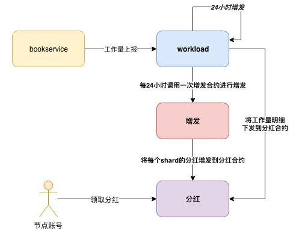

# 节点奖励制度

## 概述

系统增量发行TOP token形成奖励池。奖励池的20%为节点选票奖励，76%为节点工作量奖励，4%为链上治理委员奖励。对于设置了分红比例的节点，他收到的全部奖励要按照分红比例分到支持他的投票者账户上。

## 总奖励发行

系统创世预留给奖励的部分为200亿的38%，每年发行的比例是预留奖励剩余部分的8%（链上治理可调），随着预留奖励的剩余部分逐年减少，发行的比例也逐年减少。当发行的比例减少到低于2%（链上治理可调），之后每年将固定按照200亿的2%持续发行。

年总奖励比例计算方法：

第n年总奖励=max( 第n年年初剩余预留奖励*8%, 2%*200亿），创世年初剩余预留奖励值为38%*200亿 ；

比如，首年总奖励比例=38%*8%=3.04%，次年总奖励比例=(38%-3.04%)*8%=2.7968%。

## 工作量奖励

工作量奖励占总奖励的76%，按照工作类型的不同，奖励比例也不同，具体分为： 

| **工作类型** | **可担任此工作的节点类型** | **占总奖励百分比**   |
| ------------ | -------------------------- | -------------------- |
| 路由工作     | edge节点                   | 3%                   |
| 审计工作     | advance节点                | 10%（各cluster平分） |
| 验证工作     | validator节点，advance节点 | 60%（各shard平分）   |
| 存档工作     | advance节点                | 3%                   |

### 验证工作奖励

**奖励对象**

验证工作者，validator节点和advance节点。

**验证工作量统计**

每个unit块的head中都会记录该区块出自哪个validator leader，shard定时将每个validator在本shard内担任leader的出块数上报给Sub-Beacon，Sub-Beacon记录下每个validator在各个shard的验证工作量，以此进行验证工作奖励的计算。

**奖励规则**

先将总验证工作奖励按照shard平分，然后按照节点在该shard的验证工作量占比来分奖励，保证金为0的节点的工作奖励收归 “社区治理账户”。

公式如下：

验证工作奖励=该validator工作量 / shard总工作量 \* 每个时钟块发行的奖励 \* 时钟块高度 \* 60% / shard数量*

提醒：

> 每个时钟块发行的奖励会随着相关链上治理参数的变化而变化。

### 审计工作奖励 

**奖励对象**

审计工作者，advance节点可担任审计工作者。

**审计工作量统计**

每个unit块的head中都会记录该区块是哪个auditor leader出的，shard定时将每个auditor在本shard内担任leader的出块数上报给Sub-Beacon，Sub-Beacon记录下每个auditor在各个cluster的审计工作量汇总值，以此进行审计工作奖励的计算。 

**奖励规则**

先将总审计工作奖励（即总奖励池的10%）按照cluster平分，然后按照节点在该cluster的审计工作量占比来分奖励。 保证金为0的节点的工作奖励收归 “社区治理账户”。

奖励公式：

某节点审计工作奖励=该auditor工作量/cluster总工作量 \*每个时钟块发行的奖励 \* 时钟块高度 \* 10% / shard数量

提醒：

> 每个时钟块发行的奖励会随着链上治理参数的变化而变化。

### 存档工作奖励

**奖励对象**

存档工作者，advance节点可担任存档工作者，inactive状态的archive不奖励，保证金为0的节点不做奖励。

**奖励规则**

总奖励平分，保证金为0的节点的工作奖励收归 “社区基金账户”。

奖励公式：

*某节点存档工作奖励=每个时钟块发行的奖励 \* 时钟块高度 \* 3% / archive数量*

提醒：

> 每个时钟块发行的奖励会随着链上治理参数的变化而变化。

### 边缘工作奖励

**奖励对象**

角色为edge的节点，注意inactive状态的节点不奖励，保证金为0的节点不做奖励。

**奖励规则**

总奖励平分，每24小时平分一次。

### 零工作量

validator、auditor节点零工作量时，对应的工作量总奖励奖励将发给特定的公共合约账户。即：如果某个shard/cluster统计周期内“零工作量”，该shard/cluster的奖励将发给特定的公共合约账户；如果所有shard/cluster都是“零工作量”，本轮全部节点工作量奖励将发给特定的公共合约账户。

投票给零工作量节点的投票者，也将拿不到“节点工作量奖励”部分的分红，但注意仍然可以拿到该节点因为担任其他角色（比如edge、archive）所获得奖励的分红。

注意零工作量的定义，table合约固定周期内积累的工作量低于阈值（链上治理），将不会上报工作量。如果一轮奖励的统计周期内，某个shard/cluster下的所有table没有上报过一笔工作量交易，则该shard/cluster在Sub-Beacon层合约中的工作量会是0，此时在该shard/cluster中工作的节点为零工作量。

TCC可以通过链上治理对公共账户中的金额进行销毁，或者转账到TCC指定账户。

## 节点选票奖励

**奖励对象**

所有选票数＞0，且状态为active状态，保证金＞0的节点。

**总节点选票奖励**

20%*总奖励。

**奖励计算与发放周期**

24小时。

**票数统计**

shard定时将每个节点在本shard内获得的票数汇总值上报给Sub-Beacon，Sub-Beacon根据将节点在所有分片的票数加和可得某节点的总票数，以此进行节点选票奖励的计算。

**奖励规则**

按照节点的得票数占比分配总节点选票奖励。

节点选票奖励*=节点得票数/全网总票数\*200亿 \* M% \*20%*

## 奖励提现

每个节点24小时内可以申请提现一次。节点仅可以对已经计算出奖励的部分进行提现，低于1000 TOP无法提现。

提现可以立即到账。

节点注销后，已经计算并发放到合约的奖励可以继续领取，但系统不会继续给此节点计算和发放更多奖励。

## 奖励发放流程

业务流：节点可查看自己总剩余待领取的奖励金额，并申请完成奖励的领取。每24小时最多领取一次，每次领取奖励金额需要≥1000 TOP。

资金流：Sub-Beacon每24小时将当期奖励金额从38%挖矿资金池（或无中生有）中下发到分片级别奖励池→ 节点或投票人申请提现，奖励资金到节点或投票人账户。

