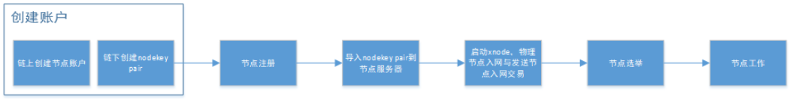

# 节点签名

## 概述

系统以keystore加密文件的方式保存账户公私钥，保证了账户私钥的安全性。

在账户keystore需要上传到云服务器的情况下，系统提供了另外一套用于节点签名的方法：

使用一对无资产的公私钥和节点绑定，节点发送交易时，使用该私钥签名。

即使该私钥被盗后，节点自身资产仍然安全。

## 节点签名流程

1. 创建账户：在客户端发起链上创建账户的交易，然后用户在客户端本地创建一对公私钥对（以keystore文件存储），该公私钥将被用作nodekey；

2. 节点注册：在客户端，用节点账户发起交易，用节点账户的私钥签名，发起“节点注册”交易。节点注册交易成功后，完成节点账户和node key公钥的绑定；

3. 导入node key：用户将nodekey的keystore文件上传到节点服务器上。

4. 物理节点入网与节点入网交易：用nodekey的私钥启动xnode节点进程，一是发起物理网络入网的请求；二是用节点账户发起交易，用nodekey签名，发起“节点入网”交易；

5. 节点选举：节点定期进行选举，选举后节点账户和绑定的nodekey会在选举块中广播给全网。

6. 节点工作：在收到选举块之后，节点可以用nodekey进行签块。

