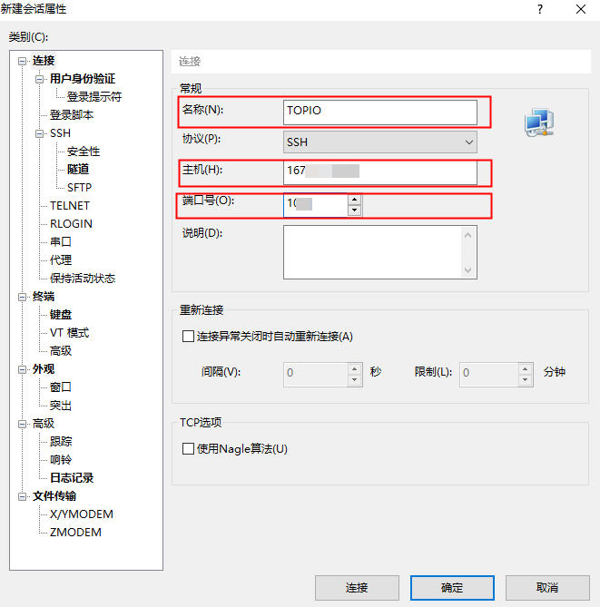
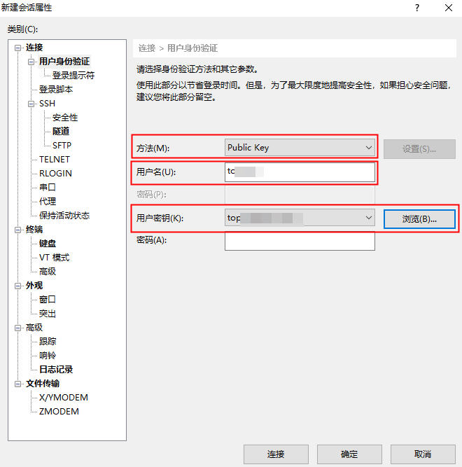
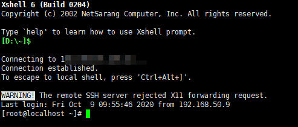

# 安装TOPIO

使用TOPIO前，请先安装TOPIO。

## 配置云服务器

### 操作系统要求

| 操作系统 | 说明                         |
| -------- | ---------------------------- |
| Linux    | CentOS 7，64位，内核3.10以上 |

### 服务器最低配置

不同的类型节点对云服务器的配置要求不同，最低配置请参见下表。

| 节点类型            | 硬件配置                               |
| ------------------- | -------------------------------------- |
| 边缘节点(edge)      | 2CPU/4GB men<br/>40GB SSD<br/>100Mb/s  |
| 验证节点(validator) | 2CPU/4GB men<br/>60GB SSD<br/>100Mb/s  |
| 高级节点(advance)   | 4CPU/8GB men<br/>100GB SSD<br/>200Mb/s |

### 服务器账户权限要求

您可以通过如下用户模式中的一种启动TOPIO。

| 云服务器用户类型 | 说明                                                         |
| ---------------- | ------------------------------------------------------------ |
| 普通用户         | 需要具备sudo权限启动TOPIO，sudo权限用户需要在所有命令前标记"sudo"，例如启动topcl：`sudo topio topcl`。 |
| root用户         | 无限制。                                                     |

## 连接云服务器

如果您需要通过Window或者Mac系统远程访问云服务器，需提前安装以下软件。

| 软件   | 版本 | 说明 |
| ------ | ---- | ---- |
| Xshell | -    | -    |

步骤1 启动Xshell，选择“文件>新建”，进入新建会话框。

步骤2 输入名称、服务器主机IP，修改端口号，如下图所示。



步骤3 左侧导航栏单击“用户身份验证”，方法选择"Public Key"，输入服务器用户名，设置用户密钥文件（配置云服务器时生成的pem文件），如下图所示。



步骤4 单击“连接”，成功连接到云服务器，如下图所示。



### 下载TOPIO安装文件

执行如下命令下载TOPIO安装文件至服务器指定目录。

```
wget https://github.com/Yarkin/test/releases/download/v.0.0.1/xx_install.tar.gz
```

"/home/cathy"是安装包存储目录，"https://github.com/Yarkin/test/releases/download/v.0.0.1/xx_install.tar.gz" 是TOPIO安装包下载链接。

## 安装步骤

步骤1 在Xshell或者Mac系统命令行终端页面执行如下命令进入TOPIO安装文件目录。

```
cd /home/cathy
```

步骤2 执行如下命令解压安装文件。

```
tar zxvf topio-0.0.0.0-debug.tar.gz
```

步骤3 执行如下命令进入解压目录。

```
cd topio-0.0.0.0-debug
```

步骤4 执行TOPIO安装脚本。

```
sh install.sh
```

## 验证安装结果

验证安装是否成功。

### 安装成功

在任一目录下执行`topio -v`验证安装是否成功，如果输出如下信息，证明安装成功。

```
################################################## load xtopchain.so(/usr/bin/libxtopchain.so) ######################################
================================================
topio version: 0.0.0.0
build date: Aug 20 2020 18:24:02
MD5:502dbb6511ff4515d7108d1d3bcb5c99
```

提醒：

> 其中，如MD5码与官网展示的对应安装包MD5码不一致，您虽然安装成功，但是安装文件存在被篡改的可能性！MD5官方链接：

### 安装失败

在任一目录下执行`topio -v`验证安装是否成功，如果输出如下信息，证明安装失败。

```
topio(10400),not found component(/usr/bin/libxtopchain.so) topio(10400),not found component(/lib/libxtopchain.so) topio(10400),not found component(/lib64/libxtopchain.so)
```

或者输出如下信息，证明安装失败。

```
-bash: topio: 未找到命令
```

以上示例基于支持中文的Linux操作系统。

如安装失败，请重新执行安装步骤。

