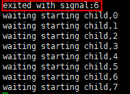

# 启动TOPIO

## 概述

启动TOPIO前您需要完成安装TOPIO。安装完成后，执行如下命令启动TOPIO：

```
topio
```

关于TOPIO命令行选项请参见[命令行选项](/zh/Tools/TOPIO/Command-line_Options.md)。

支持使用TOPIO不同模式：

* [进入topcl](#进入topcl)

进入topcl交互环境。

* [启动xnode](#启动xnode)

仅启动节点进程xnode。

* [console模式](#console模式)

启动节点进程xnode，同时进入TOPIO交互环境。

* [attach模式](#attach模式)

连接到本地节点服务器上正在运行的节点进程xnode，同时进入TOPIO交互环境。

说明：

> 以下示例使用云服务器root用户账户，如您是普通用户账户（需要具有sudo权限），须在所有命令前加上"sudo"。

### 进入topcl

执行如下命令进入topcl交互环境。

```
topio topcl
```

进入topcl后，您可以通过topcl与链进行交互：发送交易、注册节点、节点staking等。

topcl具体功能及使用，请参见[topcl使用说明](/zh/Tools/TOPIO/topcl/Overview.md)。

### 退出topcl

支持使用如下命令退出topcl。

`exit`、`q`、`quit`、`logout`。

### 启动xnode

启动节点之前，请先注册节点，具体请参见[系统交易](/zh/Tools/TOPIO/topcl/system.md)中“注册节点”内容。

完成节点注册，启动节点进程xnode，即可加入TOP Network网络，进入候选池等待选举。

提醒：

> 如果需要在本地运行多个节点进程，您必须确保每个节点都有一个单独的数据目录，并指定本地服务端口。如只在本地运行一个节点进程，那么无需指定数据目录和本地服务端口。

在TOPIO下执行如下命令启动xnode。

```
topio --account_addr T-0-LKXjgwdL9bTwADL89cBp7L2ze3wqiNmRB4 -k /root/Topnetwork/keystore/T-0-LebeXEZGGTctfqA5Y8mnJroPckUDkE2hCW --password 123456789jjj --datadir home/cathy3 --admin_http_port 56391
```

可选项说明如下表所示。

| 选项名称          | 默认值 | 类型   | 说明                                                         |
| ----------------- | ------ | ------ | ------------------------------------------------------------ |
| --account_addr    | -      | String | 节点账户地址。                                               |
| -k,--keystore     | -      | String | 此节点注册时设置的node key的keystore文件路径：如使用节点账户公私钥对作为node key，此处为节点账户keystore文件路径；如使用公私钥对作为node key，则此处为公私钥对keystore文件路径。<br/>若您在注册节点时未设置node_sign_key，系统默认使用账户公钥作为node_sign_key，则此处为账户keystore文件路径。 |
| -p,--password     | -      | String | node key对应的账户keystore或者公私钥对keystore文件密码。     |
| -d,--datadir      | -      | String | 给节点指定数据目录，如不指定，则节点数据目录为系统默认路径。如指定默认路径：/home/cathy3，则keystore文件以及链数据默认存储在此路径下。 |
| --admin_http_port | 8000   | String | 本地服务端口，如不指定，则默认为"8000"。                     |

如启动页面打印如下退出程序(exited with signal)提示，则启动xnode失败；如无以下提示，则成功启动xnode。



### 停止xnode

支持单进程及多进程。

```
[root@Jiao ~/top/xchain/cbuild/bin/Linux]# topio -s stop
signal:stop
env home:/root
found runing xnode_pid:28795
will send SIGKILL signal to pid:28795
done signal operations
```

或者使用"Ctrl C"，Linux命令`kill`停止xnode。

### 查询节点入网后的网络信息

进入交互环境查询节点网络信息，需要使用TOPIO console模式或者attach模式。

查询命令具体请参见[xnode使用说明](/zh/Tools/TOPIO/xnode/command.md)。

### console模式

启动节点进程xnode，同时进入TOPIO交互环境。

如果您已经在本地后台启动xnode进程，可停止xnode进程后再使用console模式。

#### 进入console模式

提醒：

> 如果需要在本地运行多个节点进程，您必须确保每个节点都有一个单独的数据目录，并指定本地服务端口。如只在本地运行一个节点进程，那么无需指定数据目录和本地服务端口。

在TOPIO下执行如下命令启动console。

```
topio --account_addr T-0-LKXjgwdL9bTwADL89cBp7L2ze3wqiNmRB4 -k /root/Topnetwork/keystore/T-0-LWkTjhseZj7tPZkXwifoTPm2dUJY63jdEd --password 123456789jjj --datadir home/cathy3 --admin_http_port 56391 console
```

可选项说明如下表所示。

| 选项名称          | 默认值 | 类型   | 说明                                                         |
| ----------------- | ------ | ------ | ------------------------------------------------------------ |
| --account_addr    | -      | String | 节点账户地址。                                               |
| -k,--keystore     | -      | String | 此节点注册时设置的node sign key的keystore文件路径：如使用节点账户公私钥对作为node sign key，此处为节点账户keystore文件路径；如使用公私钥对中公钥作为node sign key，则此处为公私钥对keystore文件路径。<br/>若您在注册节点时未设置node_sign_key，系统默认使用账户公钥作为node_sign_key，则此处为账户keystore文件路径。 |
| -p,--password     | -      | String | node sign key对应的账户keystore或者公私钥对keystore文件密码。 |
| -d,--datadir      | -      | String | 给节点指定数据目录，如不指定，则节点数据目录为系统默认路径。如指定默认路径：/home/cathy3，则keystore文件以及链数据默认存储在此路径下。 |
| --admin_http_port | 8000   | String | 本地服务端口，如不指定，则默认为"8000"。                     |

#### 查看console模式帮助信息

```
NAME:
    console

USAGE:
    command [arguments...]

COMMANDS:
    help                     Show a list of commands and options.
    topcl                    A command line interface to interact with the blockchain and manage accounts.
    xnode                    Xnode is the core service daemon that runs on every TOP Network node.
```

#### console模式命令说明

执行`help`查看console帮助信息。

| 命令  | 说明                                                         |
| ----- | ------------------------------------------------------------ |
| help  | 查看console帮助信息。                                        |
| topcl | 与链进行交互及账户管理的命令行客户端。<br/>提醒：<br/>在console模式下使用topcl，需要在命令前加上"topcl"，例如"topcl wallet list"。 |
| xnode | xnode是在TOP Network网络节点上运行的核心服务进程，同时集成了节点网络信息查询、节点进程守护等功能。<br/>提醒：<br/>在console模式下使用xnode，需要在命令前加上"xnode"，例如"xnode net joined"。 |

#### 退出console模式

支持如下方式退出console模式。

* Ctrl+C。

* 使用命令`exit`、`q`、`quit`、`logout`。

### attach模式

连接到本地节点服务器上正在运行的节点进程xnode，同时进入TOPIO交互环境。

如果您已经在本地后台启动xnode进程，可使用attach模式，直接连接到本地节点。

提醒：

> 启动attach模式前请确本地服务器已经运行了xnode进程。

#### 进入attach模式

在TOPIO下，执行如下命令连接到本地运行的xnode，默认端口为"8000"。

```
topio attach
```

如果启动节点进程时指定了不同的服务端口，连接到指定节点进程时需要输入相应的服务端口号。

```
topio attach --admin_http_port 56391
```

#### 查看attach模式帮助信息

执行`help`查看attach帮助信息。

```
NAME:
    attach

USAGE:
    command [arguments...]

COMMANDS:
    help                     Show a list of commands and options.
    topcl                    A command line interface to interact with the blockchain and manage accounts.
    xnode                    Xnode is the core service daemon that runs on every TOP Network node.
```

#### attach模式命令说明

| 命令  | 说明                                                         |
| ----- | ------------------------------------------------------------ |
| help  | 查看attach帮助信息。                                         |
| topcl | 与链进行交互及账户管理的命令行客户端。<br/>提醒：<br/>在attach模式下使用topcl，需要在命令前加上"topcl"，例如"topcl wallet list"。 |
| xnode | xnode是在TOP Network网络节点上运行的核心服务进程，同时集成了节点网络信息查询、节点进程守护等功能。<br/>提醒：<br/>在attach模式下使用xnode，需要在命令前加上"xnode"，例如"xnode net joined"。 |

#### 退出attach模式

支持如下方式退出attach模式。

* Ctrl+C。

* 使用命令`exit`、`q`、`quit`、`logout`。

