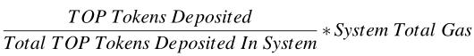

# 发送交易

## 概述

sendtx命令支持发送交易，包括转账、节点staking（锁定TOP token获取gas、锁定TOP token获取选票）、部署/调用用户智能合约等。

| 命令                                           | 说明                               |
| ---------------------------------------------- | ---------------------------------- |
| [sendtx transfer](#转账)                       | 转账，从一个账户转至另外一个账户。 |
| [sendtx stakeGas](#锁定TOP_token兑换gas)       | 锁定TOP token兑换gas。             |
| [sendtx stakeVote](#锁定TOP_token兑换选票)     | 锁定TOP token兑换选票。            |
| [sendtx deployContract](#部署用户智能合约)     | 部署用户智能合约。                 |
| [sendtx runContract](#调用用户智能合约)        | 调用用户智能合约。                 |
| [sendtx unstakeGas](#解锁兑换gas的TOP_token)   | 解锁兑换gas的TOP token。           |
| [sendtx unstakeVote](#解锁兑换选票的TOP_token) | 解锁兑换选票的TOP token。          |

## 查看sendtx所有命令及帮助

使用`sendtx -h   ` 或者` sendtx --help`查看sendtx所有命令。

```
COMMANDS:
    runContract                     Send a transaction to a contract to execute it.
    deployContract                  Create a contract account and publish code on it.
    stakeGas                        Lock TOP tokens to get gas.
    stakeVote                       Lock TOP tokens to get votes.
    transfer                        Transfer TOP tokens from account to account.
    unstakeGas                      Unstake gas from your account and unlock TOP tokens.
    unstakeVote                     Unstake votes from your account and unlock TOP tokens.

OPTIONS:
    -h --help                       Show a list of commands or help for one command.
```

使用`sendtx stakeVote -h`或者`sendtx stakeVote --help`查看子命令`stakeVote`的帮助。

```
Lock TOP tokens to get votes.

USAGE:
    sendtx stakeVote votes_num lock_duration

OPTIONS:
    -h --help                       Show help information for one command.

EXAMPLE:
    sendtx stakeVote 1000 30
```

## 命令使用说明

### 交易费用说明

TOP Network链上发送交易会消耗一定的gas资源，如果账户余额大于等于100*10^6 uTOP，系统会免费赠与25,000 Tgas。

每笔交易至少需要100,000 uTOP token作为交易保证金，否则交易将被丢弃。

在账户gas资源充足的情况下，交易保证金在交易成功后会立即退回到您的账户。如gas资源不足以支付交易费用，则需要从交易保证金中扣除一笔费用用来兑换gas资源以支付交易费用，扣除的TOP token将被销毁。

如交易保证金也不足以兑换足够的gas资源，那么交易最终将失败。

交易所消耗的资源详细信息请参见[资源模型](/zh/AboutTOPNetwork/Protocol/ResourceModel.md)。

说明：

> 在TOPIO中，账户余额、交易保证金等TOP token单位为uTOP，1TOP=1*10^6 uTOP。

### 转账

将TOP token从一个账户发送到另外一个账户。

**请求方式**

```
sendtx transfer
```

**请求参数**

| 参数名称     | 是否必选 | 默认值 | 类型   | 说明                                   |
| ------------ | -------- | ------ | ------ | -------------------------------------- |
| account_addr | 是       | -      | String | 目标账户地址，为普通账户或者合约账户。 |
| amount       | 是       | -      | String | 转账金额，单位：uTOP。转账金额需≥0。   |

**选项**

| 选项名称        | 默认值       | 类型   | 说明                             |
| --------------- | ------------ | ------ | -------------------------------- |
| -t,--tx_deposit | 10,0000 uTOP | String | 交易保证金，默认为10,0000 uTOP。 |
| -n,--note       | -            | String | 转账备注。                       |
| -h,--help       | -            | -      | 查看命令帮助信息。               |

**返回参数**

| 参数名称 | 类型   | 说明                                    |
| -------- | ------ | --------------------------------------- |
| tx_hash  | String | 本次交易hash，可用于查询交易结果。      |
| tx_size  | Uint16 | 交易大小，交易消耗的gas和交易大小相关。 |

**请求样例**

```
sendtx transfer T-0-LXC1xmtn1bXB9CAinqNoDtQJCz1Mu9CXfK 20
```

**返回样例**

返回交易的hash及交易大小，通过`get transaction`或者`get account`查询交易是否成功以及账户余额是否有相应变化从而判断转账是否成功。

* 成功返回

```
{
	"errmsg": "ok",
	"errno": 0,
	"sequence_id": "8",
	"tx_hash": "0x34ca8f317107ce6b01c933b017f28e6cf0f84f2e31627a8349f167c1aa9ade10",
	"tx_size": 306
}
Please use command 'get transaction' to query transaction status later on!!!
```

例如：转账账户原来有1,000,000,000,000uTOP余额，给另外一个账户转账20uTOP。

发起转账命令后，使用`get account `查询账户信息，账户余额减少20uTOP。

根据交易hash，使用`get transaction`查询此次交易，最终共识成功。

* 失败返回

交易失败的情况下，同样返回交易大小和交易hash。

```
{
	"errmsg": "ok",
	"errno": 0,
	"sequence_id": "4",
	"tx_hash": "0xc73f6295bc5b6be1ace273d59504f4c97d1b01cd2d3301c47cf042e28795e35b",
	"tx_size": 306
}
Please use command 'get transaction' to query transaction status later on!!!
```

根据交易hash，使用`get transaction`查询交易，最终共识失败，使用`get account`查询账户，余额无变化，则转账失败。

### 锁定TOP_token兑换gas

兑换gas的价格为：



**请求方式**

```
sendtx stakeGas
```

**请求参数**

| 参数名称     | 是否必选 | 默认值 | 类型   | 说明                                   |
| ------------ | -------- | ------ | ------ | -------------------------------------- |
| account_addr | 是       | -      | String | 锁定TOP token账户地址。                |
| locked_utop  | 是       | -      | String | 兑换gas锁定的TOP token金额，单位uTOP。 |

**选项**

| 选项名称  | 默认值 | 类型 | 说明               |
| --------- | ------ | ---- | ------------------ |
| -h,--help | -      | -    | 查看命令帮助信息。 |

**返回参数**

| 参数名称 | 类型   | 说明                                    |
| -------- | ------ | --------------------------------------- |
| tx_hash  | String | 本次交易hash，可用于查询交易结果。      |
| tx_size  | Uint16 | 交易大小，交易消耗的gas和交易大小相关。 |

**请求样例**

```
sendtx stakeGas T-0-LQHpzTF1jjj8ie4g7SYPCPvi5D5c2Q3nP5 1000
```

**返回样例**

* 成功返回

```
{
	"errmsg": "ok",
	"errno": 0,
	"sequence_id": "13",
	"tx_hash": "0x16f7ba7580fd23b1c900323937b099c9e73c5d14df787c58de8f4388820ff1ba",
	"tx_size": 306
}
Please use command 'get transaction' to query transaction status later on!!!
```

根据交易hash，使用`get transaction`查询交易，最终共识成功，使用`get account`查看账户"total_gas"、"available_gas"有相应变化，则兑换gas成功。

* 失败返回

将账户余额全部锁定获取gas，返回：

```
Error! Exception Thrown stoi
```

### 锁定TOP_token兑换选票

兑票规则：

locked TOP token=votes_amount / [ 1.04^(lock_duration / 30 - 1) ], duration < 570；

locked TOP token=vote_amount / 2,                       lock_duration >= 570。

锁定期越长，相同的兑票数量锁定越少的TOP token。

**请求方式**

```
sendtx stakeVote
```

**请求参数**

| 参数名称      | 是否必选 | 默认值 | 类型    | 说明                                                         |
| ------------- | -------- | ------ | ------- | ------------------------------------------------------------ |
| vote_amount   | 是       | -      | Uint 64 | 兑票数量，每次兑票10000票起兑。                              |
| lock_duration | 是       | -      | Uint 16 | TOP token锁定期，锁定期单位：天。<br/>锁定期最少为30天，且必须为30的整数倍。 |

**选项**

| 选项名称  | 默认值 | 类型 | 说明               |
| --------- | ------ | ---- | ------------------ |
| -h,--help | -      | -    | 查看命令帮助信息。 |

**返回参数**

| 参数名称 | 类型   | 说明                                    |
| -------- | ------ | --------------------------------------- |
| tx_hash  | String | 本次交易hash，可用于查询交易结果。      |
| tx_size  | Uint16 | 交易大小，交易消耗的gas和交易大小相关。 |

**请求样例**

兑换10000张票，锁定期30天，请求命令如下所示。

```
sendtx stakeVote 10000 30
```

**返回样例**

* 成功返回

```
{
	"errmsg": "ok",
	"errno": 0,
	"sequence_id": "25",
	"tx_hash": "0x14a3301e093d27e351b4cfe036456419830d4f43ba6938fe91e6641b1c8e90aa",
	"tx_size": 284
}
Please use command 'get transaction' to query transaction status later on!!!
```

根据交易hash，使用`get transaction`查询交易，最终共识成功，使用`get account`查看账户余额"balance"、"unused_vote_amount"、"vote_staked_token"有相应发生变化，则成功兑换选票。

* 失败返回

```
{
	"errmsg": "ok",
	"errno": 0,
	"sequence_id": "28",
	"tx_hash": "0x3eadada0895b86aa502627f89406d07f085681381648aa1479fbc5f183dc93ea",
	"tx_size": 284
}
Please use command 'get transaction' to query transaction status later on!!!
```

根据交易hash，使用`get transaction`查询交易，最终共识失败，`get account`查看账户余额无变化，则兑换选票失败。

### 部署用户智能合约

**请求方式**

```
sendtx deployContract
```

**请求参数**

| 参数名称      | 是否必选 | 默认值 | 类型   | 说明                                                         |
| ------------- | -------- | ------ | ------ | ------------------------------------------------------------ |
| gas_limit     | 是       | -      | Uint64 | 合约愿意为交易发送方付出的每笔交易的gas费用上限，单位Tgas。  |
| amount        | 是       | -      | Uint64 | 转入合约账户的金额，单位uTOP。<br/>部署合约会创建一个合约账户，您可以同时向此账户中转账，也可以不转。<br/>如果希望合约账户能得到免费的gas，那么向合约账户中的转账金额须大于等于100*10^6 uTOP token。 |
| contract_path | 是       | -      | String | 合约代码文件路径。                                           |

**选项**

| 选项名称        | 默认值            | 类型   | 说明                                              |
| --------------- | ----------------- | ------ | ------------------------------------------------- |
| -h,--help       | -                 | -      | 查看命令帮助信息。                                |
| -t,--tx_deposit | 100,000uTOP token | String | 交易保证金，单位：uTOP。默认为100,000uTOP token。 |

**返回参数**

| 参数名称         | 类型   | 说明                                            |
| ---------------- | ------ | ----------------------------------------------- |
| tx_hash          | String | 本次交易hash，可用于查询交易结果。              |
| tx_size          | Uint16 | 交易大小，交易消耗的gas和交易大小相关。         |
| contract_account | String | 部署合约创建的合约账户地址，以"T-3"为标识开头。 |

**请求样例**

```
sendtx deployContract 100 1000 /home/git/TopPyFrame/apitest/lua_script/create_key_rename.lua 
```

**返回样例**

* 成功返回

```
contract account: T - 3 - Ma6xiGnaK2Szr6kQvnJvmJa5zw5s5Cb8RJ {
	"errmsg": "ok",
	"errno": 0,
	"sequence_id": "25",
	"tx_hash": "0x572bcc1ac187ff0bd924b826728566f92cbceca74be4382eee1d6cdc53272dec",
	"tx_size": 367
}
Please use command 'get transaction' to query transaction status later on!!!
```

根据交易hash，使用`get transaction`查询交易，最终共识成功，则成功部署用户合约。

* 失败返回

同样返回交易hash和交易大小，根据交易hash，使用`get transaction`查询交易，最终共识失败，则部署用户合约失败。

### 调用用户智能合约

提醒：

> 调用用户合约前，您可以使用`get account`查询合约函数名称及参数类型相关信息。

**请求方式**

```
sendtx runContract
```

**请求参数**

| 参数名称      | 是否必选 | 默认值 | 类型     | 说明                                                         |
| ------------- | -------- | ------ | -------- | ------------------------------------------------------------ |
| amount        | 是       | -      | Uint64   | 调用用户合约时，向用户智能合约账户中转账的金额，单位uTOP。   |
| contract_addr | 是       | -      | String   | 用户智能合约账户地址，以"T-3"为标识开头。                    |
| contract_func | 是       | -      | String   | 调用合约的函数名称。                                         |
| param_type    | 是       | -      | String   | 当前支持以下参数类型：<br/>1--Unit64;<br/>2--String;<br/>3--Bool。 |
| param_value   | 是       | -      | 参见说明 | 当参数类型为1--Unit64时，参数值为整数型；<br/>当参数类型为2--String时，参数值为任意字符串；<br/>当参数类型为3--Bool时，参数值必须为"true"或者"false"。 |

**选项**

| 选项名称        | 默认值             | 类型   | 说明                                                       |
| --------------- | ------------------ | ------ | ---------------------------------------------------------- |
| -h,--help       | -                  | -      | 查看命令帮助信息。                                         |
| -t,--tx_deposit | 100,000 uTOP token | Uint64 | 交易保证金，单位：uTOP。如不填，默认为100,000 uTOP token。 |

**返回参数**

| 参数名称 | 类型   | 说明                                    |
| -------- | ------ | --------------------------------------- |
| tx_hash  | String | 本次交易hash，可用于查询交易结果。      |
| tx_size  | Uint16 | 交易大小，交易消耗的gas和交易大小相关。 |

**请求样例**

示例1：

```
sendtx runContract 1000 T-3-MbEfwERMNw9c4oKbLtfkWBkL2KFRsahEDe set_key 1,1|2,a|3,true
```

调用的合约函数名称为"set_key"；

"1,1"表示参数1类型为“Uint64整数型”，值为"1"、"2,a"表示参数2类型为"String"，值为"a"、"3,true"表示参数3类型为"Bool"，值为"true"。

示例2 ：

```
sendtx runContract 1000 T-3-MnyWSV2r64tWe92vKb4ivGitK8noAcBVFQ add 1,1|1,2
```

调用的合约函数名称为"add";

"1,1"表示参数1类型为“Uint64整数型”，值为"1"、"1,2"表示参数2类型为“Uint64整数型”，值为"2"。

**返回样例**

* 成功返回

```
{
	"errmsg": "ok",
	"errno": 0,
	"sequence_id": "1",
	"tx_hash": "0x9d093200beceab10f693a733553daa5e633ffc7bf2c6a546b700dec1ab6da4a8",
	"tx_size": 316
}
Please use command 'get transaction' to query transaction status later on!!!
```

根据交易hash，使用`get transaction`查询交易，最终共识成功，则成功调用用户合约。

* 失败返回

同样返回交易hash和交易大小，根据交易hash，使用`get transaction`查询交易，最终共识失败，则调用用户合约失败。

### 解锁兑换gas的TOP_token

发起解锁后，需要等待24小时，并由锁定账户发起一笔交易（非查询）后，解锁的金额才会到账。

**请求方式**

```
sendtx unstakeGas
```

**请求参数**

| 参数名称      | 是否必选 | 默认值 | 类型   | 说明                              |
| ------------- | -------- | ------ | ------ | --------------------------------- |
| account_addr  | 是       | -      | String | 需要解锁TOP token的账户地址。     |
| unlocked_utop | 是       | -      | String | 解锁的TOP token金额，单位为uTOP。 |

**选项**

| 选项名称  | 默认值 | 类型 | 说明               |
| --------- | ------ | ---- | ------------------ |
| -h,--help | -      | -    | 查看命令帮助信息。 |

**返回参数**

| 参数名称 | 类型   | 说明                                    |
| -------- | ------ | --------------------------------------- |
| tx_hash  | String | 本次交易hash，可用于查询交易结果。      |
| tx_size  | Uint16 | 交易大小，交易消耗的gas和交易大小相关。 |

**请求样例**

```
sendtx unstakeGas T-0-LQHpzTF1jjj8ie4g7SYPCPvi5D5c2Q3nP5 1000
```

**返回样例**

* 成功返回

```
{
	"errmsg": "ok",
	"errno": 0,
	"sequence_id": "30",
	"tx_hash": "0xb83f304a26d2ffe6a3b59eb01fd5269218367481c55b4ec15d60abdc6129380d",
	"tx_size": 306
}
Please use command 'get transaction' to query transaction status later on!!!
```

根据交易hash，使用`get transaction`查询交易，最终共识成功，使用`get account`查看账户"available_gas"有相应变化，则成功解锁TOP token。

* 失败返回

同样返回交易hash和交易大小，根据交易hash，使用`get transaction`查询交易，最终共识失败，则解锁TOP token失败。

### 解锁兑换选票的TOP_token

锁定期内的TOP token不能解锁，只能解锁到期的TOP token。

已经被使用的选票对应锁定的TOP token不能被解锁。

发起解锁后，解锁的金额将立刻到账。

**请求方式**

```
sendtx unstakeVote
```

**请求参数**

| 参数名称  | 是否必选 | 默认值 | 类型   | 说明                             |
| --------- | -------- | ------ | ------ | -------------------------------- |
| votes_num | 是       | -      | String | 选票数量，解锁相应的TOP  token。 |

**选项**

| 选项名称  | 默认值 | 类型 | 说明               |
| --------- | ------ | ---- | ------------------ |
| -h,--help | -      | -    | 查看命令帮助信息。 |

**返回参数**

| 参数名称 | 类型   | 说明                                    |
| -------- | ------ | --------------------------------------- |
| tx_hash  | String | 本次交易hash，可用于查询交易结果。      |
| tx_size  | Uint16 | 交易大小，交易消耗的gas和交易大小相关。 |

**请求样例**

```
sendtx unstakeVote 200
```

**返回样例**

* 成功返回

```
{
	"errmsg": "ok",
	"errno": 0,
	"sequence_id": "7",
	"tx_hash": "0x6e74dd5860873cd9bf0dc14f5312aac93bcbbec2a92372c783fffb7fc1f7c902",
	"tx_size": 306
}
Please use command 'get transaction' to query transaction status later on!!!
```

根据交易hash，使用`get transaction`查询交易，最终共识成功，使用`get account`查看账户余额"balance"及选票"unused_vote_amount"有相应变化，则成功解锁TOP token。

* 失败返回

解锁超过总票数的TOP token返回：

```
{
	"errmsg": "ok",
	"errno": 0,
	"sequence_id": "17",
	"tx_hash": "0x68c925994cb066d11ed946f7e6ef8ec5e62f3554ac7370c82442f8e8b5d067ed",
	"tx_size": 284
}
Please use command 'get transaction' to query transaction status later on!!!
```

根据交易hash，通过`get transaction`查询此笔交易返回：

```
{
	"errmsg": "transaction not find",
	"errno": 11,
	"sequence_id": "11"
}
```
